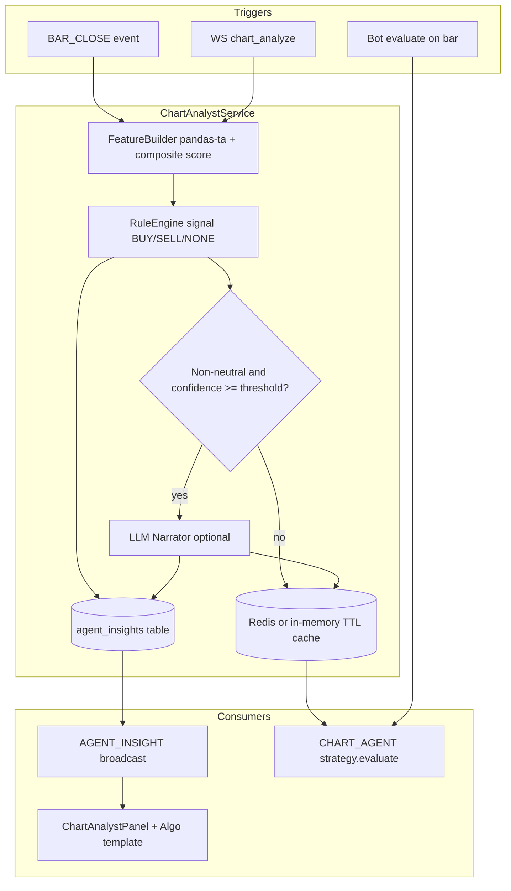

# Lightweight Chart Analyst Agent Plan

## Context from codebase + research

**What you already have (strong foundation):**
- Rule-based chart signal in frontend: [`frontend/src/utils/indicators.js`](frontend/src/utils/indicators.js) `generateSignal()` + [`ChartWidget.jsx`](frontend/src/components/ChartWidget.jsx) `ChartSignalBadge` (BUY/SELL/NEUTRAL + reasons)
- Production bot pipeline: `MarketScreenerService` (pandas-ta) → `strategy.evaluate()` → `BotManager` risk gate → OMS ([`backend/app/services/bots/manager.py`](backend/app/services/bots/manager.py))
- 7 built-in strategies + `CUSTOM` plugin loader ([`backend/strategies/example_rsi_reversal.py`](backend/strategies/example_rsi_reversal.py))
- Market archive + `get_market_history` for 200+ bar warm-up ([`backend/app/services/archive/query.py`](backend/app/services/archive/query.py))
- Chart overlay architecture for bar-anchored markers (`signal-markers` scatter in `ChartWidget.applyOverlayPatch`)

**What is missing:** No LLM/agent layer, no persisted analyst insights, no backend equivalent of `generateSignal`, no strategy that consumes analyst output.

**Research takeaway (applied conservatively):**
- Full multi-agent / vision pipelines (e.g. [QuantAgent](https://arxiv.org/html/2509.09995)) are too heavy for v1 latency and cost.
- Proven lightweight pattern: **deterministic features → structured signal → LLM only on meaningful events** ([crypto analyst agent pattern](https://www.codersarts.com/post/how-to-build-a-real-time-crypto-analyst-agent-with-langgraph-macd-and-slack-alerts)) and **audit persistence** ([ai-trading-agent](https://github.com/AI4FinanceFoundation/ai-trading-agent)).
- Your choice: **hybrid + assist bots** aligns with decision-support feeding execution, not replacing risk gates.

---

## Target architecture (v1)



**Design principles for v1:**
1. **Rules decide; LLM explains** — never let the LLM flip a signal without passing the same risk/bot gates.
2. **Bot-native delivery** — primary output is a structured object consumable by `CHART_AGENT` strategy (your selected autonomy model).
3. **Cost gate** — LLM called only when `signal in {BUY, SELL}` and `confidence >= AGENT_LLM_MIN_CONFIDENCE` (default 0.55), plus per-symbol cooldown (e.g. 5 min).
4. **No chart images in v1** — pass compact JSON features (OHLCV summary + indicator snapshot); add vision later if needed.
5. **Human safety unchanged** — all trades still flow through existing `RiskGate`, `signal_ledger`, sim/live guards.

---

## Structured signal contract

Add a shared schema (backend Pydantic + frontend JSDoc mirror):

```python
class ChartAgentInsight:
    symbol: str
    bar_time: int          # closed bar unix sec
    timeframe: str         # "1m" default for bot bar-close
    signal: Literal["BUY", "SELL", "NONE"]
    confidence: float      # 0..1 from rule score normalization
    score: int             # raw composite (-4..+4, mirrors frontend)
    reasons: list[str]     # rule hits e.g. "MACD bullish crossover"
    levels: dict           # entry_hint, stop_loss_distance, take_profit_price (optional)
    narrative: str | None  # LLM summary when gated on
    model: str | None
    created_at: str
    insight_id: str        # "{symbol}:{bar_time}" for idempotency
```

Align `levels` with existing bot signal fields (`stop_loss_distance`, `take_profit_price`) so `BotManager._handle_signal` needs no special cases.

---

## Phase 1 — Backend feature + rule engine (no LLM)

### 1.1 Port composite scorer to Python
- New module: [`backend/app/services/agent/feature_builder.py`](backend/app/services/agent/feature_builder.py)
  - Reuse [`MarketScreenerService.process_candles`](backend/app/services/bots/screener.py) for indicator columns
  - Implement composite score matching frontend `generateSignal` weights (RSI zones, MACD cross, EMA alignment) — **single source of truth going forward**
- New module: [`backend/app/services/agent/rule_engine.py`](backend/app/services/agent/rule_engine.py)
  - Input: last closed bar row from screener DF (`df.iloc[-2]` — same convention as bot strategies)
  - Output: `ChartAgentInsight` without `narrative`

### 1.2 Candle sourcing
- New helper: [`backend/app/services/agent/candle_source.py`](backend/app/services/agent/candle_source.py)
  - Wrap existing `get_bot_candles()` / feed buffer + archive merge (same as bots)
  - Minimum bars: `BOT_MIN_CANDLES` (200)

### 1.3 Persistence
- Extend [`backend/app/database.py`](backend/app/database.py) with `agent_insights` table:
  - `insight_id` PK, `symbol`, `bar_time`, `payload` JSON, `created_at`
  - Index on `(symbol, bar_time DESC)`
- Optional: Redis cache key `agent:insight:{symbol}` with TTL 10 min (reuse existing `REDIS_URL` from [docker-compose.yml](docker-compose.yml))

---

## Phase 2 — Hybrid LLM narrator

### 2.1 LLM client (minimal)
- New: [`backend/app/services/agent/llm_client.py`](backend/app/services/agent/llm_client.py)
  - Use existing `httpx` to call OpenRouter or direct provider (env-driven)
  - Structured prompt: **only summarize provided JSON**; instruct model not to invent prices/indicators
  - Timeout 8s; failures return `narrative=None` (analysis still usable)

### 2.2 Orchestrator
- New: [`backend/app/services/agent/chart_analyst.py`](backend/app/services/agent/chart_analyst.py)

```python
async def analyze(symbol: str, *, force_llm: bool = False) -> ChartAgentInsight:
    candles = await get_agent_candles(symbol)
    features = feature_builder.build(candles)
    insight = rule_engine.score(features)
    if should_call_llm(insight, force_llm):
        insight.narrative = await llm_client.summarize(insight)
    persist(insight)
    return insight
```

### 2.3 Config ([`backend/app/config.py`](backend/app/config.py) + `.env.example`)
| Flag | Default | Purpose |
|------|---------|---------|
| `AGENT_ENABLED` | `true` | Master switch |
| `AGENT_LLM_ENABLED` | `false` | Enable narrator (off in sim/dev) |
| `AGENT_LLM_MIN_CONFIDENCE` | `0.55` | Cost gate |
| `AGENT_LLM_COOLDOWN_SEC` | `300` | Per-symbol LLM throttle |
| `OPENROUTER_API_KEY` | — | Provider key |
| `AGENT_LLM_MODEL` | `openai/gpt-4o-mini` | Cheap default |

---

## Phase 3 — API + real-time delivery

### 3.1 Protocol extensions
- [`backend/app/api/protocol.py`](backend/app/api/protocol.py):
  - `Action.CHART_ANALYZE = "chart_analyze"`
  - `MessageType.AGENT_INSIGHT = "agent_insight"`

### 3.2 Handler
- New: [`backend/app/api/handlers/agent.py`](backend/app/api/handlers/agent.py)
  - `chart_analyze`: params `{ symbol, force_llm?: bool }` → returns latest insight
  - Rate limit: 1 req / 10s per client per symbol (reuse rate-limit middleware pattern)

### 3.3 HTTP binding
- `POST /api/v1/agent/analyze` → `chart_analyze`
- `GET /api/v1/agent/insights/{symbol}` → last N insights from DB

### 3.4 Bar-close hook (optional but recommended)
- In server bar-close path ([`backend/app/services/bots/runtime.py`](backend/app/services/bots/runtime.py) or `bar_publish_loop`):
  - For symbols with active `CHART_AGENT` bots OR symbols in client watchlist subscription set → run `analyze()` async task
  - Broadcast `agent_insight` to subscribed clients (same pattern as `market_update`)

### 3.5 Frontend dispatch
- [`frontend/src/api/protocol.js`](frontend/src/api/protocol.js) + [`dispatch.js`](frontend/src/api/dispatch.js): handle `AGENT_INSIGHT`
- [`useStore.js`](frontend/src/store/useStore.js): add `agentInsights: { [symbol]: insight }`, `setAgentInsight`

---

## Phase 4 — Bot engine integration (`CHART_AGENT` strategy)

### 4.1 Built-in strategy (preferred over CUSTOM for discoverability)
- New: [`backend/app/services/bots/strategies_chart_agent.py`](backend/app/services/bots/strategies_chart_agent.py)

```python
class ChartAgentStrategy:
    def evaluate(self, row, config):
        insight = chart_analyst.get_cached(config["symbol"])
        if not insight or insight["bar_time"] != row["time"]:
            return {"signal": "NONE"}
        if insight["confidence"] < config.get("min_confidence", 0.55):
            return {"signal": "NONE"}
        return {
            "signal": insight["signal"],
            "stop_loss_distance": insight["levels"].get("stop_loss_distance"),
            "take_profit_price": insight["levels"].get("take_profit_price"),
        }
```

- Register in strategy loader alongside MACD_RSI ([`backend/app/services/bots/strategies.py`](backend/app/services/bots/strategies.py))
- Add catalog entry in [`strategy_catalog.py`](backend/app/services/bots/strategy_catalog.py):

```python
{
  "id": "CHART_AGENT",
  "name": "Chart Analyst Agent",
  "description": "Hybrid rule+LLM chart analysis; trades on high-confidence signals.",
  "category": "agent",
  "execution_mode": "BAR_CLOSE",
}
```

### 4.2 Bot create defaults
- `config`: `{ "min_confidence": 0.55, "use_llm": false }`
- Existing bot lifecycle, pause/resume, backtester, and signal ledger work unchanged

### 4.3 Backtest compatibility
- Extend [`backtester.py`](backend/app/services/bots/backtester.py) to replay historical bars through `rule_engine` only (no LLM) — deterministic backtests

---

## Phase 5 — Frontend UX (intelligence layer)

### 5.1 Replace/enhance ChartSignalBadge
- New: [`frontend/src/components/ChartAnalystBadge.jsx`](frontend/src/components/ChartAnalystBadge.jsx)
  - Primary: backend `agentInsights[symbol]` (authoritative when available)
  - Fallback: client `generateSignal()` while loading / offline
  - Popover sections: **Signal**, **Rule reasons**, **LLM narrative** (if present), **Confidence bar**
  - Actions: **Refresh analysis** → `sendAction(CHART_ANALYZE)`, **Deploy Chart Agent** → prefill Algo tab with `CHART_AGENT`

### 5.2 Algo tab integration
- [`ResizableDock.jsx`](frontend/src/components/ResizableDock.jsx) `AlgoTab`:
  - New `StrategyTemplateCard` for `CHART_AGENT` with confidence slider + "Use LLM explanations" toggle
  - Show last agent insight per symbol in bot table (`last_signal_at` already exists — enrich with confidence)

### 5.3 Chart overlays (lightweight)
- Extend `applyOverlayPatch` in [`ChartWidget.jsx`](frontend/src/components/ChartWidget.jsx):
  - Optional horizontal `markLine` for suggested stop/TP from `insight.levels`
  - Distinct color from bot trade markers (e.g. dashed amber vs filled triangles)

### 5.4 Optional dock tab (Phase 5b — defer if timeboxed)
- "Analyst" tab with insight history list — can ship after core loop works

---

## Phase 6 — Testing & observability

| Test | Location |
|------|----------|
| Rule engine parity vs frontend scorer | `backend/tests/test_chart_agent_rules.py` |
| Insight idempotency same bar | `backend/tests/test_chart_analyst.py` |
| CHART_AGENT evaluate maps to BUY/SELL | `backend/tests/test_chart_agent_strategy.py` |
| WS round-trip chart_analyze | extend existing frontend e2e or API test |

Log fields: `insight_id`, `signal`, `confidence`, `llm_called`, `latency_ms` in bot_logs or dedicated `agent_audit` column.

---

## Rollout phases (recommended order)

| Sprint | Deliverable | User-visible outcome |
|--------|-------------|---------------------|
| **A** (1 week) | Phase 1 + 3 (no LLM) + frontend badge reading API | Backend-authoritative signals on chart; manual refresh |
| **B** (1 week) | Phase 4 `CHART_AGENT` + Algo template | Deploy bot that trades on analyst signals in SIM |
| **C** (3–5 days) | Phase 2 LLM narrator + cost gate | Rich explanations on strong signals only |
| **D** (later) | Bar-close auto-analyze, overlays, analyst history tab | Continuous intelligence |

---

## Future intelligence upgrades (out of v1 scope)

- **Multi-agent decomposition** (Indicator / Trend / Risk sub-reports like QuantAgent) behind same `ChartAgentInsight` envelope
- **Vision pattern agent** for 1H/4H timeframes (requires chart image export from ECharts)
- **HITL actions** from UI: approve one-click order from insight (separate from bot path)
- **RAG over `bot_trades` + insights** for post-trade explanation ("why did we enter?")

---

## Key risks and mitigations

| Risk | Mitigation |
|------|------------|
| LLM hallucination | Rules-only execution path; LLM never sets `signal` |
| Latency on bar-close | Cache + async analyze; bot reads cache, not blocking LLM |
| Frontend/backend signal drift | Python rule engine becomes source of truth; frontend falls back only |
| Cost runaway | Confidence gate + cooldown + `AGENT_LLM_ENABLED=false` default |
| Live trading accidents | `CHART_AGENT` respects same `ALLOW_LIVE_BOTS`, risk gate, signal ledger as other strategies |

---

## Files to create/modify (summary)

**New backend:** `services/agent/{chart_analyst,feature_builder,rule_engine,llm_client,candle_source}.py`, `api/handlers/agent.py`, `services/bots/strategies_chart_agent.py`, `tests/test_chart_agent_*.py`

**Modify backend:** `protocol.py`, `database.py`, `config.py`, `strategy_catalog.py`, `strategies.py`, `router` registration, `runtime.py` bar-close hook

**New frontend:** `ChartAnalystBadge.jsx`, optional `hooks/useChartAnalyst.js`

**Modify frontend:** `ChartWidget.jsx`, `ResizableDock.jsx`, `protocol.js`, `dispatch.js`, `useStore.js`, `config/strategies.js`
