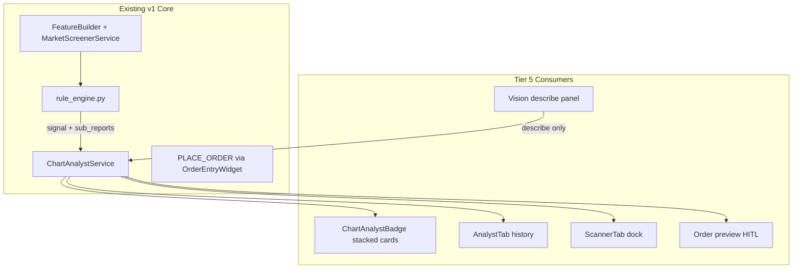
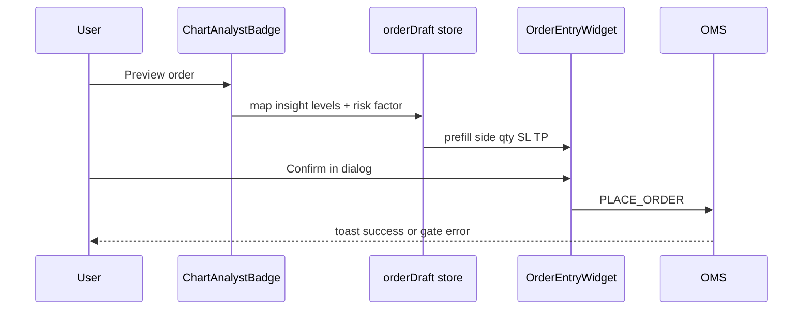
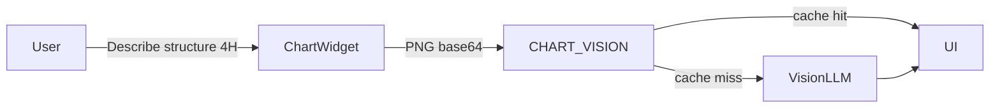

# Tier 5 Intelligence — Integration Plan

Build on the **shipped v1 Chart Analyst** ([`backend/app/services/agent/`](backend/app/services/agent/), [`AnalystTab.jsx`](frontend/src/components/AnalystTab.jsx), [`ChartAnalystBadge.jsx`](frontend/src/components/ChartAnalystBadge.jsx)). Rules remain the sole signal authority; LLM/vision never flip `signal`.



**Non-goals:** Multi-agent orchestration, per-bar vision, auto-trading from analyst UI, bot `RiskGate` on manual orders.

**Recommended build order:** 19 → 21 → 20 → 22 (envelope first; scanner reuses scoring; HITL consumes levels + risk factor; vision is isolated).

---

## 19. Insight envelope v2 (local sub_reports, zero latency hit)

### Current state
[`ChartAgentInsight`](backend/app/services/agent/models.py) is flat: one `score`, flat `reasons`, `levels` from ATR. Scoring lives in [`rule_engine._score_row()`](backend/app/services/agent/rule_engine.py) — RSI + MACD + EMA combined into a single integer.

### Target contract (additive, backward-compatible)

```json
{
  "version": 2,
  "signal": "BUY",
  "score": 3,
  "confidence": 0.75,
  "reasons": ["MACD above signal", "Price above EMA21"],
  "sub_reports": {
    "trend": { "score": 2, "reasons": ["Price above all EMAs (uptrend)"] },
    "momentum": { "score": 1, "reasons": ["MACD above signal"] },
    "risk": {
      "atr_regime": "elevated",
      "suggested_size_factor": 0.8,
      "reasons": ["ATR 1.8× 20-bar median"]
    }
  },
  "levels": { "entry_hint": 42000, "stop_loss_distance": 150, "take_profit_price": 42301 }
}
```

- **`signal` / `score` / `confidence`:** unchanged composite from existing `_bot_signal()` / `_confidence()` — bots and [`ChartAgentStrategy`](backend/app/services/bots/strategies_chart_agent.py) read **only** top-level fields.
- **`sub_reports`:** informational decomposition; same closed bar (`iloc[-2]`).

### Backend integration

| File | Change |
|------|--------|
| [`models.py`](backend/app/services/agent/models.py) | Add optional `version: int = 2`, `sub_reports: dict`; `from_dict()` tolerates v1 payloads (no `sub_reports`) |
| [`rule_engine.py`](backend/app/services/agent/rule_engine.py) | Split `_score_row()` into `_score_trend()`, `_score_momentum()`, `_score_risk()`; return `SubReportResult` dataclass; composite `score = trend.score + momentum.score` (risk does **not** add to signal score) |
| [`rule_engine.py`](backend/app/services/agent/rule_engine.py) | `_risk_report(row, df)`: ATR vs rolling median → `atr_regime` (`normal` / `elevated` / `compressed`); `suggested_size_factor` (e.g. 1.0 / 0.8 / 1.2) |
| [`chart_analyst.py`](backend/app/services/agent/chart_analyst.py) | Pass through `sub_reports` in `analyze()` / `ensure_for_bar()`; persist full JSON in `agent_insights.payload` |
| [`llm_client.py`](backend/app/services/agent/llm_client.py) | Prompt includes `sub_reports` when present; explicit instruction: do not change signal |
| [`frontend/src/utils/indicators.js`](frontend/src/utils/indicators.js) | Optional parity helper for local fallback badge (trend/momentum only; risk stays backend-only or simplified) |

**Domain split (matches existing rule weights):**

| Domain | Inputs | Contributes to `score`? |
|--------|--------|-------------------------|
| Trend | EMA 9/21/50 alignment vs price | Yes |
| Momentum | RSI zones + MACD cross/position | Yes |
| Risk | ATR regime, size factor | No (metadata only) |

### Frontend integration

| File | Change |
|------|--------|
| New [`SubReportCards.jsx`](frontend/src/components/SubReportCards.jsx) | Overview row: signal + confidence + top reason; expandable cards for trend / momentum / risk |
| [`ChartAnalystBadge.jsx`](frontend/src/components/ChartAnalystBadge.jsx) | Popover: summary first; `SubReportCards` on expand |
| [`AnalystTab.jsx`](frontend/src/components/AnalystTab.jsx) | Expanded history row shows stacked cards; v1 rows without `sub_reports` fall back to flat reasons |
| [`useStore.js`](frontend/src/store/useStore.js) | No schema change — same `agentInsights` / `agentInsightHistory` objects |

### Tests
- Extend [`test_chart_agent_rules.py`](backend/tests/test_chart_agent_rules.py): assert domain scores sum to composite; risk never changes `signal`
- Extend [`test_chart_analyze_api.py`](backend/tests/test_chart_analyze_api.py): response includes `sub_reports` when `version >= 2`
- Snapshot test for v1 payload still deserializes

---

## 20. Analyst → action bridges (HITL, separate from bot path)

### Current state
- **Bot bridge exists:** [`ChartWidget.handleDeployChartAgent`](frontend/src/components/ChartWidget.jsx) → prefills `CHART_AGENT` in Algo tab.
- **Manual order path:** [`OrderEntryWidget.jsx`](frontend/src/components/OrderEntryWidget.jsx) → `sendAction(PLACE_ORDER)` → [`handlers/trading.py`](backend/app/api/handlers/trading.py) → OMS ([`sim_oms.py`](backend/app/services/sim_oms.py): $50k cap, balance checks). **Bot `RiskGate` does not apply** to manual orders.

### Integration design (deferred implementation, planned wiring)



### New shared module: [`frontend/src/lib/insightOrderDraft.js`](frontend/src/lib/insightOrderDraft.js)

```js
// insight → { symbol, side, orderType, quantity, stop_loss_price, take_profit_price, sourceInsightId }
buildOrderDraftFromInsight(insight, { tickerPrice, defaultQtyPct, sizeFactor })
```

Mapping rules:
- `side`: `BUY` / `SELL` only; disable for `NONE`
- `quantity`: base allocation × `sub_reports.risk.suggested_size_factor` (default 1.0)
- `stop_loss_price`: `entry ± levels.stop_loss_distance`
- `take_profit_price`: from `levels.take_profit_price`
- `entry`: `levels.entry_hint` or live ticker

### Store + UI hooks

| File | Change |
|------|--------|
| [`useStore.js`](frontend/src/store/useStore.js) | Add `orderDraft: null`, `setOrderDraft(draft)`, `clearOrderDraft()` |
| [`OrderEntryWidget.jsx`](frontend/src/components/OrderEntryWidget.jsx) | `useEffect` consumes `orderDraft` → set side/qty/SL/TP; scroll-into-view optional |
| New [`InsightOrderPreviewDialog.jsx`](frontend/src/components/InsightOrderPreviewDialog.jsx) | Read-only ticket: qty, SL, TP, size factor, signal; Confirm → `setOrderDraft` + focus order panel; Cancel clears |
| [`ChartAnalystBadge.jsx`](frontend/src/components/ChartAnalystBadge.jsx) | Button: **Preview order** (when signal ≠ NONE and levels present) |
| [`AnalystTab.jsx`](frontend/src/components/AnalystTab.jsx) | Same action on expanded row |
| [`ScannerTab.jsx`](frontend/src/components/ScannerTab.jsx) (item 21) | Row action: Preview order |

**Explicit separation from bot path:**
- HITL uses `PLACE_ORDER` + OrderEntryWidget gates only
- Deploy Chart Agent button remains unchanged (`dock-tab: algo`)
- No new backend action required for v1 HITL (optional future `ORDER_PREVIEW` per [`UPGRADE_ROADMAP.md`](docs/UPGRADE_ROADMAP.md) Track A1)

### Acceptance
- Preview never submits without explicit Confirm
- Failed OMS gate surfaces same toasts as manual entry
- `CHART_AGENT` bot config untouched by HITL flow

---

## 21. Screener / Scanner dock tab

### Current state
[`MarketScreenerService`](backend/app/services/bots/screener.py) is **internal only** — used by bot bar-close pipeline and [`FeatureBuilder`](backend/app/services/agent/feature_builder.py). Universe = [`symbolsList`](frontend/src/store/useStore.js) from `terminal_config`. Watchlist filtering pattern in [`WatchlistWidget.jsx`](frontend/src/components/WatchlistWidget.jsx) (category tabs + search + sort).

### Backend integration

| File | Change |
|------|--------|
| New [`backend/app/api/handlers/scanner.py`](backend/app/api/handlers/scanner.py) | `Action.MARKET_SCAN` handler |
| [`protocol.py`](backend/app/api/protocol.py) | `MARKET_SCAN`, `MessageType.SCAN_RESULTS` |
| [`bindings.py`](backend/app/api/bindings.py) + [`transport.js`](frontend/src/api/transport.js) | Register WS + `POST /api/v1/scanner/scan` |
| New [`backend/app/services/scanner/market_scanner.py`](backend/app/services/scanner/market_scanner.py) | Batch orchestrator |

**Scan pipeline (per symbol, sequential or small pool to respect candle fetch cost):**
1. `get_bot_candles(symbol)` (reuse [`candle_source.py`](backend/app/services/agent/candle_source.py))
2. `FeatureBuilder.build()` → `score_dataframe()` (same rules as analyst)
3. Extract row metrics: RSI, MACD cross flag, analyst `signal`/`score`

**Request shape:**
```json
{ "symbols": ["BTCUSDT", "AAPL"], "sort_by": "score", "signal_filter": "any" }
```
Default `symbols`: omit → server uses `ctx.feed.symbols` intersected with request watchlist if provided.

**Response shape:**
```json
{
  "type": "scan_results",
  "data": {
    "scanned_at": "...",
    "rows": [
      {
        "symbol": "BTCUSDT",
        "signal": "BUY",
        "score": 3,
        "rsi": 42.1,
        "macd_cross": "bullish",
        "bar_time": 1700000000,
        "insight_id": "BTCUSDT:1700000000"
      }
    ]
  }
}
```

**Rate limit:** one scan per client per 30s (batch, not per-symbol 10s).

### Frontend integration

| File | Change |
|------|--------|
| New [`ScannerTab.jsx`](frontend/src/components/ScannerTab.jsx) | Toolbar: Scan watchlist / Scan all; filters (category, search, signal filter); sortable table |
| [`ResizableDock.jsx`](frontend/src/components/ResizableDock.jsx) | Add tab `{ id: 'scanner', label: 'Scanner', icon: Radar }` + `ErrorBoundary` |
| [`useStore.js`](frontend/src/store/useStore.js) | `scanResults`, `scanMeta`, `setScanResults()` |
| [`dispatch.js`](frontend/src/api/dispatch.js) | Handle `SCAN_RESULTS` |
| Reuse [`WatchlistWidget.jsx`](frontend/src/components/WatchlistWidget.jsx) helpers | `isCrypto`, `getCategory`, search/sort patterns |

**Row click behavior:**
1. `setActiveSymbol(symbol)`
2. `sendAction(CHART_ANALYZE, { symbol })` if no cached insight for current bar
3. `dispatchEvent('dock-tab', { detail: 'analyst' })` — loads history via existing [`fetchAgentInsights`](frontend/src/api/endpoints.js)

**Tab badge:** count of rows where `signal !== 'NONE'`.

**Persistence rationale:** Scanner tab + watchlist state in Zustand survives chart/navigation changes; scan results cached in store until next Scan (optional `localStorage` TTL later).

---

## 22. Vision agent (on-demand, higher TF, never signal)

### Scope guardrails
- **Trigger:** user button only (Badge or Analyst tab); never bar-close hook
- **Timeframes:** `1h`, `4h` only — reject `1m` in handler
- **Output:** `vision_report: { structure, patterns, notes }` — **no `signal` field**
- **Cache:** Redis/DB key `vision:{symbol}:{timeframe}:{bar_time}` TTL **4h** (config `AGENT_VISION_CACHE_SEC`)
- **Cost:** single LLM vision call per cache miss

### Chart capture strategy (prefer client-side)

ECharts supports `chart.getDataURL({ type: 'png', pixelRatio: 2 })` on the chart instance in [`ChartWidget.jsx`](frontend/src/components/ChartWidget.jsx).



### Backend integration

| File | Change |
|------|--------|
| [`protocol.py`](backend/app/api/protocol.py) | `CHART_VISION`, `MessageType.VISION_REPORT` |
| New [`backend/app/api/handlers/vision.py`](backend/app/api/handlers/vision.py) | Validate TF; rate limit 1/symbol/15min; attach to insight record or separate `vision_reports` table |
| New [`backend/app/services/agent/vision_client.py`](backend/app/services/agent/vision_client.py) | OpenRouter multimodal call; system prompt: describe structure only, no trade advice |
| [`config.py`](backend/app/config.py) | `AGENT_VISION_ENABLED`, `AGENT_VISION_MODEL`, cache TTL |
| [`models.py`](backend/app/services/agent/models.py) | Optional `VisionReport` dataclass linked by `insight_id` or `(symbol, timeframe, bar_time)` |

**Request:**
```json
{
  "symbol": "BTCUSDT",
  "timeframe": "4h",
  "image_base64": "...",
  "bar_time": 1700000000
}
```

**Response:**
```json
{
  "type": "vision_report",
  "data": {
    "symbol": "BTCUSDT",
    "timeframe": "4h",
    "bar_time": 1700000000,
    "structure": "Higher-highs with range compression near resistance",
    "patterns": ["ascending channel", "potential double top forming"],
    "notes": "...",
    "model": "...",
    "cached": false
  }
}
```

### Frontend integration

| File | Change |
|------|--------|
| [`ChartWidget.jsx`](frontend/src/components/ChartWidget.jsx) | Expose `captureChartPng()` via ref or callback; TF switch to 1H/4H before capture |
| [`ChartAnalystBadge.jsx`](frontend/src/components/ChartAnalystBadge.jsx) or Analyst tab | **Describe structure (4H)** button; loading state; show vision text below `SubReportCards` |
| [`useStore.js`](frontend/src/store/useStore.js) | `visionReports[`${symbol}:${timeframe}`]` |

**Hard rule in UI:** vision section labeled **"Structure notes (not a signal)"**; no BUY/SELL badge from vision.

### Fallback
If `AGENT_VISION_ENABLED=false` or no API key: hide button; no server-side chart rendering in v1 (avoids headless browser dependency).

---

## Cross-cutting concerns

| Concern | Approach |
|---------|----------|
| Backward compatibility | v1 clients ignore unknown fields; `from_dict()` defaults `version=1`, `sub_reports=null` |
| Bot path unchanged | `ChartAgentStrategy` reads `signal`, `confidence`, `levels` only |
| Parity | Frontend local fallback may stay flat until item 19 frontend parity is needed |
| Observability | Log `insight_id`, scan batch duration, vision cache hit/miss in existing agent audit pattern |
| Config flags | `AGENT_ENABLED` gates 19; scanner adds `SCANNER_ENABLED`; vision adds `AGENT_VISION_ENABLED` |

---

## Suggested milestones

| Milestone | Items | Est. |
|-----------|-------|------|
| M1 — Explainability | 19 backend + UI cards | 3–4d |
| M2 — Discovery | 21 scanner API + tab | 4–5d |
| M3 — Trust | 20 HITL preview dialog + order draft | 3–4d |
| M4 — Optional depth | 22 vision (client PNG + cache) | 4–5d |

M1 unblocks richer HITL copy ("elevated vol → 80% size"). M2 can start in parallel with M1 backend once `score_dataframe` export is stable.
