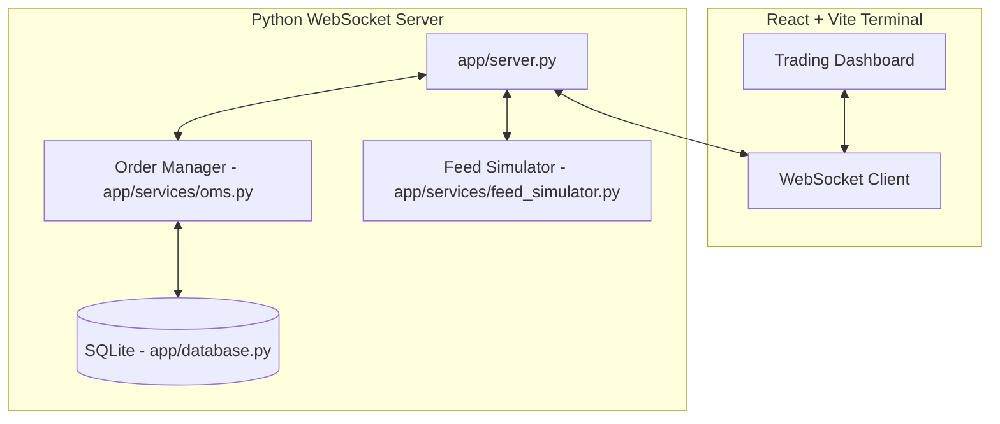

# Real-Time Trading Terminal & Order Management System (OMS)

A high-performance, real-time trading simulator and terminal featuring a Python WebSocket backend and a dynamic React + Vite frontend. The terminal supports real-time market data feed simulation, a limit and market order book, execution tracking, and FIFO-based realized Profit & Loss (P&L) calculations.

---

## Architecture Overview



### 1. Backend (Python + WebSockets)
- **`main.py`**: The entry point to start the WebSocket application.
- **`app/config.py`**: Centralizes system configuration, pre-trade risk limits, and symbol parameters.
- **`app/database.py`**: Sets up and manages the local SQLite database (`trading.db`) to persist trade executions and history.
- **`app/services/oms.py`**: The Order Management System (OMS). It tracks account balances, manages active order books, executes market orders, tracks limit orders, matches orders against market updates, and computes FIFO realized P&L.
- **`app/services/feed_simulator.py`**: Simulates real-time price feeds, order books, and OHLCV candlestick data for multiple trading symbols.
- **`app/websocket/`**: Houses the `ConnectionManager` and WebSocket client message routing handlers.

### 2. Frontend (React + Vite)
- Built on React with Vite for hot-module reloading (HMR) and fast build execution.
- Subscribes to backend market broadcasts to update live pricing charts and order books.
- Allows placing/canceling orders and viewing live trade logs, account balances, and P&L metrics.

---

## Getting Started

### Prerequisites
- **Python 3.10+**
- **Node.js 18+** & **npm**

### Setup & Run Backend

1. Navigate to the backend directory:
   ```bash
   cd backend
   ```

2. Create a virtual environment and activate it:
   ```bash
   # On Windows (PowerShell)
   python -m venv .venv
   .venv\Scripts\Activate.ps1

   # On macOS/Linux
   python3 -m venv .venv
   source .venv/bin/activate
   ```

3. Install required dependencies (such as `websockets`):
   ```bash
   pip install websockets
   ```

4. Start the WebSocket server:
   ```bash
   python main.py
   ```
   The server will start listening on `ws://localhost:8765`.

### Setup & Run Frontend

1. Navigate to the frontend directory:
   ```bash
   cd frontend
   ```

2. Install dependencies:
   ```bash
   npm install
   ```

3. Run the development server:
   ```bash
   npm run dev
   ```
   Open the displayed URL (usually `http://localhost:5173`) in your browser.

---

## Production Adaptation Note
The backend includes a `LiveFeedAdapter` stub (`server.py`), showcasing how the terminal can be updated to fetch and normalize live WebSocket feeds from production exchanges such as Binance or Alpaca APIs.
