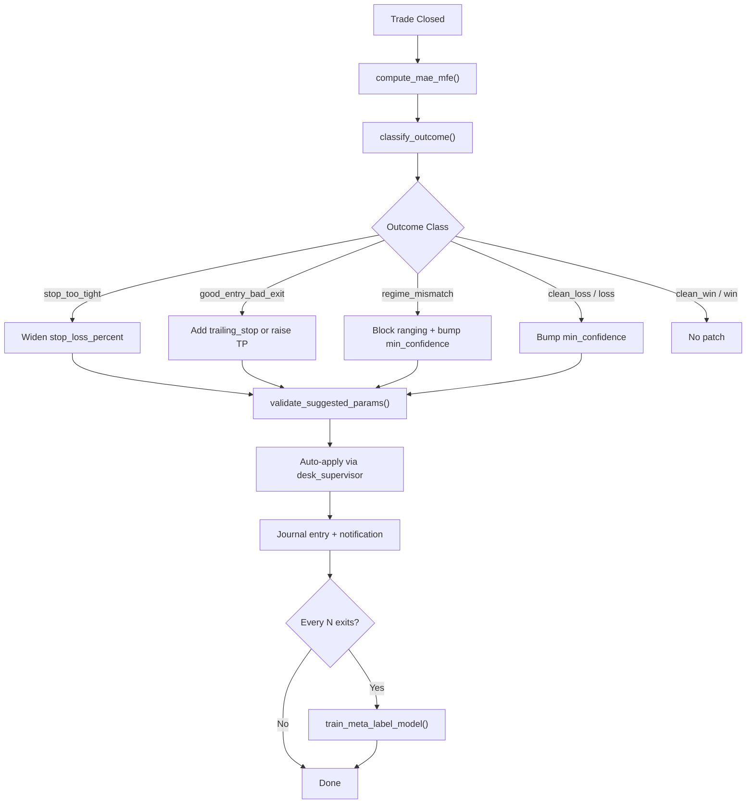
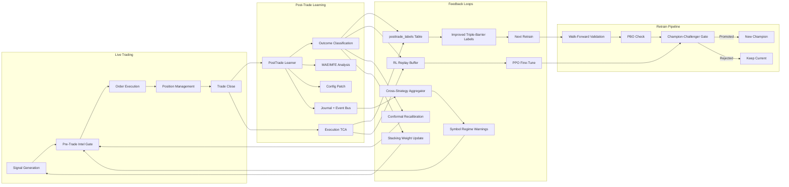

# AI Fine-Tuning & Post-Trade Learning — Implementation Feasibility Report

**Document:** AI-FT-PTL-001  
**Project:** Antigravity Trading Terminal  
**Date:** 16 August 2026  
**Classification:** Internal — Engineering  

---

## 1. Executive Summary

This report provides a systematic review of the Antigravity Trading Terminal's existing AI/ML capabilities and assesses the implementation feasibility of **fine-tuning** and **post-trade learning** across all model families. The application already has substantial infrastructure for both. This report identifies where each capability is **production-ready**, where it is **partially implemented and extensible**, and where **new work is required** — with concrete implementation specifications for each.

> [!IMPORTANT]
> The terminal's AI stack is mature. The recommendations in this report are incremental enhancements to existing infrastructure, not greenfield builds. Estimated implementation effort across all items is **8–14 engineering weeks**.

---

## 2. Current AI Feature Inventory

### 2.1 ML Model Registry

Source: [ml_registry.py](file:///c:/Users/Dhimeji01/.gemini/antigravity/scratch/trading-terminal/backend/app/services/bots/ml_registry.py)

The platform supports **seven trainable ML strategies** and one ensemble orchestrator:

| Strategy ID | Model Type | Artifact Format | Training Method |
|---|---|---|---|
| `ML_SIGNAL_BOOST` | HistGradientBoosting (sklearn) | `.joblib` | Supervised classification |
| `LSTM_DIRECTION` | LSTM (PyTorch → ONNX) | `.onnx` + `scaler.json` | Sequence-to-label |
| `RL_PPO_AGENT` | Actor-Critic PPO (PyTorch → ONNX) | `.onnx` + `scaler.json` | Reinforcement learning |
| `TCN_MULTI_HORIZON` | Temporal Convolutional Network | `.onnx` + `scaler.json` | Multi-horizon regression |
| `VAE_REGIME_DETECTOR` | Variational Autoencoder | `.onnx` + `scaler.json` | Unsupervised regime clustering |
| `TRANSFORMER_SIGNAL` | Transformer encoder | `.onnx` + `scaler.json` | Supervised classification |
| `GNN_CROSS_ASSET` | Graph Neural Network | `.onnx` + `scaler.json` | Cross-asset relational learning |
| `HYBRID_ENSEMBLE` | Weighted voting / stacking | In-memory | Multi-model combination |

Additionally, the **Meta-Label GBM** ([meta_label_model.py](file:///c:/Users/Dhimeji01/.gemini/antigravity/scratch/trading-terminal/backend/app/services/bots/meta_label_model.py)) is a secondary gradient-boosted classifier that predicts P(win) for any strategy's entry setups, using 28 features including sentiment, regime, and temporal encoding.

### 2.2 Existing Training Infrastructure

| Capability | Module | Status |
|---|---|---|
| Process-isolated training | [ml_train_executor.py](file:///c:/Users/Dhimeji01/.gemini/antigravity/scratch/trading-terminal/backend/app/services/bots/ml_train_executor.py) | ✅ Production |
| Walk-forward validation (purged CV) | [ml_walk_forward_validator.py](file:///c:/Users/Dhimeji01/.gemini/antigravity/scratch/trading-terminal/backend/app/services/bots/ml_walk_forward_validator.py) | ✅ Production |
| PBO overfitting detection | [ml_pbo_validator.py](file:///c:/Users/Dhimeji01/.gemini/antigravity/scratch/trading-terminal/backend/app/services/bots/ml_pbo_validator.py) | ✅ Production |
| Optuna hyperparameter sweep | [ml_hyperparam_sweep.py](file:///c:/Users/Dhimeji01/.gemini/antigravity/scratch/trading-terminal/backend/app/services/bots/ml_hyperparam_sweep.py) | ✅ Production |
| Model versioning & snapshots | [ml_model_artifacts.py](file:///c:/Users/Dhimeji01/.gemini/antigravity/scratch/trading-terminal/backend/app/services/bots/ml_model_artifacts.py) | ✅ Production |
| Champion-challenger promotion | [model_promotion.py](file:///c:/Users/Dhimeji01/.gemini/antigravity/scratch/trading-terminal/backend/app/services/bots/model_promotion.py) | ✅ Production |
| Feature drift detection (PSI) | [ml_feature_drift.py](file:///c:/Users/Dhimeji01/.gemini/antigravity/scratch/trading-terminal/backend/app/services/bots/ml_feature_drift.py) | ✅ Production |
| Auto-retrain scheduler | [ml_retrain_scheduler.py](file:///c:/Users/Dhimeji01/.gemini/antigravity/scratch/trading-terminal/backend/app/services/bots/ml_retrain_scheduler.py) | ✅ Production |
| Alpha decay monitor | [alpha_decay.py](file:///c:/Users/Dhimeji01/.gemini/antigravity/scratch/trading-terminal/backend/app/services/bots/alpha_decay.py) | ✅ Production |
| ONNX runtime inference | [ml_onnx_runtime.py](file:///c:/Users/Dhimeji01/.gemini/antigravity/scratch/trading-terminal/backend/app/services/bots/ml_onnx_runtime.py) | ✅ Production |

### 2.3 Existing Post-Trade Learning Infrastructure

| Capability | Module | Status |
|---|---|---|
| Post-trade lesson generation | [posttrade_learner.py](file:///c:/Users/Dhimeji01/.gemini/antigravity/scratch/trading-terminal/backend/app/services/bots/posttrade_learner.py) | ✅ Production |
| MAE/MFE excursion analysis | `compute_mae_mfe()` in posttrade_learner | ✅ Production |
| Outcome classification (7 classes) | `classify_outcome()` in posttrade_learner | ✅ Production |
| Automatic config patching | `build_config_patch()` in posttrade_learner | ✅ Production |
| LLM-generated trade narratives | `_llm_lesson()` in posttrade_learner | ✅ Production |
| Periodic meta-label retrain trigger | Integrated in `learn_from_closed_trade()` | ✅ Production |
| Trade calibration buckets | [calibration.py](file:///c:/Users/Dhimeji01/.gemini/antigravity/scratch/trading-terminal/backend/app/services/bots/calibration.py) | ✅ Production |
| Conformal prediction gating | [conformal_gate.py](file:///c:/Users/Dhimeji01/.gemini/antigravity/scratch/trading-terminal/backend/app/services/bots/conformal_gate.py) | ✅ Production |
| Execution TCA telemetry | [execution_tca.py](file:///c:/Users/Dhimeji01/.gemini/antigravity/scratch/trading-terminal/backend/app/services/bots/execution_tca.py) | ✅ Production |

### 2.4 Agent & LLM Infrastructure

| Capability | Module | Status |
|---|---|---|
| Trade Copilot (intent → tools → narrate) | [copilot.py](file:///c:/Users/Dhimeji01/.gemini/antigravity/scratch/trading-terminal/backend/app/services/agent/copilot.py) | ✅ Production |
| Pre-trade intelligence agent | [pretrade_intel.py](file:///c:/Users/Dhimeji01/.gemini/antigravity/scratch/trading-terminal/backend/app/services/bots/pretrade_intel.py) | ✅ Production |
| HMM regime gate | [hmm_regime.py](file:///c:/Users/Dhimeji01/.gemini/antigravity/scratch/trading-terminal/backend/app/services/bots/hmm_regime.py) | ✅ Production |
| Agent reasoning pipeline | [reasoning.py](file:///c:/Users/Dhimeji01/.gemini/antigravity/scratch/trading-terminal/backend/app/services/agent/reasoning.py) | ✅ Production |
| Agent event bus | [agent_event_bus.py](file:///c:/Users/Dhimeji01/.gemini/antigravity/scratch/trading-terminal/backend/app/services/agent/agent_event_bus.py) | ✅ Production |
| Desk supervisor (approval workflow) | [desk_supervisor.py](file:///c:/Users/Dhimeji01/.gemini/antigravity/scratch/trading-terminal/backend/app/services/agent/desk_supervisor.py) | ✅ Production |
| Stacking meta-learner | [stacking_meta_learner.py](file:///c:/Users/Dhimeji01/.gemini/antigravity/scratch/trading-terminal/backend/app/services/bots/stacking_meta_learner.py) | ✅ Production |

---

## 3. Fine-Tuning Opportunities

### 3.1 Supervised Models (ML_SIGNAL_BOOST, LSTM, Transformer, TCN, GNN)

#### 3.1.1 Online / Incremental Fine-Tuning

**Current State:** All supervised models retrain from scratch on the full walk-forward window. The retrain scheduler ([ml_retrain_scheduler.py](file:///c:/Users/Dhimeji01/.gemini/antigravity/scratch/trading-terminal/backend/app/services/bots/ml_retrain_scheduler.py)) enforces a 24h cooldown and queues jobs via `request_retrain()`. Models are retrained when they go stale (>168h), alpha decays beyond 0.4, or feature drift PSI exceeds 0.25.

**Implementation Opportunity — Warm-Start Fine-Tuning:**

| Attribute | Specification |
|---|---|
| **Objective** | Resume training from the current champion's weights on new data instead of cold-starting |
| **Applicable Models** | LSTM_DIRECTION, TRANSFORMER_SIGNAL, TCN_MULTI_HORIZON, GNN_CROSS_ASSET (PyTorch) |
| **Mechanism** | Load `.onnx` → deserialize to PyTorch `state_dict` → fine-tune for N epochs on the latest walk-forward OOS fold → re-export to ONNX |
| **Infrastructure Needed** | (1) Store PyTorch `.pt` checkpoint alongside ONNX artifact; (2) Add `warm_start=True` parameter to each trainer; (3) Reduce learning rate by 10× for fine-tune epochs; (4) Apply gradient clipping at 1.0 |
| **Risk Controls** | Champion-challenger gate (already in [model_promotion.py](file:///c:/Users/Dhimeji01/.gemini/antigravity/scratch/trading-terminal/backend/app/services/bots/model_promotion.py)) blocks promotion if OOS metric degrades ≥5%. Walk-forward + PBO validation runs post-fine-tune. |
| **Effort** | 2–3 weeks |
| **Feasibility** | ✅ **High** — the training executor, versioning, and promotion infrastructure are all in place |

**Implementation Opportunity — Incremental GBM Boosting:**

| Attribute | Specification |
|---|---|
| **Objective** | Add boosting rounds to the existing ML_SIGNAL_BOOST HistGBM ensemble on new trade data |
| **Applicable Models** | ML_SIGNAL_BOOST (sklearn HistGradientBoosting) |
| **Mechanism** | sklearn's `HistGradientBoostingClassifier` supports `warm_start=True` with `max_iter` increased. Load `.joblib` → set `warm_start=True` → increase `max_iter` by Δ rounds → `fit()` on the latest walk-forward window |
| **Risk Controls** | Monotonic feature constraints; early stopping on OOS holdout; PBO gate |
| **Effort** | 1 week |
| **Feasibility** | ✅ **High** — direct sklearn API, no custom serialization needed |

#### 3.1.2 Hyperparameter Fine-Tuning

**Current State:** Optuna TPE sweeps ([ml_hyperparam_sweep.py](file:///c:/Users/Dhimeji01/.gemini/antigravity/scratch/trading-terminal/backend/app/services/bots/ml_hyperparam_sweep.py)) already cover all seven ML strategies with strategy-specific search spaces. Multi-fidelity screening (ASHA-like budget caps) prunes poor trials early.

**Implementation Opportunity — Successive Halving with Transfer:**

| Attribute | Specification |
|---|---|
| **Objective** | Warm-start Optuna studies from previous symbol/timeframe runs to accelerate convergence |
| **Mechanism** | Persist Optuna study `.db` files per symbol×strategy×timeframe. On retrain, load the previous study and add N new trials seeded from the best historic configuration |
| **Infrastructure Needed** | (1) Optuna storage backend switch from in-memory to SQLite (one `.db` per model root); (2) Study name convention: `{strategy}_{symbol}_{timeframe}` |
| **Effort** | 1–2 weeks |
| **Feasibility** | ✅ **High** — Optuna natively supports `load_study` + `enqueue_trial` |

### 3.2 Reinforcement Learning (RL_PPO_AGENT)

**Current State:** The PPO agent ([rl_ppo_trainer.py](file:///c:/Users/Dhimeji01/.gemini/antigravity/scratch/trading-terminal/backend/app/services/bots/rl_ppo_trainer.py)) trains an Actor-Critic network on episodes from `TradingEnv` ([rl_trading_env.py](file:///c:/Users/Dhimeji01/.gemini/antigravity/scratch/trading-terminal/backend/app/services/bots/rl_trading_env.py)). Episodes are capped at 2048 steps. The reward function accounts for trade costs, holding costs, and PnL.

**Implementation Opportunity — Continual RL Fine-Tuning with Replay Buffer:**

| Attribute | Specification |
|---|---|
| **Objective** | Continually update PPO policy from live trade outcomes without full retrain |
| **Mechanism** | (1) Record (state, action, reward, next_state) tuples from live trading into a persistent replay buffer (ring buffer, 50k transitions); (2) On retrain trigger, run 3–5 PPO update epochs on sampled mini-batches from the replay buffer + latest candle episodes; (3) Apply KL-divergence constraint (β=0.01) between old and new policy to prevent catastrophic forgetting |
| **Infrastructure Needed** | (1) `ReplayStore` class persisting transitions to SQLite or flat files under `data/rl_replay/`; (2) Live hook in `positions.py` to write (obs, action, reward) on trade close; (3) Modified `train_ppo_agent()` accepting `replay_buffer` parameter |
| **Risk Controls** | Maximum KL divergence per update (reject update if KLD > 0.05). Champion-challenger gate. Minimum 1000 replay transitions before first fine-tune. |
| **Effort** | 3–4 weeks |
| **Feasibility** | ✅ **High** — `TradingEnv` already exposes the Gymnasium-style API; replay buffer is a standard extension |

**Implementation Opportunity — Reward Shaping from Post-Trade Lessons:**

| Attribute | Specification |
|---|---|
| **Objective** | Feed outcome classifications from the post-trade learner into the RL reward function |
| **Mechanism** | Map `outcome_class` → reward modifier: `clean_win → +0.2 bonus`, `regime_mismatch → -0.3 penalty`, `stop_too_tight → -0.1`, `good_entry_bad_exit → -0.15`. Inject as auxiliary reward term during replay-based fine-tuning |
| **Infrastructure Needed** | Outcome class field in replay buffer; modified `_compute_reward()` in `TradingEnv` |
| **Effort** | 1 week (additive to replay buffer work) |
| **Feasibility** | ✅ **High** — post-trade outcomes are already classified and stored |

### 3.3 Unsupervised Models (VAE_REGIME_DETECTOR, HMM Regime Gate)

**Current State:** The VAE ([ml_vae_regime.py](file:///c:/Users/Dhimeji01/.gemini/antigravity/scratch/trading-terminal/backend/app/services/bots/ml_vae_regime.py)) learns latent regime representations. The HMM gate ([hmm_regime.py](file:///c:/Users/Dhimeji01/.gemini/antigravity/scratch/trading-terminal/backend/app/services/bots/hmm_regime.py)) uses a Gaussian mixture on (log-return, rolling-vol) for soft regime classification.

**Implementation Opportunity — Adaptive Regime Boundary Calibration:**

| Attribute | Specification |
|---|---|
| **Objective** | Fine-tune regime cluster centroids and covariances as market structure evolves |
| **Mechanism** | Exponential moving average update of mixture parameters: `μ_new = (1-α)μ_old + α·μ_batch`, with α=0.05, computed on a rolling 500-bar window every 24h |
| **Risk Controls** | Floor on component weight (min 5%); maximum centroid shift per update (2σ); alert if regime count changes |
| **Effort** | 1 week |
| **Feasibility** | ✅ **High** — `RegimeModel` already stores means and covariances in serializable form |

### 3.4 Meta-Label & Calibration Models

**Current State:** The meta-label model is a GBM that predicts P(win) using 28 features (sentiment, regime, temporal). It retrains every N exits (configurable via `POSTTRADE_LEARNER_RETRAIN_EVERY_N`). Calibration buckets in [calibration.py](file:///c:/Users/Dhimeji01/.gemini/antigravity/scratch/trading-terminal/backend/app/services/bots/calibration.py) compute Wilson-bound win rates per score/confidence bucket.

**Implementation Opportunity — Isotonic Calibration Layer:**

| Attribute | Specification |
|---|---|
| **Objective** | Add a post-hoc calibration layer (isotonic regression) to meta-label probabilities so that a predicted 70% P(win) actually wins 70% of the time |
| **Mechanism** | After each meta-label retrain, hold out 20% of predictions and fit `sklearn.isotonic.IsotonicRegression`. Store as `calibrator.joblib` alongside the model |
| **Effort** | 1 week |
| **Feasibility** | ✅ **High** — the calibration module already partitions trade data into buckets |

### 3.5 LLM / Copilot Fine-Tuning

**Current State:** The Trade Copilot ([copilot.py](file:///c:/Users/Dhimeji01/.gemini/antigravity/scratch/trading-terminal/backend/app/services/agent/copilot.py)) uses external LLM APIs via `_chat()`. Post-trade lessons also use LLM narration. The system prompt is hardcoded.

**Implementation Opportunity — Domain-Specific Prompt Library & Few-Shot Tuning:**

| Attribute | Specification |
|---|---|
| **Objective** | Improve copilot response quality for trading-specific queries via curated few-shot examples and dynamic prompt construction |
| **Mechanism** | (1) Build a `prompt_library/` directory with versioned system prompts + few-shot exemplars per intent type (analysis, explain, action); (2) Retrieve best-matching exemplars via embedding similarity on the user query; (3) Log user corrections as negative examples for prompt refinement |
| **Effort** | 2 weeks |
| **Feasibility** | ✅ **High** — no model weight changes; pure prompt engineering with retrieval |

**Implementation Opportunity — LoRA Fine-Tune of Local Embedding Model:**

| Attribute | Specification |
|---|---|
| **Objective** | Fine-tune a local embedding model for intent classification to reduce LLM API calls |
| **Mechanism** | Collect (user_query, intent_label, tool_call) tuples from copilot logs. Fine-tune a small sentence-transformer (e.g., `all-MiniLM-L6-v2`) with LoRA adapters on these pairs. Use the tuned embeddings for intent routing; only invoke LLM for narration |
| **Effort** | 2–3 weeks |
| **Feasibility** | 🟡 **Medium** — requires sufficient log volume (>1000 labeled examples) and a LoRA training pipeline |

---

## 4. Post-Trade Learning Enhancements

### 4.1 Current Post-Trade Learning Flow

### 4.2 Enhancement: Closed-Loop Feature Feedback

| Attribute | Specification |
|---|---|
| **Objective** | Feed post-trade outcomes back into the ML feature engineering pipeline as new training labels with improved quality |
| **Current Gap** | Triple-barrier labels ([ml_triple_barrier.py](file:///c:/Users/Dhimeji01/.gemini/antigravity/scratch/trading-terminal/backend/app/services/bots/ml_triple_barrier.py)) are computed from price action alone. Post-trade classification adds regime context, MAE/MFE analysis, and execution quality — none of which feed back to the labelling step |
| **Mechanism** | (1) After `learn_from_closed_trade()` completes, write a `(bar_time, symbol, outcome_class, mae, mfe, execution_shortfall_bps)` record to a new `posttrade_labels` table; (2) During next retrain, the triple-barrier labeller reads this table and: (a) adjusts barrier widths per-symbol based on median MAE/MFE; (b) downsample or upweight samples from hostile regimes; (c) exclude bars with severe execution shortfall (>50bps) as unreliable labels |
| **Effort** | 2 weeks |
| **Feasibility** | ✅ **High** — posttrade_learner already writes to journal; adding a structured table is incremental |

### 4.3 Enhancement: Execution-Aware Reward Feedback

| Attribute | Specification |
|---|---|
| **Objective** | Incorporate implementation shortfall (IS) data from [execution_tca.py](file:///c:/Users/Dhimeji01/.gemini/antigravity/scratch/trading-terminal/backend/app/services/bots/execution_tca.py) into model training labels and RL rewards |
| **Current Gap** | TCA captures `delay_bps`, `spread_bps`, `impact_bps`, and `opp_bps` per order but these do not flow into any training loop |
| **Mechanism** | (1) Aggregate mean IS per symbol×timeframe over the trailing 30d; (2) Subtract aggregate IS from gross PnL when computing RL rewards; (3) For supervised models, adjust triple-barrier take-profit thresholds by adding the expected IS cost (conservative labelling) |
| **Effort** | 1–2 weeks |
| **Feasibility** | ✅ **High** — TCA data is already stored in `execution_quality_log` |

### 4.4 Enhancement: Cross-Strategy Learning Transfer

| Attribute | Specification |
|---|---|
| **Objective** | Share post-trade lessons and regime insights across bots trading the same symbol |
| **Current Gap** | Each bot's post-trade learner operates independently. A regime_mismatch lesson on Bot A doesn't benefit Bot B on the same symbol |
| **Mechanism** | (1) Publish `POSTTRADE_LESSON` events (already done via `agent_event_bus`); (2) Add a subscriber that aggregates symbol-level regime statistics; (3) When a symbol accumulates ≥3 regime_mismatch lessons in 24h, broadcast a symbol-wide `REGIME_WARNING` event that all bots on that symbol can consume to increase their `min_confidence` |
| **Infrastructure** | [agent_event_subscribers.py](file:///c:/Users/Dhimeji01/.gemini/antigravity/scratch/trading-terminal/backend/app/services/bots/agent_event_subscribers.py) already implements subscriber patterns |
| **Effort** | 1 week |
| **Feasibility** | ✅ **High** — event bus + subscriber pattern exist |

### 4.5 Enhancement: Adaptive Conformal Gate Recalibration

| Attribute | Specification |
|---|---|
| **Objective** | Automatically recalibrate the conformal gate's `q_hat` threshold as post-trade data accumulates |
| **Current Gap** | Conformal calibration ([conformal_gate.py](file:///c:/Users/Dhimeji01/.gemini/antigravity/scratch/trading-terminal/backend/app/services/bots/conformal_gate.py)) is fitted once during training. As the model's calibration drifts, the gate may become too permissive or too restrictive |
| **Mechanism** | (1) After every 50 closed trades, recompute nonconformity scores on the last 200 predictions vs. outcomes; (2) Update `q_hat` via exponential smoothing: `q_hat_new = 0.8·q_hat_old + 0.2·q_hat_recent`; (3) Persist updated calibration alongside model artifacts |
| **Effort** | 1 week |
| **Feasibility** | ✅ **High** — conformal gate already exposes `ConformalCalibration` dataclass with serialization |

### 4.6 Enhancement: Stacking Meta-Learner Online Update

| Attribute | Specification |
|---|---|
| **Objective** | Update ensemble combination weights from live trade outcomes without full retrain |
| **Current Gap** | The stacking meta-learner ([stacking_meta_learner.py](file:///c:/Users/Dhimeji01/.gemini/antigravity/scratch/trading-terminal/backend/app/services/bots/stacking_meta_learner.py)) computes inverse-MSE or gating weights from OOS data at train time. Live performance drift is not reflected |
| **Mechanism** | (1) Record each base learner's prediction alongside the trade outcome in a ring buffer (last 500 trades); (2) Every 100 trades, recompute inverse-MSE weights from the buffer; (3) If gating mode is active, re-fit the logistic gating coefficients on the buffer |
| **Effort** | 1–2 weeks |
| **Feasibility** | ✅ **High** — `StackingModel` has `to_dict()` / `from_dict()` serialization |

---

## 5. Implementation Priority Matrix

| # | Enhancement | Effort | Impact | Risk | Priority |
|---|---|---|---|---|---|
| 1 | Warm-start fine-tuning (PyTorch models) | 2–3 wk | High — 40-60% faster retrain, better adaptation | Low | **P0** |
| 2 | Incremental GBM boosting | 1 wk | Medium — faster ML_SIGNAL_BOOST updates | Low | **P0** |
| 3 | Closed-loop feature feedback (posttrade → labels) | 2 wk | High — directly improves label quality | Medium | **P0** |
| 4 | RL replay buffer + continual fine-tuning | 3–4 wk | High — RL adapts to live markets | Medium | **P1** |
| 5 | Reward shaping from post-trade lessons | 1 wk | Medium — ties RL to outcome analysis | Low | **P1** |
| 6 | Execution-aware reward feedback (TCA → training) | 1–2 wk | Medium — realistic cost modeling | Low | **P1** |
| 7 | Adaptive conformal gate recalibration | 1 wk | Medium — prevents stale confidence floors | Low | **P1** |
| 8 | Cross-strategy learning transfer | 1 wk | Medium — portfolio-level risk intelligence | Low | **P1** |
| 9 | Stacking meta-learner online update | 1–2 wk | Medium — ensemble stays calibrated | Low | **P2** |
| 10 | Adaptive regime boundary calibration | 1 wk | Low-Medium — soft gate stays aligned | Low | **P2** |
| 11 | Optuna study persistence & transfer | 1–2 wk | Medium — faster sweep convergence | Low | **P2** |
| 12 | Isotonic calibration layer (meta-label) | 1 wk | Medium — better P(win) calibration | Low | **P2** |
| 13 | Domain-specific prompt library | 2 wk | Medium — copilot quality | Low | **P2** |
| 14 | LoRA embedding fine-tune (copilot) | 2–3 wk | Medium — reduced API cost | Medium | **P3** |

---

## 6. Architecture for Post-Trade Learning Loop

The following architecture integrates all proposed enhancements into a unified feedback loop:

---

## 7. Risk Mitigations

| Risk | Mitigation | Already in Place? |
|---|---|---|
| Catastrophic forgetting during fine-tuning | KL-divergence constraint for RL; champion-challenger gate for supervised | Partially (champion gate ✅; KL constraint needs implementation) |
| Overfitting to recent trades | Walk-forward + PBO validation on every retrain; minimum sample thresholds | ✅ Yes |
| Feedback loop instability (post-trade → labels → model → trades) | Dampened updates (EMA α ≤ 0.2); cooldown periods (24h default); minimum trade counts before adaptation | ✅ Yes (cooldown, min trades) |
| Stale model deployed after failed fine-tune | Model versioning + rollback via `activate_model_version()`; validation sidecar fingerprints | ✅ Yes |
| Feature drift invalidating fine-tuned models | PSI monitoring triggers full retrain when drift > 0.25 | ✅ Yes |
| LLM hallucination in trade lessons | Contradiction detector (`_lesson_contradicts_outcome`) + template fallback | ✅ Yes |

---

## 8. Prerequisites & Dependencies

| Requirement | Current Status | Action Needed |
|---|---|---|
| PyTorch ≥ 2.3.0 | Optional dependency, used by LSTM/PPO/TCN/Transformer/GNN trainers | None (already supported) |
| ONNX Runtime ≥ 1.18.0 | Used for inference | None |
| Optuna ≥ 3.0 | Used by hyperparam sweep | Add SQLite storage backend for study persistence |
| scikit-learn | Used by ML_SIGNAL_BOOST + meta-label | None |
| SQLite | Primary database | Add `posttrade_labels` and `rl_replay` tables |
| Disk space for replay buffer | ~200MB for 50k RL transitions | Acceptable |
| Disk space for Optuna studies | ~10MB per study | Acceptable |

---

## 9. Conclusion

The Antigravity Trading Terminal already possesses a mature, production-grade AI/ML infrastructure encompassing seven model families, comprehensive validation (walk-forward, PBO, conformal), and a working post-trade learning agent. The enhancements proposed in this report are **incremental extensions** to existing infrastructure — not speculative greenfield work. Every recommendation has a concrete implementation path rooted in modules that already exist in the codebase.

The highest-impact investments are:

1. **Warm-start fine-tuning** for PyTorch models — cuts retrain latency and improves adaptation without full cold-start.
2. **Closed-loop feature feedback** — the single most impactful quality improvement, connecting post-trade intelligence directly to training labels.
3. **RL replay buffer** — enables the PPO agent to learn from live trading experience continuously.

These three items collectively represent approximately **7–9 weeks of engineering effort** and address the most material gaps between the current system's capability and a fully closed-loop adaptive trading platform.

---

*End of report.*
