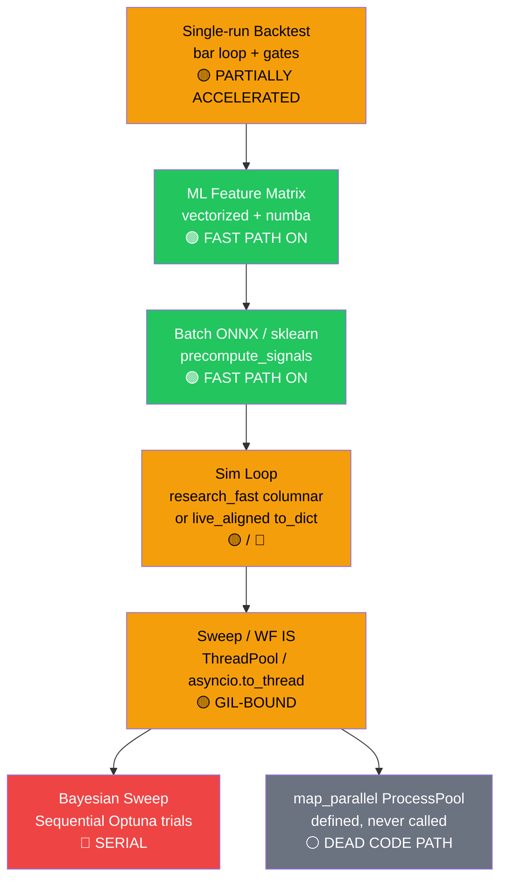

# Backtest Performance Deep-Dive: Bottleneck Analysis & GPU/Multi-Core Acceleration

> **Status:** Core research-path accelerations landed (2026-08-02) — batch ONNX, vectorized/numba features, `research_fast` columnar loop (+ volume + gate hydration), CUDA research opt-in, slim polls / progress heartbeats. WF IS ProcessPool shortcut stays **removed** (Tier A: ThreadPool-only). `map_parallel()` exists but is **unused** by call sites. Companion ML-train analysis: [OPTIMIZER_PERFORMANCE_ANALYSIS.md](./OPTIMIZER_PERFORMANCE_ANALYSIS.md).  
> **Created:** 2026-08-02  
> **Scope:** Backend backtest compute pipeline — single-run sim, ML batch precompute, sweep / walk-forward / portfolio / Bayesian paths, job progress/cancel, and research vs live_aligned device policy

---

## Executive Summary

Backtests feel slow for two different reasons: **(1) single-run ML bars** still spend most wall time in feature build + Python bar-loop bookkeeping even after batch ONNX, and **(2) combo sweeps** are only **thread-parallel** (GIL-bound) — `map_parallel()`’s ProcessPool path is never called, and WF IS explicitly forbids ProcessPool. Available multi-core CPU and GPU are therefore underutilized on the hottest paths.



**6 bottlenecks identified. Estimated remaining speedup with open fixes: 2–5× on multi-core CPU sweeps, 2–6× on research ML single-runs (GPU + lean sim_mode), 3–10× combined on long 1m ML + grid WF.**

Already-shipped research accelerations (batch + vectorized + numba + `research_fast`) typically deliver **~2–5×** vs naive per-bar evaluate on inference-heavy stretches — see `backtest_perf.estimate_backtest_seconds` comments and `tools/bench_backtest.py`.

---

## System Architecture (Current State)

### Compute Path

```
User clicks "Run Backtest" / "Optimize" (AlgoPanel / Backtest Lab)
  └─ Frontend (watchBacktestJob — slim polls include_results=0)
       └─ WS RUN_BACKTEST  OR  deferred job via bots.py handler
            └─ classify_backtest_tier()  →  inline | deferred
                 └─ resolve_backtest_candles → screener.process_candles (indicator DF)
                      └─ optional indicator fingerprint warm-cache (sweeps)
                 └─ BacktesterService.run_backtest / run_walk_forward / portfolio
                      └─ backtester.py
                           ├─ sim_mode: live_aligned | research | research_fast
                           ├─ try_precompute_signals_from_df()  [if batch ML]
                           │    └─ ml_feature_engineering (vectorized/numba)
                           │    └─ ml_batch_inference + ONNX (CUDA only if research*)
                           └─ bar loop (exits, cancel, progress, gates)
                                ├─ research_fast + precomputed → columnar OHLCV+ATR
                                └─ else → df.iloc[i].to_dict()
                 └─ Sweep paths:
                      ├─ Non-WF grid: asyncio.Semaphore + to_thread (thread workers)
                      ├─ WF IS grid: ThreadPoolExecutor only (Tier A)
                      ├─ Portfolio symbols: ThreadPoolExecutor
                      └─ Bayesian: sequential Optuna ask/tell
```

### Current Config Defaults

| Config | Default | Source | Effect |
|--------|---------|--------|--------|
| `BACKTEST_PARALLEL_WORKERS` | **min(cpu_count, 8)** | [config.py:L217](file:///c:/Users/Dhimeji01/.gemini/antigravity/scratch/trading-terminal/backend/app/config.py#L217) | Sweep / portfolio / WF IS worker count |
| `BACKTEST_PARALLEL_MAX` | **16** | [config.py:L219](file:///c:/Users/Dhimeji01/.gemini/antigravity/scratch/trading-terminal/backend/app/config.py#L219) | Hard cap (also clamped to 32 in code) |
| `BACKTEST_PARALLEL_BACKEND` | **auto** | [config.py:L223](file:///c:/Users/Dhimeji01/.gemini/antigravity/scratch/trading-terminal/backend/app/config.py#L223) | Process unless CUDA session loaded — **only used by unused `map_parallel()`** |
| `BACKTEST_BATCH_INFERENCE` | **true** | [config.py:L225](file:///c:/Users/Dhimeji01/.gemini/antigravity/scratch/trading-terminal/backend/app/config.py#L225) | Batched ONNX/sklearn precompute |
| `BACKTEST_INFERENCE_BATCH_SIZE` | **512** | [config.py:L228](file:///c:/Users/Dhimeji01/.gemini/antigravity/scratch/trading-terminal/backend/app/config.py#L228) | Chunk size; research+GPU auto-bumps toward 2048 |
| `BACKTEST_VECTORIZED_FEATURES` | **true** | [config.py:L230](file:///c:/Users/Dhimeji01/.gemini/antigravity/scratch/trading-terminal/backend/app/config.py#L230) | Columnar NumPy feature matrix |
| `BACKTEST_NUMBA_FEATURES` | **true** (env only) | [ml_feature_kernels.py:L27](file:///c:/Users/Dhimeji01/.gemini/antigravity/scratch/trading-terminal/backend/app/services/bots/ml_feature_kernels.py#L27) | JIT CVD/VPIN/rolling kernels |
| `BACKTEST_INFERENCE_DEVICE` | **auto** | [config.py:L234](file:///c:/Users/Dhimeji01/.gemini/antigravity/scratch/trading-terminal/backend/app/config.py#L234) | Prefer CUDA EP for **research / research_fast only** |
| `BACKTEST_DEFER_HEAVY` | **true** | [config.py:L240](file:///c:/Users/Dhimeji01/.gemini/antigravity/scratch/trading-terminal/backend/app/config.py#L240) | Queue heavy runs off WS handler |
| `BACKTEST_FORCE_DEFER_OPTIMIZATION` | **true** | [config.py:L242](file:///c:/Users/Dhimeji01/.gemini/antigravity/scratch/trading-terminal/backend/app/config.py#L242) | Always defer sweep / WF |
| `BACKTEST_INLINE_MAX_SEC` | **30** | [config.py:L246](file:///c:/Users/Dhimeji01/.gemini/antigravity/scratch/trading-terminal/backend/app/config.py#L246) | Estimate threshold for inline tier |
| `BACKTEST_SWEEP_TIME_BUDGET_SEC` | **300** | [config.py:L250](file:///c:/Users/Dhimeji01/.gemini/antigravity/scratch/trading-terminal/backend/app/config.py#L250) | Adaptive trial budget wall clock |
| `BACKTEST_SWEEP_MAX_TRIALS` | **200** | [config.py:L248](file:///c:/Users/Dhimeji01/.gemini/antigravity/scratch/trading-terminal/backend/app/config.py#L248) | Cap for random/LHS/Bayesian |
| `BACKTEST_SWEEP_MAX_GRID` | **24** | [config.py:L249](file:///c:/Users/Dhimeji01/.gemini/antigravity/scratch/trading-terminal/backend/app/config.py#L249) | Cap for grid mode |
| `sim_mode` (request default) | **live_aligned** | [backtester.py:L493](file:///c:/Users/Dhimeji01/.gemini/antigravity/scratch/trading-terminal/backend/app/services/bots/backtester.py#L493) | Full parity + **CPU ONNX**; no columnar fast path |

---

## Already Implemented (Do Not Re-Plan as Wishlist)

| Area | Status | Evidence |
|------|--------|----------|
| Batched ML inference (GBM/LSTM/TCN/Transformer) | ✅ Done | `ml_batch_inference.py`, strategy `precompute_backtest_signals*` |
| Vectorized feature matrix | ✅ Done | `BACKTEST_VECTORIZED_FEATURES` → `compute_signal_feature_matrix_vectorized` |
| Numba feature kernels | ✅ Done | `BACKTEST_NUMBA_FEATURES` (default true) in `ml_feature_kernels.py` |
| Research CUDA ONNX | ✅ Done | `backtest_research_inference()` + `BACKTEST_INFERENCE_DEVICE=auto\|cuda` |
| CUDA session flag for `auto` backend | ✅ Done | `cuda_session_loaded_in_process()` — only after successful CUDA session |
| `research_fast` columnar sim loop | ✅ Done | Slim OHLCV+ATR arrays; skips full `to_dict` per bar |
| Volume on columnar path | ✅ Done | Regression in `test_backtest_costs.py` — participation uses bar volume |
| On-demand gate-row hydration | ✅ Done | Full `df.iloc[i].to_dict()` only when VAE / live_parity filter needs indicators |
| WF IS ProcessPool removed | ✅ Done (Tier A) | Comment + ThreadPool-only in `backtest_walk_forward.py` |
| Progress heartbeats / stall fix | ✅ Done | `ProgressThrottle`, `progress.updated_at`, FE `include_results=0` polls |
| Indicator fingerprint warm-cache | ✅ Done | `backtest_indicator_cache.unique_indicator_configs` |
| Heavy job deferral + cancel tokens | ✅ Done | `backtest_perf.classify_backtest_tier`, `backtest_jobs` / job store |
| Bench harness | ✅ Done | `backend/tools/bench_backtest.py` |

---

## Bottleneck #1: Default `sim_mode=live_aligned` Blocks GPU + Columnar Fast Path

> [!CAUTION]
> This is the **single biggest lever for single-run ML backtests**. Default mode keeps CPU ONNX (parity with live) and the full `to_dict()` bar loop — even when batch + vectorized features are on.

### Evidence

[backtester.py:L493–506](file:///c:/Users/Dhimeji01/.gemini/antigravity/scratch/trading-terminal/backend/app/services/bots/backtester.py#L493-L506):
```python
sim_mode = str(cfg.get("sim_mode") or "live_aligned").lower()
...
live_parity = sim_mode == "live_aligned"  # when live_parity unset
if research_fast and cfg.get("live_parity") is None:
    live_parity = False
```

[ml_onnx_runtime.py:L86–94](file:///c:/Users/Dhimeji01/.gemini/antigravity/scratch/trading-terminal/backend/app/services/bots/ml_onnx_runtime.py#L86-L94):
```python
def backtest_research_inference(config: dict | None = None) -> bool:
    """... Only ``research`` / ``research_fast`` sim modes opt in."""
    mode = str(cfg.get("sim_mode") or "live_aligned").strip().lower()
    return mode in ("research", "research_fast")
```

Columnar path only engages when `research_fast` **and** precomputed signals exist ([backtester.py:L1257–1260](file:///c:/Users/Dhimeji01/.gemini/antigravity/scratch/trading-terminal/backend/app/services/bots/backtester.py#L1257-L1260)).

### Impact

| Mode | CUDA ONNX | Columnar loop | Live-parity gates | Typical use |
|------|-----------|---------------|-------------------|-------------|
| `live_aligned` (default) | ❌ CPU | ❌ `to_dict` | ✅ Full | Deploy-grade / capacity parity |
| `research` | ✅ if EP | ❌ `to_dict` | Partial | Faster inference, still dict rows |
| `research_fast` | ✅ if EP | ✅ OHLCV+ATR | Off by default | Exploratory speed |

### Why Default Is Correct for Deploy

`live_aligned` must match live `evaluate()` + risk gates. CUDA research sessions must never alias live CPU sessions (`ort_provider_cache_tag`). Deploy stamps / capacity-parity WF should stay `live_aligned` (see `.env.example` note on `ML_EXPLORATORY_SIM_MODE`).

### Fix Options

| Option | Change | Risk |
|--------|--------|------|
| **UI default exploratory → `research_fast`** | AlgoPanel / Lab for ML research runs | Low if labeled “exploratory” |
| **Force `BACKTEST_INFERENCE_DEVICE=cuda`** | Helps only when `sim_mode` is research* | Low |
| **Extend columnar to `research` (not only fast)** | Code | Medium — gate hydration must stay correct |
| **Keep live_aligned for WF deploy stamps** | Policy | Required |

---

## Bottleneck #2: Sweep / WF Parallelism Is Thread-Only (GIL) — `map_parallel` Unused

> [!WARNING]
> The optimizer doc assumed WF/sweep used `map_parallel()` ProcessPool. **Current code reality: no call site invokes `map_parallel`.** WF IS and portfolio use `ThreadPoolExecutor`; non-WF grid uses `asyncio.to_thread` + Semaphore.

### Evidence

`map_parallel` is defined only in [backtest_perf.py:L84–122](file:///c:/Users/Dhimeji01/.gemini/antigravity/scratch/trading-terminal/backend/app/services/bots/backtest_perf.py#L84-L122). Repo-wide search finds **zero** call sites outside that definition.

WF IS ([backtest_walk_forward.py:L958–965](file:///c:/Users/Dhimeji01/.gemini/antigravity/scratch/trading-terminal/backend/app/services/bots/backtest_walk_forward.py#L958-L965)):
```python
workers = parallel_worker_count(len(configs))
if workers > 1:
    # ThreadPool only — must call the injected ``run_backtest`` (cancel_cb,
    # thread_local BacktesterService, tests). A ProcessPool shortcut that
    # rebuilt a fresh backtester was both wrong ... and silently dropped cancel/progress.
    with ThreadPoolExecutor(max_workers=workers, thread_name_prefix="bt-wf-sweep") as pool:
```

Non-WF grid ([bots.py:L1146–1156](file:///c:/Users/Dhimeji01/.gemini/antigravity/scratch/trading-terminal/backend/app/api/handlers/bots.py#L1146-L1156)):
```python
workers = parallel_worker_count(len(configs))
sem = asyncio.Semaphore(workers)
...
return await asyncio.to_thread(_run_config, run_idx, run_config)
```

### Impact

- Pure-Python bar loops + pandas `iloc` share the GIL → thread workers often yield **≪ N×** speedup
- Numpy/ORT release the GIL in chunks → some benefit on batch-precompute phases, then contend again in the sim loop
- Raising `BACKTEST_PARALLEL_WORKERS` helps ORT/numpy stretches more than the Python sim core

### Why ProcessPool Was Removed for WF IS

Tier A correctness: injected `run_backtest`, cancel/progress wiring, and thread-local `BacktesterService` cannot be pickled into a naive ProcessPool. A prior ProcessPool shortcut imported a non-existent `Backtester` and dropped cancel — **must not return** without a redesign.

### Fix Options

| Approach | How | Speedup | Risk |
|----------|-----|---------|------|
| **Wire `map_parallel` for picklable TA grid only** | Top-level worker fn + candle bytes + config dict | 1.5–3× on TA grids | Medium — cancel/progress harder |
| **ProcessPool for research_fast ML IS** | Isolated worker module, poll cancel via shared flag/file | 2–4× | High — CUDA spawn fragility |
| **Keep ThreadPool; raise workers + lower ORT threads** | Config only | 1.2–1.8× | Low |
| **Vectorize multi-combo sim** | Shared features, param axis in NumPy | 3–10× | High effort |

---

## Bottleneck #3: Soft Cap `min(cpu_count, 8)` + Conservative Estimates

### Evidence

[config.py:L215–217](file:///c:/Users/Dhimeji01/.gemini/antigravity/scratch/trading-terminal/backend/app/config.py#L215-L217):
```python
_bt_cpu = os.cpu_count() or 4
_bt_workers_default = str(min(max(2, _bt_cpu), 8))
BACKTEST_PARALLEL_WORKERS = int(os.environ.get("BACKTEST_PARALLEL_WORKERS", _bt_workers_default))
```

[backtest_perf.py:L24–31](file:///c:/Users/Dhimeji01/.gemini/antigravity/scratch/trading-terminal/backend/app/services/bots/backtest_perf.py#L24-L31) hard-caps at `min(BACKTEST_PARALLEL_MAX, 32)`.

### What's Good

- `configure_parallel_thread_env()` sets `ORT_INTRA_OP_THREADS` / `OMP_NUM_THREADS` / `MKL_NUM_THREADS` so workers × intra ≈ cores (when `map_parallel` process path is used)
- Trial budgets (`BACKTEST_SWEEP_TIME_BUDGET_SEC`, max trials/grid) prevent unbounded grids
- Indicator fingerprint cache avoids re-computing identical indicator DFs across combos

### What Can Improve

1. Soft cap **8** is low for 12–32 core hosts when ORT/numpy dominate
2. Tier-routing estimates still assume ~20–50 bars/s for deep/ML ([backtest_perf.py:L178–202](file:///c:/Users/Dhimeji01/.gemini/antigravity/scratch/trading-terminal/backend/app/services/bots/backtest_perf.py#L178-L202)) — conservative by design so long runs defer, but UI ETA can look pessimistic after accelerations
3. Portfolio **combo** sweep in `bots.py` is **sequential over configs** (symbols loaded once; each config loops symbols serially) — unlike multi-symbol baseline portfolio which uses ThreadPool

---

## Bottleneck #4: Python Sim Loop + Gate Lookback Materialization

> [!IMPORTANT]
> Even with batch precompute, every bar still runs position/exit/gate logic in Python. Entry bars with VAE enabled rebuild lookback via `dict(df.iloc[j])`.

### Evidence

Hot loop structure ([backtester.py:L1283–1447](file:///c:/Users/Dhimeji01/.gemini/antigravity/scratch/trading-terminal/backend/app/services/bots/backtester.py#L1283-L1447)):
- Cancel check + SL/TP / trailing / time stop
- Signal from precomputed list **or** `strategy.evaluate(row)`
- Optional gate-row hydration for VAE / filter
- `apply_vae_regime_meta_gate` with up to 24 prior rows as dicts
- Shared conformal / HMM gates on new entries

```python
# VAE lookback — materializes dicts every BUY/SELL with no position
start = max(0, i - 24)
for j in range(start, i):
    lookback.append(dict(df.iloc[j]))
```

### Measured Impact (Estimated)

| Path | Relative cost on long 1m ML |
|------|----------------------------|
| Feature matrix (vectorized+numba) | Medium — often no longer dominant |
| Batch ONNX predict | Low–medium (GPU: low) |
| Python sim + exits | **High** — remaining wall clock |
| VAE/HMM lookback dicts on sparse entries | Medium spikes |
| Full live_parity filters every bar | High |

### Fix Direction

- Pre-slice NumPy lookback buffers for VAE/HMM (no per-entry `iloc` dicts)
- Extend columnar path to `research` mode
- Optional “gates deferred” research profile that samples gates, not every entry (exploratory only)

---

## Bottleneck #5: Bayesian Sweep + RL Remain Serial / Per-Bar

### Evidence

Bayesian ([backtest_bayesian.py:L225–237](file:///c:/Users/Dhimeji01/.gemini/antigravity/scratch/trading-terminal/backend/app/services/bots/backtest_bayesian.py#L225-L237)):
```python
for trial_idx in range(n_trials):
    trial = study.ask()
    cfg = _suggest_config(trial, base_config, axes)
    res = evaluate_fn(cfg)  # sequential
```

RL: `strategies_rl.py` has **no** `precompute_backtest_signals`. `BATCH_ML_STRATEGIES` excludes RL/VAE/GNN ([ml_batch_inference.py:L24–29](file:///c:/Users/Dhimeji01/.gemini/antigravity/scratch/trading-terminal/backend/app/services/bots/ml_batch_inference.py#L24-L29)). Estimates treat `RL_PPO_AGENT` as ~20 bars/s and always heavy ([backtest_perf.py:L190–192](file:///c:/Users/Dhimeji01/.gemini/antigravity/scratch/trading-terminal/backend/app/services/bots/backtest_perf.py#L190-L192)).

### Impact

- Bayesian: TPE is sequential after startup; first `n_startup` trials (default ~8) are random and **could** batch-parallel like ML Optuna Opt #3
- RL backtests stay per-bar ONNX → multi-minute runs on month-scale 1m data
- Portfolio sweep × Bayesian explicitly unsupported (error path in `bots.py`)

---

## Bottleneck #6: Perceived Slowness (Progress / Poll / Stall) — Mostly Fixed, Still Relevant

> Not pure compute, but drives “it feels stuck” reports.

### Evidence (shipped mitigations)

| Fix | Where |
|-----|-------|
| Precompute maps into first ~10% of bar progress | `backtester.py` `_precompute_progress` |
| Wall-clock heartbeat even when bar unchanged | `ProgressThrottle` (`min_interval` + 5s heartbeat) |
| Server stamps `progress.updated_at` every update | `backtest_job_store.update_job_progress` |
| Polls use `include_results=0` | `GET /api/v1/backtest/jobs/{id}`, FE `fetchBacktestJob(..., includeResults: false)` |
| Stall detector prefers server `updated_at` (15 min) | `frontend/src/lib/backtestPolling.js` |

### Residual Risk

- Full-result fetch still uses 120s timeout — only after terminal status
- Extremely long silent phases that forget to call `progress_cb` can still look frozen until heartbeat path runs
- Multi-MB results on complete can hitch the UI once (expected)

---

## Proposed Optimizations

### Optimization 1: Prefer `research_fast` + CUDA for Exploratory ML Backtests [Config / UI]

> **Effort:** 0–1 hour  |  **Speedup:** 2–5× on inference-heavy single runs  |  **Risk:** Low (label as exploratory)

```bash
# .env — research machines with onnxruntime-gpu
BACKTEST_INFERENCE_DEVICE=cuda
BACKTEST_INFERENCE_BATCH_SIZE=2048
BACKTEST_BATCH_INFERENCE=true
BACKTEST_VECTORIZED_FEATURES=true
BACKTEST_NUMBA_FEATURES=true
```

Request / UI:
```json
{ "sim_mode": "research_fast", "live_parity": false }
```

Keep deploy-grade WF / capacity parity on `live_aligned`. Optional: `ML_EXPLORATORY_SIM_MODE=research_fast` for lean ML validate only (already documented in `.env.example`).

---

### Optimization 2: Raise Parallel Worker Caps [Config]

> **Effort:** 0  |  **Speedup:** 1.3–2× on grid sweeps (thread-bound)  |  **Risk:** Low–Medium (RAM)

```bash
BACKTEST_PARALLEL_WORKERS=12
BACKTEST_PARALLEL_MAX=24
# Keep auto — do NOT force process globally (CUDA spawn + WF Tier A)
BACKTEST_PARALLEL_BACKEND=auto
ORT_INTRA_OP_THREADS=2
ORT_INTER_OP_THREADS=1
OMP_NUM_THREADS=2
MKL_NUM_THREADS=2
```

> [!IMPORTANT]
> Forcing `BACKTEST_PARALLEL_BACKEND=process` today changes **almost nothing** for WF/grid/portfolio, because those paths never call `map_parallel()`. It only matters after Opt #4 wires ProcessPool call sites.

---

### Optimization 3: Extend Columnar Loop to `research` + Slim Gate Buffers [Code]

> **Effort:** 2–4 hours  |  **Speedup:** 1.5–3× on long research (non-fast) runs  |  **Risk:** Medium

#### [MODIFY] [backtester.py](file:///c:/Users/Dhimeji01/.gemini/antigravity/scratch/trading-terminal/backend/app/services/bots/backtester.py)

- Enable `_col_fast` whenever `research` **or** `research_fast` and signals are precomputed
- Replace VAE/HMM `dict(df.iloc[j])` with pre-extracted NumPy columns / record arrays for lookback
- Keep on-demand full gate-row hydration for filter strategies that need RSI/MACD/etc.

---

### Optimization 4: Wire ProcessPool via `map_parallel` for Picklable Grid Combos [Code]

> **Effort:** 4–8 hours  |  **Speedup:** 2–4× on TA / CPU-sklearn grids  |  **Risk:** High (cancel, CUDA, memory)

#### Design constraints (must satisfy Tier A lessons)

1. Top-level picklable worker (module function), not closures over `BacktesterService`
2. Cooperative cancel: worker polls job_id cancel flag / shared memory — not only parent `cancel_cb`
3. Progress: aggregate in parent via `as_completed`, not silent ProcessPool `map`
4. If `cuda_session_loaded_in_process()` → stay on threads (`auto` already encodes this)
5. Fallback to threads on spawn failure (already in `map_parallel`)

#### Suggested first call site

Non-WF TA grid in `bots.py` (no live CUDA, no injected test doubles) — **not** WF IS until cancel/progress parity is proven.

---

### Optimization 5: Parallel Bayesian Startup Trials [Code]

> **Effort:** 2–3 hours  |  **Speedup:** 2–3× on Bayesian screen phase  |  **Risk:** Low–Medium

Mirror optimizer Opt #3: run first `bayesian_startup_trials` (random) concurrently via ThreadPool/`map_parallel`, then sequential TPE. Same pattern as `ml_hyperparam_sweep` parallel startup.

#### [MODIFY] [backtest_bayesian.py](file:///c:/Users/Dhimeji01/.gemini/antigravity/scratch/trading-terminal/backend/app/services/bots/backtest_bayesian.py)

---

### Optimization 6: RL (and optionally VAE/GNN) Batch Precompute [Code]

> **Effort:** 3–6 hours  |  **Speedup:** 2–5× on RL month-scale 1m  |  **Risk:** Medium (action/state coupling)

#### [MODIFY] [strategies_rl.py](file:///c:/Users/Dhimeji01/.gemini/antigravity/scratch/trading-terminal/backend/app/services/bots/strategies_rl.py)

- Add `precompute_backtest_signals` using feature matrix + chunked ONNX
- Caveat: if policy is **position-conditioned**, pure open-loop precompute is wrong — only batch features / value head, or document research-only approximation
- Register in `BATCH_ML_STRATEGIES` when safe

---

### Optimization 7: Parallelize Portfolio Sweep Combos [Code]

> **Effort:** 1–2 hours  |  **Speedup:** 1.5–3× when many configs × few symbols  |  **Risk:** Low

#### [MODIFY] [bots.py](file:///c:/Users/Dhimeji01/.gemini/antigravity/scratch/trading-terminal/backend/app/api/handlers/bots.py) portfolio-sweep loop (~L930)

Today: sequential `for run_config in configs`. Reuse the same Semaphore/`to_thread` pattern as non-WF grid (symbols already cached in `candles_by_sym`).

---

### Optimization 8: Refresh Tier Estimates + Bench Baselines [Code / Ops]

> **Effort:** 1–2 hours  |  **Speedup:** UX only (correct deferral / ETA)  |  **Risk:** Low

- Re-measure with `python -m tools.bench_backtest --bars 5000` under vectorized/batch/numba on/off
- Update `estimate_backtest_seconds` bars/s constants for research_fast+CUDA
- Document expected bars/s per strategy class in this doc’s verification section

---

## Priority Matrix

| # | Optimization | Type | Speedup | Effort | Priority |
|---|-------------|------|---------|--------|----------|
| 1 | `research_fast` + CUDA for exploratory ML | Config/UI | 2–5× | 0–1 hr | 🔴 **Do now** |
| 2 | Raise parallel worker caps + ORT/OMP tune | Config | 1.3–2× | 0 min | 🔴 **Do now** |
| 3 | Columnar `research` + slim gate buffers | Code | 1.5–3× | 2–4 hrs | 🟡 High |
| 7 | Parallel portfolio-sweep combos | Code | 1.5–3× | 1–2 hrs | 🟡 High |
| 5 | Parallel Bayesian startup trials | Code | 2–3× | 2–3 hrs | 🟡 High |
| 6 | RL batch precompute (if open-loop safe) | Code | 2–5× | 3–6 hrs | 🟢 Medium |
| 4 | Wire `map_parallel` ProcessPool (TA grid first) | Code | 2–4× | 4–8 hrs | 🟢 Medium |
| 8 | Refresh estimates + bench baselines | Code/Ops | UX | 1–2 hrs | 🟢 Medium |

---

## Recommended Immediate Action (Config Changes)

Create or update your `.env` file with these settings:

```bash
# ── Research GPU Acceleration (needs sim_mode=research|research_fast) ──
BACKTEST_INFERENCE_DEVICE=cuda
BACKTEST_INFERENCE_BATCH_SIZE=2048

# ── Already-on fast paths (confirm not overridden) ────────────────────
BACKTEST_BATCH_INFERENCE=true
BACKTEST_VECTORIZED_FEATURES=true
BACKTEST_NUMBA_FEATURES=true

# ── Multi-Core (ThreadPool / asyncio.to_thread today) ─────────────────
BACKTEST_PARALLEL_WORKERS=12
BACKTEST_PARALLEL_MAX=24
BACKTEST_PARALLEL_BACKEND=auto          # keep auto; do not force process yet

# ── Thread Tuning (workers × intra ≈ cores) ───────────────────────────
ORT_INTRA_OP_THREADS=2
ORT_INTER_OP_THREADS=1
OMP_NUM_THREADS=2
MKL_NUM_THREADS=2

# ── Trial Budget (wider sweeps in same wall time) ─────────────────────
BACKTEST_SWEEP_TIME_BUDGET_SEC=600
BACKTEST_SWEEP_MAX_TRIALS=200
```

UI / request for exploratory ML runs:
- Set **`sim_mode=research_fast`** (not for deploy stamps)
- Keep **`sim_mode=live_aligned`** for capacity-parity WF and production validation

> [!IMPORTANT]
> Config + exploratory `sim_mode` alone should give **~2–4×** on ML research single-runs (if you were defaulting to `live_aligned`). Worker-cap raises add **~1.3–2×** on grid sweeps. ProcessPool wiring (Opt #4) is the main remaining multi-core unlock and needs careful cancel/CUDA design.

---

## Config Knobs (Current vs Recommended)

| Knob | Shipped default | Recommended (research host) | Notes |
|------|-----------------|----------------------------|-------|
| `BACKTEST_INFERENCE_DEVICE` | `auto` | `cuda` if GPU EP installed | No effect under `live_aligned` |
| `BACKTEST_INFERENCE_BATCH_SIZE` | `512` | `2048` | Auto-bumps toward 2048 when research+GPU |
| `BACKTEST_PARALLEL_WORKERS` | min(cpu, 8) | 12 (12+ cores) | Thread-bound until Opt #4 |
| `BACKTEST_PARALLEL_MAX` | 16 | 24 | Hard safety cap |
| `BACKTEST_PARALLEL_BACKEND` | `auto` | `auto` | Process path unused by WF/grid today |
| `BACKTEST_BATCH_INFERENCE` | true | true | Keep on |
| `BACKTEST_VECTORIZED_FEATURES` | true | true | Keep on |
| `BACKTEST_NUMBA_FEATURES` | true | true | Env-only; not in `config.py` |
| `sim_mode` | `live_aligned` | `research_fast` exploratory | Deploy stays live_aligned |
| `BACKTEST_SWEEP_TIME_BUDGET_SEC` | 300 | 600 | Optional wider search |

---

## Verification Plan

### Bench (synthetic, no network)

```bash
cd backend
python -m tools.bench_backtest --bars 5000 --vectorized --batch
python -m tools.bench_backtest --bars 5000 --no-vectorized --no-batch
```

Compare `feature_bars_per_sec` / `predict_bars_per_sec`. Optional: set `BACKTEST_NUMBA_FEATURES=false` to isolate JIT gains.

### After Config Changes

```bash
# 1. Research CUDA — look for log:
#    "Research ONNX inference using CUDAExecutionProvider"

# 2. Confirm live_aligned stays CPU:
#    run with sim_mode=live_aligned — must NOT create CUDA session
#    (cuda_session_loaded_in_process remains False)

# 3. GPU util during research_fast ML backtest
nvidia-smi -l 1

# 4. Grid sweep CPU — threads should rise to ~BACKTEST_PARALLEL_WORKERS
#    Expect imperfect saturation (GIL) until ProcessPool is wired
```

### After Code Changes

```bash
cd backend && python -m pytest tests/test_backtest_perf.py tests/test_ml_batch_inference.py tests/test_backtest_costs.py tests/test_ml_feature_vectorized.py tests/test_backtest_cancel_path.py -x -v
```

- Columnar volume: `test_research_fast_columnar_uses_bar_volume_for_participation`
- CUDA flag: `test_cuda_session_flag_set_only_after_success`
- Backend auto: `test_parallel_backend_auto_process_unless_cuda_session_loaded`
- Cancel still interrupts precompute + bar loop
- ProcessPool (if wired): cancel + progress parity vs ThreadPool; bit-identical summaries on TA fixture

---

## Risks & Conflicts

| Risk | Detail | Mitigation |
|------|--------|------------|
| **live_aligned vs CUDA** | GPU sessions must not alias live CPU ORT caches | `ort_provider_cache_tag`, `backtest_research_inference()` gate |
| **ProcessPool vs cancel** | Prior WF ProcessPool dropped cancel/progress | Tier A: ThreadPool-only until redesigned worker |
| **CUDA + spawn** | Fragile on Windows; `auto` flips to threads after CUDA session created | Keep `BACKEND=auto`; never force process after research CUDA warm-up |
| **GIL** | ThreadPool under-delivers on pure Python sim | Research_fast columnar + batch reduce Python time; ProcessPool for picklable grids |
| **Memory** | Each worker holds DF/model copies | Raise workers only on ≥16–32GB; keep `PARALLEL_MAX` |
| **RL open-loop batch** | Position-dependent policies break naive precompute | Feature-only batch or document approximation |
| **Deploy parity** | `research_fast` skips heavy live_parity gates | Never stamp deploy / capacity-parity from research_fast |
| **Perceived stall** | Large `include_results=1` polls | FE already uses slim polls; keep it |

---

## Job durability & resume

Heavy deferred backtests (sweeps, walk-forward, ML/RL) persist discrete checkpoints so a crash or restart does not discard finished work.

| Knob | Default | Meaning |
|------|---------|---------|
| `BACKTEST_HEAVY_SIDECAR` | `1` | Run ML/RL deferred jobs in a sibling process (`python -m app.services.bots.heavy_job_worker`); API only enqueues pending |
| `BACKTEST_SIDECAR_ALL` | `0` | When `1`, sidecar claims all deferred jobs (TA included) |
| `BACKTEST_DEFER_HEAVY` | `true` | Classify slow runs as deferred jobs |
| `BACKTEST_FORCE_DEFER_OPTIMIZATION` | `true` | Always defer sweeps / walk-forward |

**Resume semantics**

- Sweep: after each combo, `checkpoint_json` stores completed indices + rows. Resume skips `_done_indices`.
- Walk-forward: after each fold, `kind: "walk_forward"` checkpoint stores fold results; resume skips finished folds.
- Jobs UI shows a **Resumable** badge + Play for `failed` / `cancelled` / `pending` with a compatible checkpoint.
- FE stall/timeout never cancels the server job — only explicit Cancel does. Client timeout on deferred jobs keeps watching via `isDeferredBacktestStillAlive`.
- Dead `worker_pid` heartbeats re-queue the job as `pending` while preserving the checkpoint.

`POST /api/v1/backtest/jobs/{id}/resume` re-queues without wiping `checkpoint_json`.

---

## Open Questions / Ambiguities

1. **Should non-WF grid ever call `map_parallel`?** Infrastructure exists and is tested for backend selection, but product paths intentionally use ThreadPool/`to_thread` for cancel. Decision needed before Opt #4.
2. **RL batch safety:** Is PPO observation fully open-loop from OHLCV features, or does it require current position / account state each bar? Code suggests features from bars + policy ONNX — needs confirmation before shipping Opt #6.
3. **Portfolio sweep parallelism:** Sequential configs look unintentional vs portfolio baseline ThreadPool — confirm no ordering / budget side effects before Opt #7.
4. **`.env.example` comment drift:** Line ~225 still says `auto` uses ProcessPool when CUDA EP *present*; code uses `cuda_session_loaded_in_process()` (session created), not merely EP installed. Docstring in `parallel_backend()` is correct; example comment is slightly stale.
5. **`BACKTEST_NUMBA_FEATURES`:** Not mirrored in `config.py` (env-read only) — intentional?

---

## Architecture Notes (Call-Path Detail)

### Single-run ML research_fast (happy path)

```
candles → process_candles → prepare_strategy_df
  → try_precompute_signals_from_df
       → precompute_signal_feature_matrix (vectorized → numba kernels)
       → chunked ONNX/sklearn (CUDA if research*)
  → columnar OHLCV+volume+ATR loop
       → precomputed_signals[i]
       → hydrate full row only if VAE/filter needs it
       → exits / costs / progress / cancel
```

### Walk-forward IS sweep (Tier A)

```
configs[] → ThreadPoolExecutor(parallel_worker_count)
  → injected run_backtest(symbol, strategy, cfg, train, cancel_cb=…)
  → cancel polled in as_completed
  → NO ProcessPool, NO map_parallel
```

### Job UX path

```
bots.py enqueue_progress → update_job_progress(+updated_at)
  → WS send_backtest_progress
  → FE watchBacktestJob polls GET ...?include_results=0
  → stall if updated_at / fingerprint frozen > 15 min
```

---

## Cross-Links

- ML train / Optuna / WF-validate acceleration: [OPTIMIZER_PERFORMANCE_ANALYSIS.md](./OPTIMIZER_PERFORMANCE_ANALYSIS.md)
- Lab UX redesign (not compute): [BACKTEST_LAB_REDESIGN_PLAN.md](./BACKTEST_LAB_REDESIGN_PLAN.md)
- Bench tool: `backend/tools/bench_backtest.py`
