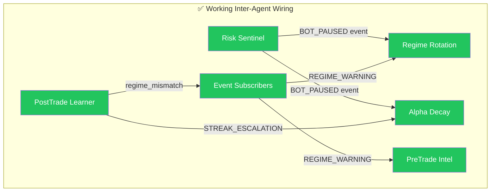
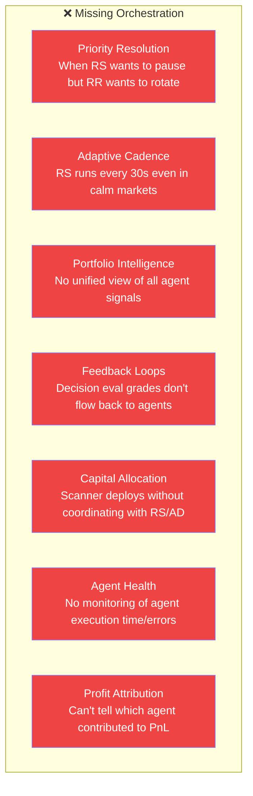

# Bot Variant Orchestration — Performance, Monitoring & Profit Maximization

> **Scope:** Deep analysis of the 6 deployed agent variants + how to orchestrate them into a cohesive, self-improving autonomous trading system.

---

## Executive Summary

Your trading terminal has **6 agent variants** implemented and running as independent `asyncio` loops in [runtime.py](file:///c:/Users/Dhimeji01/.gemini/antigravity/scratch/trading-terminal/backend/app/services/bots/runtime.py):

| Agent | File | Loop | Default Interval | Enabled by Default |
|:---|:---|:---|:---|:---|
| **Risk Sentinel** | [risk_sentinel.py](file:///c:/Users/Dhimeji01/.gemini/antigravity/scratch/trading-terminal/backend/app/services/bots/risk_sentinel.py) | `risk_monitor_loop` | `RISK_MONITOR_INTERVAL_SEC` (~30s) | ✅ Yes |
| **Regime Rotation** | [regime_rotation.py](file:///c:/Users/Dhimeji01/.gemini/antigravity/scratch/trading-terminal/backend/app/services/bots/regime_rotation.py) | `regime_rotation_loop` | 300s (5 min) | ✅ Yes |
| **Alpha Decay** | [alpha_decay.py](file:///c:/Users/Dhimeji01/.gemini/antigravity/scratch/trading-terminal/backend/app/services/bots/alpha_decay.py) | `alpha_decay_loop` | 3600s (1 hour) | ❌ No |
| **Pre-Trade Intel** | [pretrade_intel.py](file:///c:/Users/Dhimeji01/.gemini/antigravity/scratch/trading-terminal/backend/app/services/bots/pretrade_intel.py) | Inline (per signal) | Per-signal | ✅ Yes |
| **Post-Trade Learner** | [posttrade_learner.py](file:///c:/Users/Dhimeji01/.gemini/antigravity/scratch/trading-terminal/backend/app/services/bots/posttrade_learner.py) | Event-driven | Per trade close | ✅ Yes |
| **Scanner Auto-Deploy** | [scanner_deploy.py](file:///c:/Users/Dhimeji01/.gemini/antigravity/scratch/trading-terminal/backend/app/services/bots/scanner_deploy.py) | `scanner_deploy_loop` | 300s (5 min) | ❌ No |

**The critical finding**: these agents already exist and function individually, but they operate as **isolated loops with minimal inter-agent coordination**. The current coordination layer is limited to:

1. [AgentEventBus](file:///c:/Users/Dhimeji01/.gemini/antigravity/scratch/trading-terminal/backend/app/services/agent/agent_event_bus.py) — pub/sub for events (BOT_PAUSED, REGIME_WARNING, STREAK_ESCALATION)
2. [DeskSupervisor](file:///c:/Users/Dhimeji01/.gemini/antigravity/scratch/trading-terminal/backend/app/services/agent/desk_supervisor.py) — HITL gating (propose_or_execute)
3. [decision_eval.py](file:///c:/Users/Dhimeji01/.gemini/antigravity/scratch/trading-terminal/backend/app/services/agent/decision_eval.py) — retrospective grading of decisions
4. [agent_event_subscribers.py](file:///c:/Users/Dhimeji01/.gemini/antigravity/scratch/trading-terminal/backend/app/services/bots/agent_event_subscribers.py) — cross-agent state (paused bots, regime warnings, streak cooldowns)

**The gap**: there is no **orchestration layer** that prioritizes agent actions when they conflict, adapts agent cadences based on market conditions, aggregates agent signals into a unified portfolio-level intelligence, or feeds decision quality metrics back into agent parameters.

---

## Current Architecture Diagnosis

### What Works Well



- **Risk Sentinel → Regime Rotation**: `recently_paused_bot_ids()` prevents rotation of sentinel-paused bots
- **Risk Sentinel → Alpha Decay**: `is_streak_escalation_ignored()` skips decay evaluation during cooldown
- **PostTrade Learner → Event Bus**: publishes regime_mismatch events that trigger REGIME_WARNING
- **DeskSupervisor**: all mutation actions (pause, rotate, deploy, patch) go through propose_or_execute
- **Decision Eval**: grades veto/rotation/patch/pause decisions after the fact

### What's Broken or Missing



---

## Proposed Changes

### Phase 1: Agent Priority Resolution & Conflict Arbitration

> **Problem**: When multiple agents want to act on the same bot simultaneously, there's no priority system. Risk Sentinel might want to pause a bot while Regime Rotation wants to rotate it, or Alpha Decay wants to retrain while Scanner Deploy wants to deploy more.

#### [NEW] `agent_orchestrator.py`

A centralized orchestrator that sits between the agent loops and the DeskSupervisor. It:

1. **Maintains a priority queue** of pending agent actions per bot_id
2. **Resolves conflicts** using a priority hierarchy:
   - P0: Risk Sentinel (safety always wins)
   - P1: Alpha Decay (stale strategy shouldn't run)
   - P2: Pre-Trade Intel (veto before execution)
   - P3: Regime Rotation (strategy swap)
   - P4: Post-Trade Learner (config patches)
   - P5: Scanner Deploy (new deployments)
3. **Implements cooldowns** — after Risk Sentinel pauses a bot, suppress all other agent actions for that bot for a configurable window
4. **Implements mutual exclusion** — only one "heavy" action (rotate, deploy, retrain) can be in-flight per bot at a time
5. **Logs all conflict resolutions** to `agent_events` for Decision Eval grading

```python
# Core concept
class AgentOrchestrator:
    PRIORITY = {
        "RISK_SENTINEL": 0,    # Safety: always wins
        "ALPHA_DECAY": 1,       # Staleness: high urgency
        "PRETRADE_INTEL": 2,    # Entry gate: per-signal
        "REGIME_ROTATION": 3,   # Strategy rotation
        "POSTTRADE_LEARNER": 4, # Config patches
        "SCANNER_DEPLOY": 5,    # New capital deployment
    }

    async def submit_action(self, agent: str, bot_id: str, action: AgentAction) -> ActionResult:
        """Submit action through priority queue with conflict resolution."""
        # Check for conflicting in-flight actions
        # Resolve by priority
        # Execute via DeskSupervisor
        # Log resolution
```

#### [MODIFY] Each agent's action path

Wire all 6 agents to submit through the orchestrator instead of directly calling `propose_or_execute`. The existing DeskSupervisor (HITL gate) remains downstream.

---

### Phase 2: Adaptive Agent Cadence

> **Problem**: All loops run at fixed intervals regardless of market conditions. Risk Sentinel runs every 30s even when markets are flat. Scanner Deploy scans every 5 minutes even when volatility is extreme and no one should be deploying.

#### [MODIFY] [runtime.py](file:///c:/Users/Dhimeji01/.gemini/antigravity/scratch/trading-terminal/backend/app/services/bots/runtime.py)

Replace fixed `asyncio.sleep(interval)` with adaptive cadence driven by:

| Regime | Risk Sentinel | Regime Rotation | Alpha Decay | Scanner Deploy |
|:---|:---|:---|:---|:---|
| **Normal** | 30s | 5 min | 1 hour | 5 min |
| **Trending** | 30s | 2 min (rotations more frequent) | 1 hour | 3 min (more opportunities) |
| **Elevated Vol** | 10s (danger!) | 10 min (don't rotate in chaos) | 30 min (watch for breaks) | DISABLED (no new deployments) |
| **Compressed** | 60s (calm) | 5 min | 2 hours | 5 min |
| **Drawdown > 5%** | 5s (critical!) | DISABLED | 15 min | DISABLED |
| **After kill-switch** | 5s | DISABLED | DISABLED | DISABLED |

The orchestrator would expose a `get_adaptive_interval(agent_name)` method that agents call after each evaluation cycle.

#### [NEW] `regime_aware_scheduler.py`

- Subscribes to regime classification changes via the event bus
- Maintains a global market regime state (per-symbol + portfolio-wide)
- Provides `next_interval(agent)` that agents use instead of a fixed sleep
- Fires `REGIME_SHIFT` events when portfolio-wide regime changes (>60% of symbols flipping)

---

### Phase 3: Unified Portfolio Intelligence Layer

> **Problem**: Each agent sees only its own slice of the picture. Risk Sentinel monitors drawdown, Alpha Decay monitors performance divergence, Regime Rotation monitors ATR regimes — but nobody combines these into a portfolio-level health score.

#### [NEW] `portfolio_intelligence.py`

A read-only aggregation layer that computes portfolio-level metrics every tick:

```python
@dataclass
class PortfolioIntelligence:
    # Risk layer
    drawdown_velocity: float          # from Risk Sentinel
    correlation_exposure: float       # from Risk Sentinel
    streak_paused_count: int          # from Risk Sentinel

    # Performance layer
    decaying_bot_count: int           # from Alpha Decay
    avg_alpha_decay_score: float      # from Alpha Decay
    regime_mismatch_count: int        # from Alpha Decay / Event Subscribers

    # Quality layer
    veto_rate_24h: float              # from Pre-Trade Intel
    avg_pretrade_confidence_adj: float # from Pre-Trade Intel

    # Learning layer
    avg_lesson_quality: float         # from Post-Trade Learner
    patches_applied_24h: int          # from Post-Trade Learner
    retrain_queued_count: int         # from Retrain Scheduler

    # Deployment layer
    auto_deployed_count: int          # from Scanner Deploy
    deployment_room_pct: float        # from Scanner Deploy

    # Computed
    portfolio_health_score: float     # 0-100 composite
    recommended_regime: str           # portfolio-wide consensus regime
    agent_confidence_weights: dict    # from Decision Eval
```

This becomes the single source of truth that:
- The **Copilot chatbot** queries for "how are my bots doing?"
- The **Adaptive Cadence** layer uses for regime decisions
- The **Agent Orchestrator** uses for conflict resolution context
- The **Frontend** renders in a dedicated "Agent Dashboard" panel

---

### Phase 4: Decision Quality Feedback Loops

> **Problem**: [decision_eval.py](file:///c:/Users/Dhimeji01/.gemini/antigravity/scratch/trading-terminal/backend/app/services/agent/decision_eval.py) grades past decisions (veto, rotation, patch, pause) — but those grades are only written to `agent_eval_summary` and consumed by Strategy Advisor for `advisor_confidence_weight`. The grades never flow back to the agents themselves to tune their thresholds.

#### [MODIFY] [decision_eval.py](file:///c:/Users/Dhimeji01/.gemini/antigravity/scratch/trading-terminal/backend/app/services/agent/decision_eval.py)

Add a `feedback_dispatch` step after grading:

```python
# After grading, dispatch feedback to the originating agent
async def _dispatch_feedback(decision_type: str, outcome: dict):
    if decision_type == "veto":
        # If PreTrade Intel vetoes are scoring poorly (price moved in the
        # trade's direction), tighten veto thresholds
        await event_bus.publish("AGENT_FEEDBACK", {
            "agent": "PRETRADE_INTEL",
            "metric": "veto_accuracy_7d",
            "value": rolling_accuracy,
            "suggestion": "raise_veto_threshold" if accuracy < 0.5 else None,
        })
    elif decision_type == "rotation":
        # If Regime Rotation rotations are underperforming (rotated strategy
        # did worse than original), adjust cooldown or heuristic
        ...
    elif decision_type == "pause":
        # If Risk Sentinel pauses are premature (bot recovered quickly),
        # widen velocity threshold
        ...
```

#### [MODIFY] Each agent

Add a `apply_feedback(feedback: dict)` method that adjusts operational thresholds based on decision eval grades:

| Agent | Feedback → Adjustment |
|:---|:---|
| **Risk Sentinel** | If pauses are scored as "premature" >50% → widen `RISK_SENTINEL_MAX_VELOCITY` by 10% |
| **Regime Rotation** | If rotations are scored as "wrong" >40% → extend cooldown period |
| **Pre-Trade Intel** | If vetoes are scored as "missed_profit" >60% → raise veto threshold |
| **Post-Trade Learner** | If patches are scored as "degraded" >30% → disable auto-apply |
| **Alpha Decay** | If pauses are scored as "too_early" >50% → increase min_trades threshold |
| **Scanner Deploy** | If deployments are scored as "loss" >40% → raise min_confidence |

> [!IMPORTANT]
> All auto-adjustments must be bounded (min/max ranges) and logged. An agent should never adjust itself out of a safe operating range. The `PARAM_BOUNDS` pattern from [strategy_advisor.py](file:///c:/Users/Dhimeji01/.gemini/antigravity/scratch/trading-terminal/backend/app/services/bots/strategy_advisor.py#L38-L51) should be reused.

---

### Phase 5: Capital Allocation Orchestration

> **Problem**: Scanner Deploy allocates capital independently, without consulting Risk Sentinel's portfolio health or Alpha Decay's view of existing bot quality. The result can be deploying new bots while existing ones are decaying or the portfolio is under drawdown stress.

#### [MODIFY] [scanner_deploy.py](file:///c:/Users/Dhimeji01/.gemini/antigravity/scratch/trading-terminal/backend/app/services/bots/scanner_deploy.py)

Add pre-deploy checks that consult other agents:

```python
# Before deploying, check portfolio intelligence
intel = portfolio_intelligence.snapshot()

# Hard blocks
if intel.drawdown_velocity > 0:
    skip("Portfolio drawdown accelerating — no new deployments")
if intel.portfolio_health_score < 40:
    skip("Portfolio health critical — no new deployments")
if intel.decaying_bot_count > len(active_bots) * 0.5:
    skip("Over 50% of bots showing alpha decay — fix existing before adding new")

# Soft adjustments
if intel.correlation_exposure > 30:
    # Tighten correlation threshold for new deployments
    effective_max_correlation = SCANNER_DEPLOY_MAX_CORRELATION * 0.7

# Size based on portfolio health
health_factor = intel.portfolio_health_score / 100.0
effective_allocation = base_allocation * health_factor
```

#### [NEW] Dynamic position sizing across agents

Instead of each agent using fixed allocation, implement a shared capital allocation model:

```python
class CapitalAllocator:
    def compute_allocation(self, symbol: str, strategy: str, confidence: float) -> float:
        """Dynamic allocation based on portfolio state and agent consensus."""
        base = SCANNER_DEPLOY_BASE_ALLOCATION
        
        # Scale by confidence
        base *= (confidence / 0.65)  # normalized against min_confidence
        
        # Scale by portfolio health
        base *= portfolio_intelligence.health_factor()
        
        # Scale by regime suitability
        regime_score = regime_rotation.strategy_regime_score(strategy, symbol)
        base *= regime_score
        
        # Scale by alpha decay status of similar strategies
        decay_penalty = alpha_decay.strategy_decay_factor(strategy)
        base *= decay_penalty
        
        return min(base, SCANNER_DEPLOY_MAX_ALLOCATION)
```

---

### Phase 6: Agent Observability & Profit Attribution

> **Problem**: There is no monitoring of agent execution quality (latency, error rates, action counts), and no way to attribute PnL to agent decisions.

#### [MODIFY] [metrics.py](file:///c:/Users/Dhimeji01/.gemini/antigravity/scratch/trading-terminal/backend/app/observability/metrics.py)

Add agent-specific metrics:

```python
# Per-agent counters
"agent_evaluations_total{agent=RISK_SENTINEL}"
"agent_actions_total{agent=RISK_SENTINEL,action=pause}"
"agent_conflicts_resolved_total{winner=RISK_SENTINEL,loser=REGIME_ROTATION}"
"agent_feedback_applied_total{agent=PRETRADE_INTEL,direction=tighten}"

# Per-agent histograms
"agent_evaluation_duration_seconds{agent=RISK_SENTINEL}"
"agent_decision_accuracy{agent=PRETRADE_INTEL}"
"agent_portfolio_impact_pnl{agent=SCANNER_DEPLOY}"  # PnL of agent-created bots

# Portfolio intelligence gauge
"portfolio_health_score"
"portfolio_decaying_bots_count"
"portfolio_drawdown_velocity"
```

#### [NEW] `agent_pnl_attribution.py`

Track which agent decisions contributed to PnL:

| Decision | Attribution Logic |
|:---|:---|
| Scanner Deploy creates bot → bot profits $500 | SCANNER_DEPLOY: +$500 |
| Pre-Trade Intel vetoes an entry → price moves 3% in the veto'd direction | PRETRADE_INTEL: -$X (missed opportunity) |
| Risk Sentinel pauses bot → bot was about to lose $200 more | RISK_SENTINEL: +$200 (loss avoidance) |
| Regime Rotation swaps strategy → new strategy outperforms by $150 | REGIME_ROTATION: +$150 |
| Post-Trade Learner widens stop → bot survives shakeout, captures $100 | POSTTRADE_LEARNER: +$100 |
| Alpha Decay triggers retrain → new model improves win rate by 5% | ALPHA_DECAY: +$X (across subsequent trades) |

This data powers the Copilot's "which agents are making me money?" query and enables the feedback loops in Phase 4 with concrete PnL impact.

#### [NEW] Frontend Agent Dashboard

A new dock panel showing:
- Real-time agent health (last eval time, errors, latency)
- Portfolio Intelligence composite score
- Agent action timeline (filterable by agent, action type)
- PnL attribution pie chart (which agent contributed how much)
- Decision accuracy trend per agent (from decision_eval grades)
- Conflict resolution log (which agent won, why)

---

### Phase 7: Enable the Dormant Agents

> **Problem**: Alpha Decay (`ALPHA_DECAY_ENABLED=false`) and Scanner Deploy (`SCANNER_DEPLOY_ENABLED=false`) are disabled by default. They need to be enabled with safe defaults.

#### [MODIFY] `.env` / [config.py](file:///c:/Users/Dhimeji01/.gemini/antigravity/scratch/trading-terminal/backend/app/config.py)

```bash
# ── Enable the full agent stack ──────────────────────────────────────────
ALPHA_DECAY_ENABLED=true
ALPHA_DECAY_INTERVAL_SEC=1800        # 30 min (was 3600)
ALPHA_DECAY_MIN_TRADES=15            # Lower bar (was 10 but effectively disabled)
ALPHA_DECAY_AUTO_PAUSE=true
ALPHA_DECAY_AUTO_RETRAIN=true

SCANNER_DEPLOY_ENABLED=true
SCANNER_DEPLOY_MIN_CONFIDENCE=0.70   # Conservative (was 0.65)
SCANNER_DEPLOY_MAX_CONCURRENT_BOTS=3 # Conservative (was 5)
SCANNER_DEPLOY_MAX_PORTFOLIO_PCT=25  # Conservative (was 40)
SCANNER_DEPLOY_MAX_DRAWDOWN_PCT=3    # Tighter per-position DD (was 5)

# ── Agent auto-actions & feedback ─────────────────────────────────────────
AUTO_AGENT_ACTIONS=true              # Agents execute without HITL approval
AGENT_EVAL_ENABLED=true
AGENT_EVAL_INTERVAL_SEC=1800         # Grade decisions every 30 min (was 3600)
POSTTRADE_LEARNER_AUTO_APPLY=true    # Apply config patches automatically
```

> [!WARNING]
> Enabling `AUTO_AGENT_ACTIONS=true` means agents will execute pauses, rotations, and deployments without human confirmation. Start with `false` (HITL mode) and enable once you've validated the agents are making good decisions via the Decision Eval dashboard.

---

### Phase 8: Cross-Agent Learning via the ML Retrain Scheduler

> **Problem**: Model retraining is triggered independently by Alpha Decay (when decay is detected) and by the [ml_retrain_scheduler.py](file:///c:/Users/Dhimeji01/.gemini/antigravity/scratch/trading-terminal/backend/app/services/bots/ml_retrain_scheduler.py) (age-based). Post-Trade Learner also triggers periodic retrains. These three retrain triggers are uncoordinated.

#### [MODIFY] `ml_retrain_scheduler.py`

Centralize all retrain triggers through the scheduler with source tracking:

```python
class RetrainRequest:
    source: str        # "alpha_decay" | "age_based" | "posttrade_learner" | "drift_detected"
    priority: int      # 0=urgent, 1=normal, 2=batch
    symbol: str
    strategy: str
    reason: str
    
# Dedup: if alpha_decay and age_based both trigger for the same symbol/strategy,
# only one retrain runs (highest priority wins)
```

#### [MODIFY] [model_promotion.py](file:///c:/Users/Dhimeji01/.gemini/antigravity/scratch/trading-terminal/backend/app/services/bots/model_promotion.py)

Add orchestrator awareness: after champion-challenger promotion, notify agents:
- Alpha Decay resets its decay score for the promoted model
- Post-Trade Learner resets its lesson window
- Regime Rotation re-evaluates strategy-regime mapping with new model performance

---

## Priority Matrix

| Phase | What | Estimated Effort | Performance Impact | Profit Impact | Risk |
|:---|:---|:---|:---|:---|:---|
| **7** | Enable dormant agents | 0 (config) | Medium | 🔴 High — more alpha sources | Medium |
| **1** | Agent priority resolution | 3-4 days | High — prevents destructive conflicts | 🔴 High — stops agents from fighting | Low |
| **3** | Portfolio intelligence | 2-3 days | High — unified visibility | 🟡 Medium — better decisions from visibility | Low |
| **6** | Agent observability & attribution | 3-4 days | 🔴 Critical — can't improve without measuring | 🔴 High — see what's working | Low |
| **2** | Adaptive cadence | 2 days | 🔴 High — faster response in danger, less CPU in calm | 🟡 Medium | Low |
| **4** | Decision feedback loops | 3-4 days | High — self-tuning agents | 🔴 High — agents improve over time | Medium |
| **5** | Capital allocation orchestration | 2-3 days | Medium | 🔴 High — right-sized positions | Medium |
| **8** | Cross-agent retrain coordination | 2 days | Medium | 🟡 Medium — fewer wasted retrains | Low |

---

## Verification Plan

### Automated Tests

```bash
# Unit tests for orchestrator priority resolution
cd backend && python -m pytest tests/test_agent_orchestrator.py -x -v

# Integration test: Risk Sentinel pause should suppress Regime Rotation
python -m pytest tests/test_agent_conflicts.py -x -v

# Decision eval feedback loop tests
python -m pytest tests/test_decision_feedback.py -x -v

# Portfolio intelligence aggregation tests
python -m pytest tests/test_portfolio_intelligence.py -x -v
```

### Manual Verification

1. **Deploy all 6 agents** with `AUTO_AGENT_ACTIONS=false` (HITL mode)
2. **Monitor the Action Queue** in the frontend for 24 hours — verify agents are proposing sensible actions
3. **Check the Agent Dashboard** for:
   - All agents showing green health (no errors, reasonable latency)
   - Portfolio health score is reasonable (40-80 range)
   - Decision accuracy trending above 50% for all agents
4. **Simulate a drawdown** in paper mode — verify Risk Sentinel escalates to P0 and suppresses all other agents
5. **Enable `AUTO_AGENT_ACTIONS=true`** after 48 hours of clean HITL operation
6. **Run for 1 week** with attribution tracking — verify PnL attribution makes sense
7. **Enable feedback loops** (Phase 4) after 2 weeks of attribution data proves agent accuracy is measurable

---

## Open Questions

> [!IMPORTANT]
> **Q1: HITL vs Full Autonomy** — Should the system start in HITL mode (`AUTO_AGENT_ACTIONS=false`) where all agent actions require human approval, or go straight to autonomous? **Recommendation**: Start HITL for 1-2 weeks, then enable autonomy.

> [!IMPORTANT]
> **Q2: Agent Feedback Bounds** — When agents auto-adjust their thresholds based on decision eval grades, how wide should the adjustment bounds be? If Risk Sentinel's velocity threshold auto-adjusts, it could loosen too much and miss a real crash. **Recommendation**: Max ±20% from defaults, with hard minimums.

> [!IMPORTANT]
> **Q3: Scanner Deploy Allocation Strategy** — Should Scanner Deploy use a fixed allocation per bot, or scale allocation based on confidence × portfolio health? The latter is more sophisticated but adds complexity. **Recommendation**: Confidence-scaled with health factor (Phase 5 proposal).

> [!IMPORTANT]
> **Q4: Execution Priority** — Do you want to start with Phase 7 (just enabling Alpha Decay + Scanner Deploy with current config), or do the full orchestration layer first? **Recommendation**: Phase 7 → Phase 1 → Phase 6 → Phase 3 → rest.
