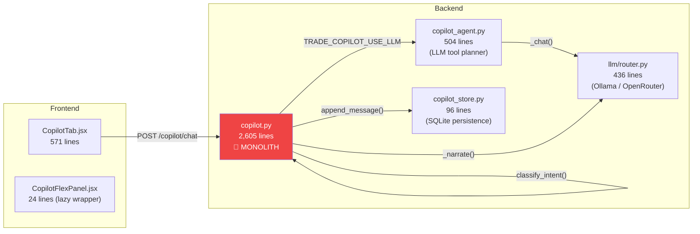

# ChatAgent (TRADE_COPILOT) — Examination & Upgrade Plan

> **Status:** Approved for Implementation (2026-08-08)  
> **Scope:** Full stack — Frontend `CopilotTab.jsx` + Backend `copilot.py`, `copilot_agent.py`, `copilot_store.py`, LLM router

---

## Approved Strategy & User Directives

1. **Architecture First:** Decompose the 2,605-line `copilot.py` monolith into modular services before adding major features.
2. **Streaming Priority:** Implement Server-Sent Events (SSE) streaming for real-time response generation.
3. **Rich Cards Scope:** Prioritize Market Analysis cards first (`analyze_symbol` sparklines, regime badges, and signal visualizers).
4. **Proactive Insights:** Enable copilot to proactively surface regime shifts, risk warnings, and stale bot alerts.

---

## Current Architecture Overview

### What It Does Well

| Capability | Implementation | Quality |
|-----------|---------------|---------|
| **Intent classification** | 155-line rule engine + LLM fallback | ✅ Thorough — handles typos, fuzzy symbols, regime questions |
| **Tool dispatch** | 15 tools (analyze, deploy, backtest, etc.) | ✅ Good coverage |
| **Confirmation flow** | Pending actions with TTL, confirm/cancel buttons | ✅ Safe for destructive ops |
| **Agent narration** | RiskSentinel / AlphaDecay / RegimeRotation → chat | ✅ Deduped, template-first with optional LLM polish |
| **Session memory** | Per-session insight cache + preferred TF | ✅ Contextual follow-ups work |
| **Voice input** | Web Speech API | ✅ Present (browser-dependent) |
| **LLM multi-turn** | Up to 3 planning turns per message | ✅ Handles compound queries |

### Bottlenecks & Refactoring Targets

| Issue | Severity | Location | Action |
|-------|----------|----------|--------|
| **2,605-line monolith** — copilot.py has intent classification, tool dispatch, 15 tool implementations, template narration, agent event handling, and session memory all in one file | 🔴 High | [copilot.py](file:///c:/Users/Dhimeji01/.gemini/antigravity/scratch/trading-terminal/backend/app/services/agent/copilot.py) | **Phase 1 Decomposition** |
| **No streaming** — user waits for full response (LLM generation + tool execution) before seeing anything | 🔴 High | [CopilotTab.jsx:L332](file:///c:/Users/Dhimeji01/.gemini/antigravity/scratch/trading-terminal/frontend/src/components/dock/CopilotTab.jsx#L332) | **Phase 2 SSE Streaming** |
| **Flat text output only** — no charts, tables, or interactive cards in responses | 🟡 Medium | [CopilotTab.jsx:L78](file:///c:/Users/Dhimeji01/.gemini/antigravity/scratch/trading-terminal/frontend/src/components/dock/CopilotTab.jsx#L78) | **Phase 3 Market Cards** |
| **Static quick prompts** — always shows same 3 suggestions regardless of context | 🟡 Medium | [CopilotTab.jsx:L23-27](file:///c:/Users/Dhimeji01/.gemini/antigravity/scratch/trading-terminal/frontend/src/components/dock/CopilotTab.jsx#L23-L27) | **Phase 3 Dynamic Prompts** |
| **No conversation history sent to LLM** — planner only sees current message + last insight, not prior turns | 🟡 Medium | [copilot_agent.py:L113-140](file:///c:/Users/Dhimeji01/.gemini/antigravity/scratch/trading-terminal/backend/app/services/agent/copilot_agent.py#L113-L140) | **Phase 1 Context Fix** |
| **No RAG / retrieval over trade logs** — can't answer "why did I lose money last week?" with data | 🟡 Medium | N/A | **Phase 4 Trade RAG** |

---

## Roadmap & Implementation Phases

### Phase 1: Architecture Decomposition & Conversation Context
* **Refactor Monolith:** Split `copilot.py` (2,605 lines) into:
  - `copilot_intent.py` (Rule classification & symbol extraction)
  - `copilot_tools.py` (Tool execution handlers)
  - `copilot_templates.py` (Markdown formatters)
  - `copilot_session.py` (TTL session memory)
  - `copilot_agents.py` (Background agent event narrators)
  - `copilot.py` (Lean orchestrator)
* **Conversation History Context:** Update `copilot_agent.py` to pass recent conversation turns (`copilot_store.list_messages`) into the LLM planning prompt.

### Phase 2: SSE Streaming Responses
* **Backend:** Add `/api/v1/copilot/chat/stream` endpoint emitting step progress, intermediate tool status, and LLM tokens.
* **Frontend:** Refactor `CopilotTab.jsx` to consume SSE streams and update response bubbles live.

### Phase 3: Market Analysis Cards & Dynamic Context Prompts
* **Market Analysis Cards:** Render rich UI components for `analyze_symbol` (regime pill, signal gauge, confidence bar, reasons list).
* **Context Prompts:** Dynamically update quick prompts based on active symbol, running bot count, and previous analysis result.

### Phase 4: Proactive Push Insights & Trade History RAG
* **Proactive Engine:** Background service monitoring market regime shifts, drawdown thresholds, and stale bots to push alerts directly to Copilot WS stream.
* **Trade RAG Tool:** New `trade_rag` tool for querying and aggregating `bot_trades` & `bot_logs` over custom time horizons.

---

## Priority Matrix

| Phase | Feature | Component | Impact | Effort |
|-------|---------|-----------|--------|--------|
| **1.1** | Monolith Decomposition | Backend (`app/services/agent/copilot/*`) | High | 4–6 hrs |
| **1.2** | Conversation Context for LLM | Backend (`copilot_agent.py`) | Very High | 2 hrs |
| **2.1** | SSE Streaming | Full Stack (`copilot_stream.py` & `CopilotTab.jsx`) | Very High | 4–6 hrs |
| **3.1** | Market Analysis Rich Cards | Frontend (`CopilotTab.jsx` + `MarketAnalysisCard.jsx`) | High | 4–6 hrs |
| **3.2** | Context-Aware Quick Prompts | Frontend (`CopilotTab.jsx`) | High | 2 hrs |
| **4.1** | Proactive Insights Engine | Backend (`copilot_proactive.py`) | High | 6–8 hrs |
| **4.2** | Trade History RAG Tool | Backend (`copilot_tools.py`) | High | 4–6 hrs |
