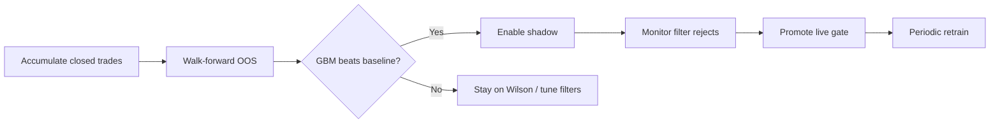

# Meta-label GBM gate — user guide

How to train, evaluate, and roll out the gradient-boosted meta-label classifier for **CHART_AGENT** bots. This gate estimates **P(win)** for each entry setup and can block low-probability trades.

## What it does

CHART_AGENT already scores entries with domain reports (trend, momentum, volume, sentiment, risk). The meta-label layer adds a **second-stage filter**:

1. **Wilson buckets** (default) — block setups whose historical win-rate lower bound is too low for that bucket (symbol, score, confidence, ATR regime).
2. **GBM classifier** — `HistGradientBoostingClassifier` trained on **your bot's closed trades**, using entry-time features only (no post-entry leakage).
3. **Hybrid** (recommended for production) — use GBM when a model is loaded; otherwise fall back to Wilson buckets.

Sentiment in the rule engine is **lexicon/heuristic**, not this ML model. The GBM only learns from **realized trade outcomes** paired with the insight snapshot at entry.

## Signal path (live)

```
rule_engine → entry filters → check_meta_label_gate → sizing → risk gates → order
```

| Stage | Config keys |
|-------|-------------|
| Enable gate | `calibration_gate_enabled: true` |
| Mode | `meta_label_model_mode`: `wilson` \| `gbm` \| `hybrid` |
| Min P(win) | `meta_label_min_prob` (default `0.52`) |
| Shadow (log only) | `meta_label_shadow_mode: true` |
| Size scaling | `use_meta_label_sizing: true` (optional) |

**Shadow mode** logs what the GBM *would* block without rejecting the entry. Use this before going live.

## Prerequisites

- Strategy: **CHART_AGENT** only
- Closed trades with **insight snapshots** at entry (stored automatically for chart-agent entries)
- **Minimum samples** for training: `meta_label_min_train_samples` (default **30**, floor **10** for walk-forward diagnostics)
- Enough backtest history if evaluating offline (≥100 bars per fold; 7–90 days typical)

## Configuration reference

Set these in **Bot config** (Algo panel → Chart Agent settings, or Bot detail → Config):

| Key | Default | Description |
|-----|---------|-------------|
| `calibration_gate_enabled` | `false` | Master switch for meta-label / Wilson gate |
| `meta_label_model_mode` | `wilson` | `wilson`, `gbm`, or `hybrid` |
| `meta_label_min_prob` | `0.52` | Block when P(win) &lt; threshold |
| `meta_label_min_train_samples` | `30` | Min closed trades before training |
| `meta_label_shadow_mode` | `false` | Log blocks without rejecting |
| `use_meta_label_sizing` | `false` | Scale size by P(win) when model loaded |
| `calibration_min_samples` | `5` | Wilson bucket minimum N |
| `calibration_min_wilson` | `0.45` | Wilson lower-bound floor |

Environment:

| Variable | Default | Description |
|----------|---------|-------------|
| `META_LABEL_MIN_TRAIN_SAMPLES` | `30` | Server default when bot config omits value |
| `META_LABEL_MODEL_DIR` | `backend/data/meta_label_models` | On-disk model artifacts |

Artifacts are stored per bot: `{META_LABEL_MODEL_DIR}/{bot_id}/model.joblib` + `metadata.json`.

## Recommended rollout workflow



### Step 1 — Walk-forward OOS evaluation

Validate that the GBM gate helps **out-of-sample** before enabling it live.

**UI**

- **Bot → Calibration** → **Walk-forward OOS** (CHART_AGENT bots)
- **Algo panel → Backtest** → check **Meta-label walk-forward** (do **not** combine with “Hold-out test 30%” — use one or the other)

**API**

```http
POST /api/v1/backtest/meta-label-walk-forward
Content-Type: application/json

{
  "bot_id": "<your-bot-uuid>",
  "days": 30,
  "rolling_folds": 2,
  "train_pct": 70,
  "min_train_samples": 30
}
```

Or pass `symbol`, `strategy`, `config`, `timeframe` without `bot_id`.

Response includes `walk_forward.aggregate` (baseline vs GBM OOS PnL) and `recommendation`.

### Step 2 — Enable shadow mode

Applies: `calibration_gate_enabled=true`, `meta_label_model_mode=hybrid`, `meta_label_shadow_mode=true`. Attempts retrain from live closed trades.

**UI:** Calibration → **Enable shadow**

**API:**

```http
POST /api/v1/bots/{bot_id}/meta-label/operational
{"stage": "shadow"}
```

Watch **Live filter rejects** in Calibration and bot logs for `Meta-label shadow block`.

### Step 3 — Promote to live blocking

Requires positive OOS walk-forward (unless you pass `require_positive_oos: false`). Retrains and sets `meta_label_shadow_mode=false`.

**UI:** Calibration → **Promote live** (enabled after successful walk-forward)

**API:**

```http
POST /api/v1/bots/{bot_id}/meta-label/operational
{
  "stage": "promote",
  "walk_forward": { ... prior evaluation result ... }
}
```

### Step 4 — Retrain after new trades

Retrain when you have **≥30** new closed trades or on a schedule (weekly).

**UI:** Calibration → **Retrain**

**API:**

```http
POST /api/v1/bots/{bot_id}/meta-label/retrain
{"min_samples": 30}
```

### Rollback

```http
POST /api/v1/bots/{bot_id}/meta-label/operational
{"stage": "rollback"}
```

Disables gate and resets mode to `wilson`.

## Status and monitoring

```http
GET /api/v1/bots/{bot_id}/meta-label/status
```

Returns:

- `model_loaded` — artifact loads and predicts successfully
- `dataset.sample_count` — usable closed trades for training
- `metadata.metrics.val_auc` — last validation AUC
- `operational.stage` — `off` \| `shadow` \| `live` \| `wilson_gate`

**Calibration panel** also shows Wilson buckets, threshold suggestions, and filter-reject dashboards.

## Tuning tips

### Not enough trades for training

Common causes:

- **Strict entry filters** (`require_trend_alignment`, `confirm_timeframe`, high `min_confidence`, `min_score`)
- **Short backtest window** or thin symbol history
- Bot recently deployed

Actions:

- Run walk-forward with **more days** (60–90)
- Temporarily relax filters for **evaluation only** (pass `config` override in walk-forward API)
- Lower `meta_label_min_train_samples` to **10** for diagnostics (not recommended for production promote)
- Let the bot run in paper until ≥30 closed trades

### GBM blocks too many entries

- Lower `meta_label_min_prob` slightly (e.g. `0.50`)
- Stay in **shadow** longer and compare blocked setups vs outcomes
- Check **top features** in status metadata — elevated ATR or low sentiment scores may dominate

### GBM blocks too few entries

- Raise `meta_label_min_prob` (e.g. `0.55–0.60`)
- Retrain with more diverse market conditions
- Ensure shorts are included (training uses both long and short round-trips when snapshots exist)

### Walk-forward says “did not beat baseline”

- Gate may not help this symbol/regime — keep Wilson or tune CHART_AGENT filters first
- Try different `rolling_folds` / `train_pct`
- Verify enough in-sample trades per fold (target ≥10–30)

## UI map

| Location | Purpose |
|----------|---------|
| **Algo → Backtest** | Optional meta-label walk-forward on full backtest |
| **Backtest Lab → Results** | Walk-forward OOS panel when enabled |
| **Bot → Calibration** | Status, walk-forward, shadow/promote/rollback, retrain |
| **Bot → Config** | Mode, thresholds, shadow, sizing toggles |

## API summary

| Method | Path | Purpose |
|--------|------|---------|
| `GET` | `/api/v1/bots/{id}/meta-label/status` | Model + dataset + operational stage |
| `POST` | `/api/v1/bots/{id}/meta-label/retrain` | Train from closed trades |
| `POST` | `/api/v1/bots/{id}/meta-label/operational` | `shadow` \| `promote` \| `rollback` |
| `POST` | `/api/v1/backtest/meta-label-walk-forward` | OOS evaluation only (no full backtest) |

## Technical notes

- **Features (21):** score, confidence, domain scores, sentiment aggregate, ATR regime one-hots, trend regime, anomaly flag, cyclical hour/dow, side.
- **Training:** chronological 80/20 split for validation metrics, then **refit on all rows** before save.
- **Walk-forward:** per fold — IS backtest (no gate) → train GBM → OOS baseline vs OOS **hybrid** gate.
- **Cold start:** `hybrid` and `gbm` fall back to Wilson when no model is loaded.
- **Models on disk** are gitignored (`backend/data/meta_label_models/`).

## Troubleshooting

| Symptom | Likely cause | Fix |
|---------|--------------|-----|
| `insufficient samples` | &lt; min closed trades with snapshots | Accumulate trades or lower min temporarily |
| `model_loaded: false` but file exists | Schema mismatch or corrupt artifact | Retrain |
| Walk-forward 0 trades | Filters too strict or short range | Relax config for eval; extend days |
| Promote button disabled | OOS did not improve PnL/expectancy | Re-run WF or stay in shadow |
| 404 on walk-forward API | Backend not restarted after upgrade | `.\scripts\start-massive.ps1 -Recycle` |
| Hold-out + WF both on | Truncated candle range | Use only one (UI now mutual-excludes) |

## Related docs

- [DATABASE.md](./DATABASE.md) — persistence and migrations
- [REVIEW_SUGGESTIONS.md](./REVIEW_SUGGESTIONS.md) — broader product review notes
