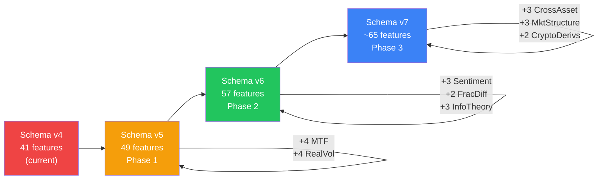

# ML Feature Engineering Upgrade Plan

> **Goal:** Improve ML model predictability by expanding the feature schema from 41 features (v4) to ~65 features (v6) with research-backed, high-alpha feature categories  
> **Status:** Implemented (Phase 1 → 2 → 3 → schema v7) — decisions locked: HTF via resample parity, sentiment zeros, always-on schema, GNN peers + hardcoded fallback

---

## Current Feature Schema Audit (v4 — 41 features)

The current [ml_feature_engineering.py](file:///c:/Users/Dhimeji01/.gemini/antigravity/scratch/trading-terminal/backend/app/services/bots/ml_feature_engineering.py) extracts 41 features across 10 categories:

| Category | Count | Features | Quality |
|----------|-------|----------|---------|
| Price Action | 4 | returns_1/5/15, log_return | ✅ Good — but single-timeframe only |
| Volatility | 3 | atr_ratio, bb_width, rolling_vol_20 | ⚠️ Only ATR-based; no realized vol decomposition |
| Momentum | 4 | rsi_14, macd_hist, stoch_k, adx | ✅ Good standard set |
| Volume | 3 | volume_ratio, obv_slope, volume_momentum | ✅ Adequate |
| Trend | 3 | ema_cross_9_21, price_vs_vwap, supertrend_dir | ✅ Good |
| Regime | 4 | atr_elevated/compressed, trend_trending/ranging | ⚠️ Binary only; no continuous regime score |
| Time Cyclical | 8 | hour/dow sin/cos, session features | ✅ Well-engineered |
| Candle Shape | 5 | high_low_range, body_ratio, shadows, spread | ✅ Good |
| Z-Scores | 2 | close_z_20, volume_z_20 | ✅ Adequate |
| Pattern | 2 | consecutive_up/down | ⚠️ Simplistic |
| Microstructure | 3 | cvd_z, cvd_slope, vpin | ✅ Recent Phase 3.7 addition |

### Critical Gaps Identified

1. **No multi-timeframe features** — model sees only the training timeframe (e.g., 1m), blind to higher-timeframe trends (1h, 4h)
2. **No sentiment/alt-data features** — sentiment data exists in `altdata/store.py` and `sentiment_provider.py` but is NOT fed into ML features
3. **No fractional differentiation** — features use raw values or simple returns; no memory-preserving stationarity (de Prado, 2018)
4. **No cross-asset features** — GNN handles cross-asset, but other models are symbol-isolated
5. **No information-theoretic features** — no entropy, no information ratio, no Hurst exponent
6. **No realized volatility decomposition** — only ATR; no Parkinson/Garman-Klass estimators
7. **No market structure features** — no support/resistance proximity, no order block detection

---

## Proposed New Feature Categories

### Phase 1: High-Impact, Low-Risk (8 new features → schema v5)

#### 1.1 Multi-Timeframe Confluence (4 features)

**Rationale:** Research consistently shows that multi-timeframe features are among the highest-alpha additions for intraday models. A 1m model that knows the 1h trend is ranging will avoid false breakout signals.

| Feature | Description | Computation |
|---------|-------------|-------------|
| `htf_trend_1h` | Higher-timeframe trend direction | Sign(EMA_9 - EMA_21) on resampled 1h bars, carried forward to every 1m bar |
| `htf_rsi_1h` | 1h RSI normalized to [0,1] | RSI_14 on 1h bars, forward-filled |
| `htf_atr_ratio_4h` | 4h ATR/close ratio | Volatility context from 4h timeframe |
| `htf_regime_daily` | Daily ADX regime (trending/ranging) | ADX_14 > 25 on daily bars → 1.0, else 0.0 |

**Implementation:**

```python
# In ml_feature_engineering.py — new function
def _compute_htf_features(candles: list[dict], timeframe: str = "1m") -> dict[str, np.ndarray]:
    """Resample candles to higher timeframes and extract confluence features."""
    from app.services.market.timeframes import TIMEFRAME_SECS
    
    tf_sec = TIMEFRAME_SECS.get(timeframe, 60)
    n = len(candles)
    
    # Resample to 1h (60 bars for 1m)
    htf_1h = _resample_ohlcv(candles, target_sec=3600, source_sec=tf_sec)
    htf_4h = _resample_ohlcv(candles, target_sec=14400, source_sec=tf_sec)
    htf_1d = _resample_ohlcv(candles, target_sec=86400, source_sec=tf_sec)
    
    # Compute indicators on resampled bars, then forward-fill to source resolution
    # ...
```

**Files to modify:**
- [ml_feature_engineering.py](file:///c:/Users/Dhimeji01/.gemini/antigravity/scratch/trading-terminal/backend/app/services/bots/ml_feature_engineering.py) — add `_compute_htf_features()` and new columns
- [ml_feature_kernels.py](file:///c:/Users/Dhimeji01/.gemini/antigravity/scratch/trading-terminal/backend/app/services/bots/ml_feature_kernels.py) — optimized resampling kernel

> **Effort:** 4–5 hours  |  **Expected Impact:** 🔴 Very High — consistently the #1 cited missing feature in trading ML literature

---

#### 1.2 Realized Volatility Decomposition (4 features)

**Rationale:** ATR alone misses important volatility structure. Parkinson and Garman-Klass estimators use all of OHLC to provide more efficient volatility estimates (5x less variance than close-to-close). Yang-Zhang adds overnight gap handling.

| Feature | Description | Formula |
|---------|-------------|---------|
| `rv_parkinson_20` | Parkinson (1980) range-based vol | `(1/(4n·ln2)) Σ ln(H/L)²` over 20 bars |
| `rv_garman_klass_20` | Garman-Klass (1980) OHLC vol | `0.5·ln(H/L)² - (2ln2-1)·ln(C/O)²` |
| `vol_regime_ratio` | Current vol / median vol (continuous) | `rv_parkinson_20 / median(rv_parkinson_20, 100)` |
| `vol_of_vol` | Volatility of volatility | `std(rv_parkinson_20, 20) / mean(rv_parkinson_20, 20)` |

**Implementation:**

```python
def _parkinson_vol(high: np.ndarray, low: np.ndarray, window: int = 20) -> np.ndarray:
    """Parkinson (1980) range-based volatility estimator."""
    log_hl = np.log(np.maximum(high, 1e-10) / np.maximum(low, 1e-10))
    log_hl_sq = log_hl ** 2
    factor = 1.0 / (4.0 * window * np.log(2.0))
    return np.sqrt(factor * _rolling_sum(log_hl_sq, window))

def _garman_klass_vol(open_: np.ndarray, high: np.ndarray, 
                       low: np.ndarray, close: np.ndarray, window: int = 20) -> np.ndarray:
    """Garman-Klass (1980) OHLC volatility estimator."""
    log_hl = np.log(np.maximum(high, 1e-10) / np.maximum(low, 1e-10))
    log_co = np.log(np.maximum(close, 1e-10) / np.maximum(open_, 1e-10))
    gk = 0.5 * log_hl ** 2 - (2.0 * np.log(2.0) - 1.0) * log_co ** 2
    return np.sqrt(_rolling_mean(gk, window))
```

> **Effort:** 3 hours  |  **Expected Impact:** 🟡 High — better volatility estimates improve signal filtering in all market conditions

---

### Phase 2: Medium-Impact, Moderate-Risk (8 new features → schema v6)

#### 2.1 Sentiment & Alternative Data Integration (3 features)

**Rationale:** The app already fetches and stores sentiment data in `altdata/store.py` via Finnhub, Polygon, and GNews. This data is used by CHART_AGENT's rule engine but is completely absent from the ML feature pipeline. Research shows NLP-driven sentiment adds 2–5% accuracy in directional prediction tasks.

| Feature | Description | Source |
|---------|-------------|--------|
| `sentiment_score_24h` | Aggregate news sentiment [-1, 1] | `altdata/store.py` → `get_sentiment_summary()` |
| `sentiment_momentum` | Change in sentiment vs 24h ago | `score_now - score_24h_ago` |
| `macro_event_proximity` | Hours until next high-impact macro event | `altdata/macro_provider.py` → economic calendar |

**Implementation challenge:** Sentiment must be time-aligned to each bar during backtesting. For training, we query the sentiment store using each bar's timestamp.

```python
def _sentiment_features_for_bar(symbol: str, bar_time: float) -> dict[str, float]:
    """Query stored sentiment at bar_time (avoids look-ahead)."""
    from app.services.altdata.store import get_sentiment_summary
    
    summary = get_sentiment_summary(symbol, epoch=bar_time, lookback_hours=24)
    score = float(summary.get("aggregate_score", 0.0))
    prior = get_sentiment_summary(symbol, epoch=bar_time - 86400, lookback_hours=24)
    prior_score = float(prior.get("aggregate_score", 0.0))
    
    return {
        "sentiment_score_24h": score,
        "sentiment_momentum": score - prior_score,
    }
```

**Files to modify:**
- [ml_feature_engineering.py](file:///c:/Users/Dhimeji01/.gemini/antigravity/scratch/trading-terminal/backend/app/services/bots/ml_feature_engineering.py) — add sentiment feature extraction
- [altdata/store.py](file:///c:/Users/Dhimeji01/.gemini/antigravity/scratch/trading-terminal/backend/app/services/altdata/store.py) — add `get_sentiment_summary()` if not present

> **Effort:** 4 hours  |  **Expected Impact:** 🟡 High — bridges existing altdata → ML pipeline

---

#### 2.2 Fractionally Differentiated Features (2 features)

**Rationale:** López de Prado (2018) demonstrates that standard integer differentiation (returns) destroys predictive memory in price series. Fractional differentiation (d ≈ 0.3–0.5) achieves stationarity while preserving 60–80% of the original memory, dramatically improving ML model stability.

| Feature | Description |
|---------|-------------|
| `frac_diff_close` | Fractionally differentiated close (d ≈ 0.4) |
| `frac_diff_volume` | Fractionally differentiated volume (d ≈ 0.3) |

**Implementation:**

```python
def _frac_diff(series: np.ndarray, d: float = 0.4, threshold: float = 1e-4) -> np.ndarray:
    """Fixed-width window fractional differentiation (de Prado, Ch. 5)."""
    # Compute weights
    weights = [1.0]
    k = 1
    while True:
        w = -weights[-1] * (d - k + 1) / k
        if abs(w) < threshold:
            break
        weights.append(w)
        k += 1
    weights = np.array(weights[::-1])
    width = len(weights)
    
    # Apply weights as convolution
    out = np.full(len(series), np.nan)
    for i in range(width - 1, len(series)):
        out[i] = np.dot(weights, series[i - width + 1 : i + 1])
    
    return np.nan_to_num(out, nan=0.0)
```

> **Effort:** 3 hours  |  **Expected Impact:** 🟡 High — preserves price memory while achieving stationarity

---

#### 2.3 Information-Theoretic Features (3 features)

**Rationale:** Entropy and Hurst exponent quantify the "predictability" of a series at each point in time. Low entropy → predictable pattern → model should be confident. High Hurst (> 0.5) → trending behavior → momentum strategies should be activated.

| Feature | Description | Computation |
|---------|-------------|-------------|
| `hurst_exponent_50` | Hurst exponent (R/S method, 50-bar window) | H > 0.5 trending, H < 0.5 mean-reverting |
| `sample_entropy_20` | Approximate entropy of returns (20-bar) | Lower → more predictable → higher model confidence |
| `information_ratio_20` | Sharpe-like ratio of recent returns | `mean(returns_20) / std(returns_20)` |

**Implementation:**

```python
def _hurst_rs(series: np.ndarray, window: int = 50) -> np.ndarray:
    """Rescaled range (R/S) Hurst exponent, rolling."""
    n = len(series)
    out = np.full(n, 0.5, dtype=np.float64)
    for i in range(window, n):
        seg = series[i - window : i]
        mean_seg = np.mean(seg)
        deviate = np.cumsum(seg - mean_seg)
        R = np.max(deviate) - np.min(deviate)
        S = np.std(seg)
        if S > 1e-10 and R > 0:
            out[i] = np.log(R / S) / np.log(window)
    return np.clip(out, 0.0, 1.0)
```

> **Effort:** 4 hours  |  **Expected Impact:** 🟡 High — meta-features that tell the model when to be confident

---

### Phase 3: Advanced Features (8 new features → schema v7)

#### 3.1 Cross-Asset Correlation Features (3 features)

**Rationale:** Even for single-symbol models (not GNN), knowing that the asset is currently correlated with or diverging from its peer basket provides crucial context. A BTC model benefits from knowing ETH is lagging.

| Feature | Description |
|---------|-------------|
| `peer_returns_avg` | Average return of top-3 correlated assets over last 5 bars |
| `peer_divergence` | Symbol's return minus peer average (divergence signal) |
| `correlation_rolling_20` | Rolling 20-bar correlation with market index / BTC |

**Dependency:** Requires multi-symbol candle availability at training time. The GNN trainer ([ml_gnn_trainer.py](file:///c:/Users/Dhimeji01/.gemini/antigravity/scratch/trading-terminal/backend/app/services/bots/ml_gnn_trainer.py)) already builds correlation matrices — we can reuse that infrastructure.

> **Effort:** 5–6 hours  |  **Expected Impact:** 🟡 Medium-High — captures lead-lag dynamics

---

#### 3.2 Market Structure Features (3 features)

**Rationale:** Support/resistance levels and order block proximity are among the most informative features for short-term direction prediction, yet are absent from the current ML pipeline. The ICT_SMC strategy already implements these concepts in [indicators.py:L474-484](file:///c:/Users/Dhimeji01/.gemini/antigravity/scratch/trading-terminal/backend/app/services/bots/indicators.py#L474-L484) for strategy evaluation.

| Feature | Description |
|---------|-------------|
| `dist_to_support_norm` | Normalized distance to nearest rolling low (20-bar) |
| `dist_to_resistance_norm` | Normalized distance to nearest rolling high (20-bar) |
| `range_position` | Where price sits in the 20-bar range: `(close - low_20) / (high_20 - low_20)` |

```python
# Already have rolling_high/low from ICT_SMC prep — just expose as ML features
rolling_high_20 = high.rolling(20).max().shift(1)
rolling_low_20 = low.rolling(20).min().shift(1)
range_20 = rolling_high_20 - rolling_low_20
range_position = np.where(range_20 > 0, (close - rolling_low_20) / range_20, 0.5)
dist_to_support_norm = np.where(close > 0, (close - rolling_low_20) / close, 0.0)
dist_to_resistance_norm = np.where(close > 0, (rolling_high_20 - close) / close, 0.0)
```

> **Effort:** 2 hours  |  **Expected Impact:** 🟡 High — leverages existing infrastructure

---

#### 3.3 Crypto Derivatives Features (2 features — crypto only)

**Rationale:** The app already computes funding rate and OI change in [crypto_derivatives.py](file:///c:/Users/Dhimeji01/.gemini/antigravity/scratch/trading-terminal/backend/app/services/altdata/crypto_derivatives.py) but doesn't feed them into ML features. Funding rate crowding and OI trends are highly predictive of crypto reversals.

| Feature | Description | Source |
|---------|-------------|--------|
| `funding_rate_norm` | Binance 8h funding rate, normalized | `crypto_derivatives.py` |
| `oi_change_24h_norm` | Open interest 24h change %, normalized | `crypto_derivatives.py` |

> **Effort:** 2 hours  |  **Expected Impact:** 🟡 Medium-High (crypto models only)

---

## Feature Schema Evolution



## Implementation Priority Matrix

| # | Feature Group | Phase | Features | Effort | Impact | Risk |
|---|---------------|-------|----------|--------|--------|------|
| 1.1 | Multi-Timeframe Confluence | 1 | 4 | 4–5 hrs | 🔴 Very High | Low — resample + forward-fill |
| 1.2 | Realized Volatility Decomposition | 1 | 4 | 3 hrs | 🟡 High | Low — pure math on OHLC |
| 2.1 | Sentiment Integration | 2 | 3 | 4 hrs | 🟡 High | Medium — time alignment in backtest |
| 2.2 | Fractional Differentiation | 2 | 2 | 3 hrs | 🟡 High | Low — pure math |
| 2.3 | Information-Theoretic | 2 | 3 | 4 hrs | 🟡 High | Low — rolling window computations |
| 3.1 | Cross-Asset Correlation | 3 | 3 | 5–6 hrs | 🟡 Medium-High | Medium — multi-symbol data required |
| 3.2 | Market Structure | 3 | 3 | 2 hrs | 🟡 High | Low — reuses existing infra |
| 3.3 | Crypto Derivatives | 3 | 2 | 2 hrs | 🟡 Medium-High | Low — data already fetched |

---

## Proposed Changes

### Core Module Changes

#### [MODIFY] [ml_feature_engineering.py](file:///c:/Users/Dhimeji01/.gemini/antigravity/scratch/trading-terminal/backend/app/services/bots/ml_feature_engineering.py)
- Add new feature names to `SIGNAL_FEATURE_NAMES` tuple
- Implement extraction functions for each new category
- Update `compute_signal_feature_matrix_vectorized()` with new columns
- Update `bar_to_signal_features()` for live inference parity
- Bump `SIGNAL_FEATURE_VERSION` to 5/6/7 per phase

#### [MODIFY] [ml_feature_kernels.py](file:///c:/Users/Dhimeji01/.gemini/antigravity/scratch/trading-terminal/backend/app/services/bots/ml_feature_kernels.py)
- Add optimized C-extension / NumPy kernels for:
  - Resampling bars to higher timeframes
  - Hurst exponent (R/S method)
  - Fractional differentiation convolution

#### [MODIFY] [altdata/store.py](file:///c:/Users/Dhimeji01/.gemini/antigravity/scratch/trading-terminal/backend/app/services/altdata/store.py)
- Add `get_sentiment_summary(symbol, epoch, lookback_hours)` for time-aligned sentiment queries

#### [NEW] `ml_feature_htf.py`
- Multi-timeframe resampling and indicator computation
- Isolated module to keep `ml_feature_engineering.py` manageable

#### [NEW] `ml_feature_advanced.py`
- Fractional differentiation, Hurst exponent, sample entropy
- Standalone pure-math module with no external dependencies

### Backward Compatibility

The existing `align_features_to_scaler_dim()` function ([ml_feature_engineering.py:L1030-1066](file:///c:/Users/Dhimeji01/.gemini/antigravity/scratch/trading-terminal/backend/app/services/bots/ml_feature_engineering.py#L1030-L1066)) already handles feature dimension mismatches:
- Older models (41 features) will auto-truncate to their trained width
- New features are appended to the end of `SIGNAL_FEATURE_NAMES`
- Retrain is required to benefit from new features, but existing models continue to work

---

## Verification Plan

### A/B Validation Protocol

For each new feature group, run before and after comparisons:

1. **Walk-Forward Validation** — 5-fold purged WF on 30 days of 1m data for BTCUSDT and AAPL
2. **Feature Importance** — Use HistGBM feature importance to verify new features rank in top-50%
3. **Ablation Test** — Train with and without new features, compare:
   - Accuracy (directional hit rate)
   - Sharpe ratio (risk-adjusted performance)
   - Calibration (predicted probability vs actual)
4. **Feature Correlation Check** — Ensure new features have < 0.8 Pearson correlation with existing features (avoid redundancy)

### Automated Tests
```bash
# Run existing test suite to verify no regressions
python -m pytest tests/ -v

# Feature parity test: vectorized vs per-bar paths produce identical output
python -m pytest tests/test_ml_feature_vectorized.py -v

# Schema version test
python -m pytest tests/test_ml_model_artifacts.py -v
```

---

## Open Questions — Resolved

1. **Multi-timeframe live inference:** Resample the same candle buffer (train/serve parity). Live strategies keep `EVAL_HISTORY_LOOKBACK` (~1500) bars for HTF accuracy.
2. **Sentiment backfill:** Time-aligned via `get_sentiment_summary(symbol, epoch=...)`. Missing history → zeros / neutral defaults; features still ship.
3. **Schema migration:** Always-on bump to v7. Legacy models load via `is_compatible_feature_schema` + `align_features_to_scaler_dim`; retrain to benefit.
4. **Cross-asset peers:** Dynamic from GNN correlation matrix when available; hardcoded crypto/equity fallback baskets otherwise.
