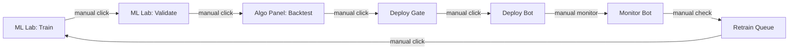
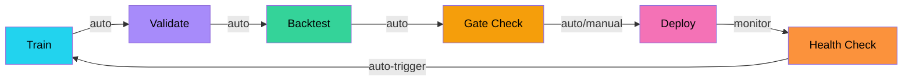
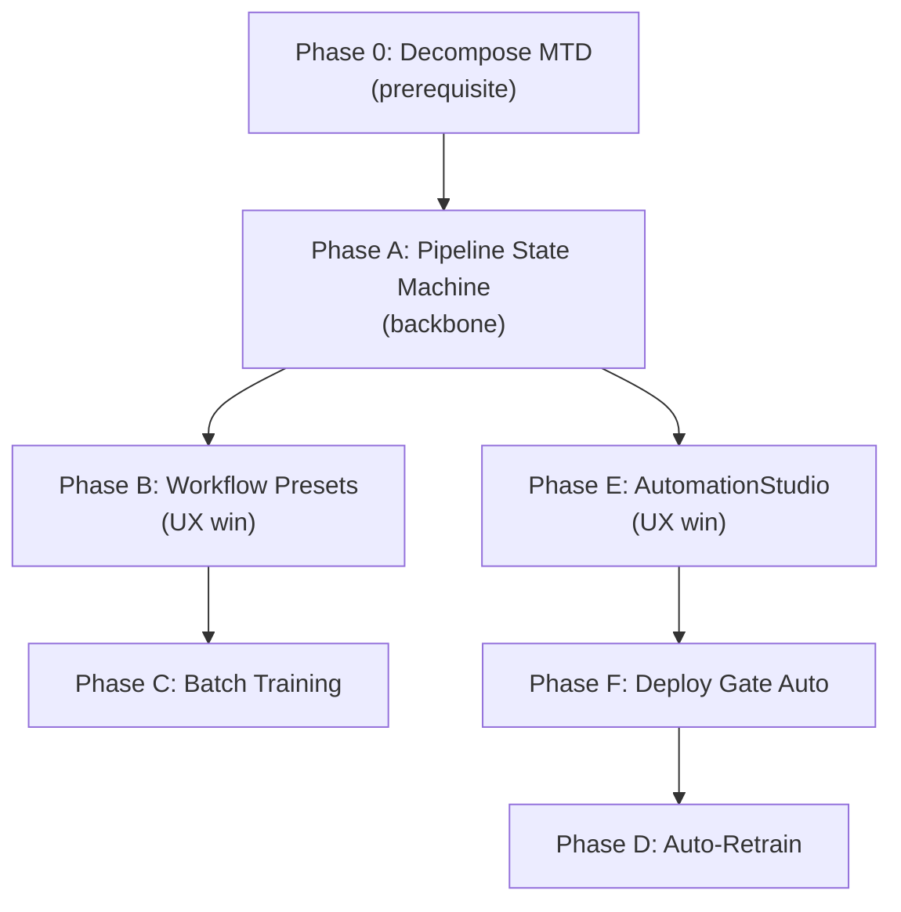

# ML Lab ↔ Algo Bot: Sync, Automation & Pipeline Acceleration

> **Status:** Approved — awaiting implementation  
> **Created:** 2026-08-01  
> **Scope:** Frontend-orchestrated pipeline connecting ML training, walk-forward validation, algo backtesting, deploy gating, and bot monitoring into a unified automation cycle.

---

## Table of Contents

1. [Background & Problem Statement](#background--problem-statement)
2. [Architecture Overview](#architecture-overview)
3. [Phase 0 — ModelTrainingDashboard Decomposition (Prerequisite)](#phase-0--modeltrainingdashboard-decomposition-prerequisite)
4. [Phase A — Pipeline State Machine](#phase-a--pipeline-state-machine)
5. [Phase B — Automation Workflow Presets](#phase-b--automation-workflow-presets)
6. [Phase C — Batch Training](#phase-c--batch-training)
7. [Phase D — Auto-Retrain Trigger & Model Health](#phase-d--auto-retrain-trigger--model-health)
8. [Phase E — AutomationStudio Enhancement](#phase-e--automationstudio-enhancement)
9. [Phase F — Deploy Gate Automation](#phase-f--deploy-gate-automation)
10. [Implementation Order](#implementation-order)
11. [Verification Plan](#verification-plan)

---

## Background & Problem Statement

After deep analysis of the ML Lab (`ModelTrainingDashboard.jsx`, decomposed into `ml-lab/*`),
Algo Bot (`AlgoPanel.jsx`), and supporting infrastructure (`mlTrainingSession.js`, `deployGate.js`,
`BacktestWorkflowPresets.jsx`, `AutomationStudio.jsx`, …), the current pipeline is **manual and
fragmented**.

**Artifact SSOT:** Lab strategy ids, on-disk subdirs, artifact filenames, and trainer import paths
live in [`backend/app/services/bots/ml_registry.py`](../backend/app/services/bots/ml_registry.py).
Meta-label GBM models remain separate under `data/meta_label_models/{bot_id}/` (not Lab-versioned).



### Key Pain Points Discovered

| # | Problem | Where it lives |
|---|---------|---------------|
| 1 | **No automation between stages** — each step (Train → Validate → Backtest → Deploy) requires the user to manually click through different panels | `ModelTrainingDashboard.jsx` L1861-2043, `AlgoPanel.jsx` L432-552 |
| 2 | **State hand-off is implicit** — ML Lab and Algo Panel share global state via `useStore`/`useResearchStore` but there's no structured "pipeline run" entity tracking a model from training through deployment | `mlTrainingSession.js` (single-job only), `useResearchStore.js` (backtest state only) |
| 3 | **Monitoring → Retrain is disconnected** — the retrain queue (`/api/v1/ml/retrain-status`) exists but only shows pending items; no automatic trigger from poor bot performance to retraining | `ModelTrainingDashboard.jsx` L1250-1275 |
| 4 | **No batch operations** — training multiple strategies for the same symbol requires clicking each one individually in the inventory table | `ModelTrainingDashboard.jsx` L1865-1877 |
| 5 | **AutomationStudio is a thin shell** — `AutomationStudio.jsx` (158 lines) wraps `AlgoTab` with a resize handle and a backtest-lab link; it doesn't orchestrate any automation | `AutomationStudio.jsx` L30-157 |
| 6 | **ModelTrainingDashboard is a monolith** — 2,872 lines mixing training forms, validation results, dataset browser, version management, loss charts, retrain queue, poll logs, and progress bars in a single component | `ModelTrainingDashboard.jsx` entire file |

### Target State



---

## Architecture Overview

### Design Decisions (User-Confirmed)

| Decision | Answer |
|----------|--------|
| **Orchestration model** | Frontend-orchestrated — the frontend programmatically calls backend APIs in sequence (`/api/v1/ml/train` → `/api/v1/ml/validate` → `RUN_BACKTEST` action → `evaluateDeployGate()` → `BOT_CREATE` action) |
| **Auto-deploy default** | Paper-mode only (safest). User can switch to approval-gated or full-auto via a settings dropdown |
| **Batch training scope** | User-selectable: radio/checkbox options for "All strategies", "Untrained only", "Stale only", or custom selection |
| **Decomposition** | ModelTrainingDashboard must be decomposed **before** pipeline integration work begins |

### Auto-Deploy Modes

| Mode | Behavior | Default |
|------|----------|---------|
| **Paper Auto-Deploy** | Pipeline auto-deploys to paper trading if all gates pass. Live is blocked. | ✅ Default |
| **Approval-Gated** | Pipeline runs Train → Validate → Backtest → Gate automatically, then **pauses** and shows a notification asking the user to confirm deploy. Works for both paper and live. | User-selectable |
| **Full Auto** | Pipeline auto-deploys to whatever execution mode is configured (paper or live) if all gates pass. Shows a ⚠️ warning when enabled. | User-selectable |

### Key Existing Infrastructure (Not Modified)

These modules are consumed but not altered:

- `mlTrainingSession.js` — single-job state tracking (pipeline composes on top)
- `deployGate.js` — deploy prerequisite evaluation (`evaluateDeployGate()`)
- `backtestPolling.js` — backtest job poll timer
- `mlJobTimeouts.js` — ML job timeout budgets
- `mlBacktestRange.js` — holdout vs free-range backtest day resolution
- `useResearchStore.js` — cold-path research state (backtest results, analytics)
- `protocol.js` — WebSocket action/message type constants

---

## Phase 0 — ModelTrainingDashboard Decomposition (Prerequisite)

> **Tag:** `[FE-only]`  
> **Effort:** ~4-5 hours  
> **Risk:** Medium — large refactor but purely structural

The 2,872-line `ModelTrainingDashboard.jsx` must be broken into focused sub-components before pipeline integration. This makes the pipeline hooks clean and testable.

### Current Monolith Structure

```
ModelTrainingDashboard.jsx (2,872 lines)
├── Helper functions (L1-120)
│   ├── defaultAdvancedKnobs()
│   ├── normalizeTopFeatures()
│   ├── parsePositiveInt()
│   └── Constants (TRAINING_WINDOWS, TRAINING_TIMEFRAMES)
├── MetricChips component (L333-438)
├── normalizeCurveHistory() + LossHistoryChart (L440-718)
├── DeployReadinessStrip (L499-602)
├── DataCalendarStrip (L604-628)
├── JobProgressBar (L806-877)
├── trainJobPhases / validateJobPhases (L879-916)
├── JobPollLog (L754-804)
├── DatasetBrowser + VersionTable (L918-1080)
├── Main component state + hooks (L1085-1500)
│   ├── fetchInventory, fetchRetrainQueue, fetchQueueTelemetry, fetchTrainRuns
│   ├── fetchStatus, refreshAll
│   ├── pollMlJobUntilDone
│   └── handleActivateVersion, handleDeleteVersion
├── runTrainJob / handleTrain (L1672-1863)
├── handleValidate (L1879-2043)
├── Retrain queue rendering (L2200+)
└── JSX render tree (L2097-2872)
```

### Proposed Decomposition

#### [NEW] `components/ml-lab/MlLabConstants.js`
- `TRAINING_WINDOWS`, `TRAINING_TIMEFRAMES`, `METRIC_LABELS`, `INT_METRIC_KEYS`, `PCT_METRIC_KEYS`
- `defaultAdvancedKnobs()`, `normalizeTopFeatures()`, `parsePositiveInt()`
- `estimateTrainingBars()`, `estimateValidateBars()`, `suggestedNFolds()`, `suggestedPboSegments()`
- `syncAdvancedForWindow()`, `readStoredTrainingWindow()`, `readStoredTrainingTimeframe()`
- `fmtMetric()`, `metricLabel()`, `pickMetricEntries()`
- `trainJobPhases()`, `validateJobPhases()`
- `formatElapsed()`, `formatDurationMs()`

#### [NEW] `components/ml-lab/MlMetricChips.jsx`
- `MetricChips` component (currently L333-438)
- Train vs Val accuracy bar
- Class-level accuracy grid (BUY/NONE/SELL)
- Overfitting risk badge

#### [NEW] `components/ml-lab/MlLossChart.jsx`
- `normalizeCurveHistory()` helper
- `LossHistoryChart` component (currently L630-718)
- SVG sparkline for training curves and RL episode returns

#### [NEW] `components/ml-lab/MlDeployReadiness.jsx`
- `DeployReadinessStrip` component (currently L499-602)
- `DataCalendarStrip` component (currently L604-628)
- Deploy readiness chips (Trained, Walk-forward, PBO, Holdout)

#### [NEW] `components/ml-lab/MlJobProgress.jsx`
- `JobProgressBar` component (currently L806-877)
- `JobPollLog` component (currently L754-804)
- `formatPollLogTime()`, `formatPollLogLine()` helpers

#### [NEW] `components/ml-lab/MlDatasetBrowser.jsx`
- `DatasetBrowser` component (currently L918-1080)
- Version table with activate/delete/pin actions
- Feature importance chart integration
- Label distribution display

#### [NEW] `components/ml-lab/MlRetrainQueue.jsx`
- Retrain actions list
- Pending retrain items
- Retrain history table
- "Run Now" action per queue item

#### [NEW] `components/ml-lab/MlTrainRunsTable.jsx`
- Recent training runs table (virtualized)
- Run metadata display (strategy, duration, metrics)

#### [NEW] `components/ml-lab/MlAdvancedKnobs.jsx`
- Advanced training configuration form
- Strategy-specific knob sections (RL, Deep, GBDT)
- Window/timeframe sync logic

#### [NEW] `lib/mlLabApi.js`
- `fetchMlInventory(symbol, strategies, timeframe)` — fetches status for all ML strategies
- `fetchMlRetrainQueue()` — wraps `/api/v1/ml/retrain-status`
- `fetchMlQueueTelemetry()` — wraps `/api/v1/ml/jobs?limit=5`
- `fetchMlTrainRuns(symbol, strategy, timeframe)` — wraps `/api/v1/ml/runs`
- `fetchMlModelStatus(symbol, strategy, timeframe)` — wraps `/api/v1/ml/model-status`
- `submitMlTrainJob(params)` — wraps `/api/v1/ml/train` POST
- `submitMlValidateJob(params)` — wraps `/api/v1/ml/validate` POST
- `activateMlVersion(params)` — wraps `/api/v1/ml/activate-version` POST
- `deleteMlVersion(params)` — wraps `/api/v1/ml/delete-version` POST
- `cancelMlJob(jobId)` — wraps `/api/v1/ml/jobs/:id/cancel` POST
- `pollMlJob(jobId)` — wraps `/api/v1/ml/jobs/:id` GET

#### [MODIFY] `components/dock/ModelTrainingDashboard.jsx`
- Becomes a **layout orchestrator** (~400-500 lines):
  - Controls/header section (strategy selector, timeframe, window, buttons)
  - Composes sub-components: `MlMetricChips`, `MlLossChart`, `MlDeployReadiness`, `MlJobProgress`, `MlDatasetBrowser`, `MlRetrainQueue`, `MlTrainRunsTable`, `MlAdvancedKnobs`
  - State management via `useMlLabState()` custom hook
  - Train/validate handlers delegate to `mlLabApi.js`
  - Pipeline integration hooks (Phase A) attach here

#### [NEW] `hooks/useMlLabState.js`
- Custom hook that encapsulates the Lab's local state:
  - `strategy`, `trainingWindow`, `trainingTimeframe`, `advanced` knobs
  - `status`, `inventory`, `retrainActions`, `retrainPending`, `trainRuns`
  - `loading`, `refreshing`, `activatingVersionId`, `deletingVersionId`
  - `showPollLog`, `challengerDismissed`
- `refreshAll()`, `fetchStatus()`, `fetchInventory()` — moved from component body
- Subscribes to `mlTrainingSession` via `useSyncExternalStore`

---

## Phase A — Pipeline State Machine

> **Tag:** `[FE-only]`  
> **Effort:** ~3-4 hours  
> **Risk:** Low — additive, no breaking changes

### [NEW] `lib/mlPipeline.js`

A module-level state machine (following the same pattern as `mlTrainingSession.js`) that tracks a "pipeline run" across multiple stages:

```
Pipeline stages:
  IDLE → TRAINING → VALIDATING → BACKTESTING → GATE_CHECK → READY_TO_DEPLOY → DEPLOYED
                                                                    │
                                                              (or GATE_FAILED)
```

**State shape:**

```js
{
  pipelineId: string | null,        // Unique run ID (uuid)
  stage: 'IDLE' | 'TRAINING' | 'VALIDATING' | 'BACKTESTING' | 'GATE_CHECK' | 'READY_TO_DEPLOY' | 'DEPLOYED' | 'GATE_FAILED' | 'ERROR',
  strategy: string | null,
  symbol: string | null,
  timeframe: string | null,
  trainingWindow: string | null,

  // Per-stage results
  trainResult: object | null,       // Metrics from training completion
  validationResult: object | null,  // Walk-forward / PBO results
  backtestResult: object | null,    // Algo backtest output
  gateResult: object | null,        // evaluateDeployGate() output

  // Configuration
  autoAdvance: boolean,             // Should pipeline auto-advance to next stage?
  autoDeployMode: 'paper' | 'approval' | 'full_auto',  // Deploy behavior
  
  // Timing
  startedAt: number | null,
  stageStartedAt: number | null,
  completedAt: number | null,

  // Errors
  errors: Array<{ stage, message, timestamp }>,
  lastError: string | null,
}
```

**API surface:**

```js
// State access
export function getMlPipeline() → state
export function subscribeMlPipeline(listener) → unsubscribe

// Pipeline lifecycle
export function startPipeline({ strategy, symbol, timeframe, trainingWindow, autoAdvance, autoDeployMode }) → pipelineId
export function advancePipeline(pipelineId, { result }) → state  // Move to next stage
export function failPipeline(pipelineId, { stage, error }) → state
export function completePipeline(pipelineId) → state
export function cancelPipeline(pipelineId) → state
export function resetPipeline() → state

// Stage-specific
export function setPipelineTrainResult(pipelineId, result)
export function setPipelineValidationResult(pipelineId, result)
export function setPipelineBacktestResult(pipelineId, result)
export function setPipelineGateResult(pipelineId, result)

// Settings (persisted to localStorage)
export function setAutoDeployMode(mode)  // 'paper' | 'approval' | 'full_auto'
export function getAutoDeployMode() → mode
```

**Key behaviors:**
- `autoAdvance` drives stage transitions: when a stage completes, the next stage begins automatically
- `autoDeployMode` controls what happens at `READY_TO_DEPLOY`:
  - `'paper'` → auto-deploys if execution mode is paper; blocks if live
  - `'approval'` → emits a notification/toast, waits for user confirmation
  - `'full_auto'` → auto-deploys regardless of execution mode (with warning)
- Pipeline survives component unmounts (module-level, like `mlTrainingSession.js`)
- Event emitter pattern: UI components subscribe for real-time stage updates

### [NEW] `components/PipelineStatusBar.jsx`

A horizontal stepper bar (~200 lines) showing pipeline progress:

```
[✓ Train 2m14s] → [✓ Validate 4m32s] → [● Backtest 1m08s...] → [○ Gate] → [○ Deploy]
```

**Features:**
- Each stage shows: icon + label + elapsed time (or "..." if active)
- Completed stages: green checkmark, clickable to review results
- Active stage: animated pulse, shows progress percentage
- Failed stage: red X with error tooltip
- Renders in both ML Lab header and AutomationStudio (when a pipeline run is active)
- Collapse to a single-line summary in compact mode

### [NEW] `components/PipelineAutoDeploySettings.jsx`

A small dropdown/popover for configuring auto-deploy behavior:

```
Auto-Deploy Mode:
  ◉ Paper only (default)
  ○ Approval required  
  ○ Full auto ⚠️
```

- Shows in ML Lab header and AutomationStudio
- `'full_auto'` shows a warning: "Bot will deploy to live trading automatically when gates pass"
- Persisted to localStorage via `mlPipeline.js`

### [MODIFY] `ModelTrainingDashboard.jsx` (post-decomposition)

- After `handleTrain` succeeds → if pipeline is active and `autoAdvance` is ON → auto-call `handleValidate`
- After `handleValidate` succeeds → if pipeline is active and `autoAdvance` is ON → programmatically trigger backtest via `sendAction(Action.RUN_BACKTEST, ...)` using the trained model's holdout range
- Add **"Run Full Pipeline"** button next to the existing Train/Validate buttons
- Add **"Auto-advance"** toggle in the Lab header (persisted to localStorage)
- Import and render `PipelineStatusBar` in the header area

### [MODIFY] `AlgoPanel.jsx`

- Subscribe to `mlPipeline` — when pipeline reaches `BACKTESTING` stage:
  1. Auto-populate backtest config from pipeline's training params (strategy, symbol, timeframe)
  2. Set backtest days to holdout range via `resolveMlBacktestDaysPayload()`
  3. Kick off `handleRunBacktest` programmatically
- After backtest completes → run `evaluateDeployGate()` → advance pipeline to `GATE_CHECK`
- If gate passes → advance to `READY_TO_DEPLOY`:
  - Paper mode: auto-call `handleCreateBot` with paper execution
  - Approval mode: show persistent toast with "Deploy Now" button
  - Full auto: auto-call `handleCreateBot` with current execution mode
- Add **"Deploy from Pipeline"** button in the deploy dialog that pre-fills from pipeline metadata

---

## Phase B — Automation Workflow Presets

> **Tag:** `[FE-only]`  
> **Effort:** ~1 hour  
> **Risk:** Low

### [MODIFY] `BacktestWorkflowPresets.jsx`

Add 3 new pipeline-aware presets to the existing `WORKFLOW_PRESETS` array:

| Preset ID | Label | Hint | Behavior |
|-----------|-------|------|----------|
| `ml_full_pipeline` | **ML Pipeline** | Full Train → Validate → Backtest → Gate cycle | Sets `autoAdvance: true` → starts pipeline via `startPipeline()` → triggers Train |
| `ml_retrain_validate` | **Retrain + Validate** | Train then walk-forward (no backtest) | Starts pipeline with `autoAdvance: true` but stops after Validate stage |
| `ml_batch_train` | **Batch Train All** | Train multiple strategies for current symbol | Opens `BatchTrainDialog` (Phase C) |

**New preset handler in `applyWorkflowPreset()`:**

```js
case 'ml_full_pipeline':
  startPipeline({
    strategy: botStrategy,
    symbol: activeSymbol,
    timeframe: botTimeframe,
    autoAdvance: true,
    autoDeployMode: getAutoDeployMode(),
  });
  // Triggers train via ML Lab API
  break;

case 'ml_retrain_validate':
  startPipeline({
    strategy: botStrategy,
    symbol: activeSymbol,
    timeframe: botTimeframe,
    autoAdvance: true,  // but pipeline stops after VALIDATING
    autoDeployMode: 'approval',  // never auto-deploy from this preset
  });
  break;

case 'ml_batch_train':
  openBatchTrainDialog();
  break;
```

---

## Phase C — Batch Training

> **Tag:** `[FE-only]`  
> **Effort:** ~2 hours  
> **Risk:** Low

### [NEW] `components/ml-lab/BatchTrainDialog.jsx`

A dialog for training multiple ML strategies at once:

**UI Layout:**

```
┌─────────────────────────────────────────┐
│  Batch Train — ETHUSDT (1m, 3 months)   │
│─────────────────────────────────────────│
│  Scope:                                  │
│    ◉ Untrained only (3 strategies)       │
│    ○ Stale models (> 48h) (2 strategies) │
│    ○ All ML strategies (7 strategies)    │
│    ○ Custom selection                    │
│─────────────────────────────────────────│
│  ☑ ML_SIGNAL_BOOST      — not trained   │
│  ☑ LSTM_DIRECTION       — not trained   │
│  ☑ TCN_MULTI_HORIZON    — not trained   │
│  ☐ RL_PPO_AGENT         — trained 2h ago│
│  ☐ VAE_REGIME_DETECTOR  — trained 1d ago│
│  ☐ TRANSFORMER_SIGNAL   — trained 3h ago│
│  ☐ GNN_CROSS_ASSET      — trained 5h ago│
│─────────────────────────────────────────│
│  ☐ Auto-validate after each train       │
│─────────────────────────────────────────│
│  Progress: Training 2/3: LSTM [▓▓▓░░] 45%│
│─────────────────────────────────────────│
│         [Cancel]        [Train Selected] │
└─────────────────────────────────────────┘
```

**Scope options (radio group):**

| Option | Behavior |
|--------|----------|
| **Untrained only** | Pre-selects strategies with `trained: false` from inventory |
| **Stale models** | Pre-selects strategies with `trained_at` older than 48 hours |
| **All ML strategies** | Selects all 7 ML strategies |
| **Custom selection** | User manually checks/unchecks strategies |

**Behavior:**
- Reads inventory from `useMlLabState()` to know which strategies are trained/stale
- Queues selected strategies sequentially (uses existing `runTrainJob()` per strategy)
- Shows per-strategy progress via `mlTrainingSession` subscription
- Optional "Auto-validate after each train" checkbox chains validation
- If a strategy fails training, logs the error and continues with the next one
- Shows summary when all complete: "Trained 5/7 strategies. 2 failed."

### [MODIFY] `ModelTrainingDashboard.jsx` (post-decomposition)

- Add **"Batch Train"** button in the Lab header (next to the strategy selector)
- Opens `BatchTrainDialog` with current symbol, timeframe, and training window pre-filled

---

## Phase D — Auto-Retrain Trigger & Model Health

> **Tag:** `[FE-only]` for indicators, `[FE+BE]` for auto-trigger  
> **Effort:** ~2 hours  
> **Risk:** Low (indicators are read-only)

### [NEW] `lib/modelHealth.js`

Utility module for model health assessment:

```js
/**
 * Assess model health from cached model status + bot runtime data.
 * @returns {{ level: 'fresh' | 'aging' | 'stale' | 'untrained', label, color, tooltip }}
 */
export function assessModelHealth(bot, modelStatus) {
  if (!modelStatus?.trained) return { level: 'untrained', ... };
  
  const trainedAt = new Date(modelStatus.trained_at);
  const ageHours = (Date.now() - trainedAt) / (1000 * 60 * 60);
  const wfOk = modelStatus.walk_forward?.ok;
  
  if (ageHours < 24 && wfOk)  return { level: 'fresh', ... };   // 🟢
  if (ageHours < 48)          return { level: 'aging', ... };    // 🟡
  return                       { level: 'stale', ... };          // 🔴
}

/**
 * Check if a bot's model should trigger a retrain suggestion.
 */
export function shouldSuggestRetrain(bot, modelStatus) {
  const health = assessModelHealth(bot, modelStatus);
  return health.level === 'stale' || health.level === 'untrained';
}
```

### [MODIFY] `ActiveBotRow.jsx`

For ML strategy bots, add a **Model Health** indicator:

- Fetch cached model status via `getCachedModelStatus(bot.symbol, bot.strategy, bot.timeframe)`
- Show colored dot: 🟢 Fresh | 🟡 Aging | 🔴 Stale | ⚪ Untrained
- Tooltip shows: "Model trained 2h ago, WF validated"
- Add a **"Retrain"** quick-action button that:
  1. Opens ML Lab (`openModelTrainingDock()`)
  2. Pre-selects the bot's strategy and symbol
  3. Optionally starts training automatically

### [NEW] `components/ml-lab/ModelHealthBadge.jsx`

Reusable badge component:

```jsx
<ModelHealthBadge bot={bot} status={modelStatus} onClick={handleRetrain} />
```

- Renders as a small colored badge with icon
- Click triggers retrain flow
- Used in `ActiveBotRow`, `AutomationStudio`, and pipeline status

---

## Phase E — AutomationStudio Enhancement

> **Tag:** `[FE-only]`  
> **Effort:** ~2-3 hours  
> **Risk:** Low

### [MODIFY] `AutomationStudio.jsx`

Transform from a thin `AlgoTab` wrapper (158 lines) into a unified orchestration cockpit:

**New layout:**

```
┌──────────────────────────────────────────────────┐
│  🤖 Automation Studio          [Paper ▼] [×]     │
│──────────────────────────────────────────────────│
│  Pipeline: [✓ Train] → [✓ Validate] → [● BT]...│  ← PipelineStatusBar
│──────────────────────────────────────────────────│
│  ┌─── Quick Actions ───────────────────────────┐ │
│  │ [▶ Full Pipeline] [🔄 Retrain Stale] [⚙ Lab]│ │
│  │ [📊 Batch Train]  [📋 Deploy Queue]         │ │
│  └─────────────────────────────────────────────┘ │
│──────────────────────────────────────────────────│
│                                                   │
│  ┌─── Active Bots ────────────────────────────┐  │
│  │  (AlgoTab content — bot list, logs, etc.)  │  │
│  │  + Model Health indicators on ML bots      │  │
│  └────────────────────────────────────────────┘  │
│                                                   │
│  ┌─── Backtest Strip ─────────────────────────┐  │
│  │  [Open Backtest Lab (Results)]             │  │
│  └────────────────────────────────────────────┘  │
└──────────────────────────────────────────────────┘
```

**New features:**
- **Pipeline status bar** (from Phase A) at the top — shows active pipeline run
- **Quick Actions strip:**
  - "Full Pipeline" → `startPipeline()` with current strategy/symbol
  - "Retrain Stale" → scans active ML bots, finds stale models, opens `BatchTrainDialog` pre-filtered
  - "Lab" → opens `ModelTrainingDashboard` in dock
  - "Batch Train" → opens `BatchTrainDialog`
- **Model Health** badges on each active ML bot in the bot list
- **Auto-deploy mode selector** (from Phase A) in the header

### [NEW] `components/AutomationQuickActions.jsx`

Extracted quick-actions strip for reuse:

```jsx
<AutomationQuickActions
  onFullPipeline={handleFullPipeline}
  onRetrainStale={handleRetrainStale}
  onOpenLab={handleOpenLab}
  onBatchTrain={handleBatchTrain}
  pipelineActive={Boolean(pipeline.pipelineId)}
/>
```

---

## Phase F — Deploy Gate Automation

> **Tag:** `[FE-only]`  
> **Effort:** ~1 hour  
> **Risk:** Medium — auto-deploy needs safeguards

### [NEW] `lib/pipelineAutoGate.js`

Utility that orchestrates the gate → deploy transition:

```js
import { evaluateDeployGate, buildDeployPayload } from './deployGate';

/**
 * Run deploy gate evaluation and optionally auto-deploy based on mode.
 * 
 * @param {object} params
 * @param {object} params.backtestResults — from pipeline
 * @param {object} params.config — bot config
 * @param {string} params.autoDeployMode — 'paper' | 'approval' | 'full_auto'
 * @param {string} params.executionMode — current terminal execution mode
 * @param {function} params.onGatePassed — callback when gate passes
 * @param {function} params.onGateFailed — callback when gate blocks
 * @param {function} params.onApprovalNeeded — callback for approval mode
 * @param {function} params.onAutoDeploy — callback to execute deploy
 * @returns {{ gateResult, deployed: boolean, reason: string }}
 */
export function evaluateAndMaybeDeploy(params) {
  const gate = evaluateDeployGate({
    results: params.backtestResults,
    symbol: params.symbol,
    config: params.config,
    strategy: params.strategy,
    timeframe: params.timeframe,
    days: params.days,
    snapshot: params.snapshot,
  });

  if (gate.blocking) {
    params.onGateFailed?.(gate);
    return { gateResult: gate, deployed: false, reason: gate.block_reason };
  }

  // Gate passed — behavior depends on mode
  params.onGatePassed?.(gate);

  switch (params.autoDeployMode) {
    case 'paper':
      if (isPaperExecutionMode(params.terminalMode, params.executionMode)) {
        params.onAutoDeploy?.(gate);
        return { gateResult: gate, deployed: true, reason: 'Auto-deployed (paper mode)' };
      }
      return { gateResult: gate, deployed: false, reason: 'Gate passed but live mode — paper auto-deploy only' };

    case 'approval':
      params.onApprovalNeeded?.(gate);
      return { gateResult: gate, deployed: false, reason: 'Awaiting user approval' };

    case 'full_auto':
      params.onAutoDeploy?.(gate);
      return { gateResult: gate, deployed: true, reason: 'Auto-deployed (full auto mode)' };

    default:
      return { gateResult: gate, deployed: false, reason: 'Unknown deploy mode' };
  }
}
```

### Safeguards

1. **Paper-mode default** — no capital risk without explicit user opt-in
2. **Full-auto warning** — when user selects `full_auto`, show a confirmation dialog: "This will automatically deploy bots with real capital. Are you sure?"
3. **Gate still enforced** — auto-deploy never bypasses the deploy gate. If `evaluateDeployGate()` returns `blocking: true`, deploy is always blocked regardless of mode
4. **Audit trail** — pipeline logs every stage transition with timestamp, so users can review what happened

---

## Implementation Order



| Order | Phase | Effort | Depends On |
|-------|-------|--------|-----------|
| 1 | **Phase 0** — Decompose ModelTrainingDashboard | ~4-5 hrs | Nothing |
| 2 | **Phase A** — Pipeline State Machine | ~3-4 hrs | Phase 0 |
| 3 | **Phase B** — Workflow Presets | ~1 hr | Phase A |
| 4 | **Phase E** — AutomationStudio Enhancement | ~2-3 hrs | Phase A |
| 5 | **Phase C** — Batch Training | ~2 hrs | Phase 0 |
| 6 | **Phase F** — Deploy Gate Automation | ~1 hr | Phase A |
| 7 | **Phase D** — Auto-Retrain Trigger | ~2 hrs | Phase A + E |

**Total estimated effort: ~16-18 hours**

---

## Verification Plan

### Automated Tests

```bash
cd frontend && npx vitest run
```

New test files:
- `lib/mlPipeline.test.js` — state machine transitions, stage advancement, error handling
- `lib/pipelineAutoGate.test.js` — gate evaluation + auto-deploy mode behavior
- `lib/modelHealth.test.js` — health level calculation from timestamps
- `lib/mlLabApi.test.js` — API wrapper unit tests
- `components/ml-lab/BatchTrainDialog.test.jsx` — scope selection, sequential queue
- `hooks/useMlLabState.test.js` — custom hook state management

Existing tests must still pass:
- `lib/mlTrainingSession.test.js`
- `lib/deployGate.test.js`
- `lib/backtestPolling.test.js`
- `lib/mlBacktestRange.test.js`
- All 52 existing test suites (317 tests)

### Build Verification

```bash
cd frontend && npx vite build
```

- Bundle size regression check (new modules should be < 5KB gzipped combined)
- No new circular imports

### Manual Verification

1. **Pipeline end-to-end**: Click "Full Pipeline" → verify Train auto-chains to Validate → Backtest → Gate check → deploy notification appears (paper mode)
2. **Batch training**: Select 3 strategies with "Untrained only" → verify they train sequentially with correct per-strategy progress
3. **Model health indicators**: Deploy ML bot → wait → verify health badge changes from 🟢 to 🟡 to 🔴
4. **Auto-deploy modes**: Test each mode (paper, approval, full_auto) reaches correct endpoint
5. **AutomationStudio**: Verify pipeline status bar renders, quick actions work, model health badges show
6. **Decomposition smoke**: After Phase 0, verify ML Lab renders identically (pixel-comparison if needed)
