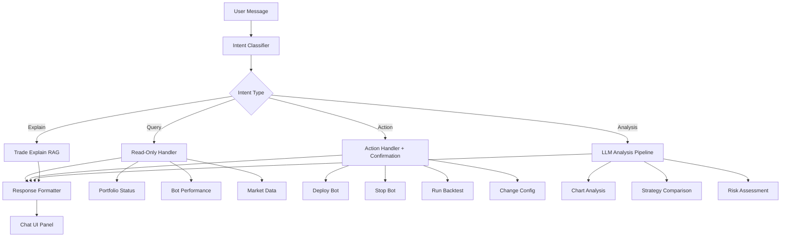
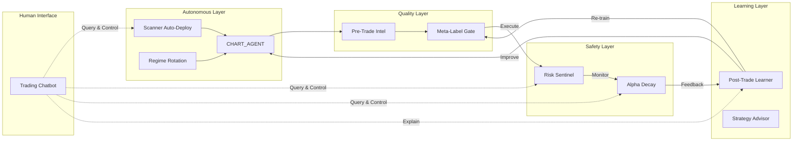

# New Agentic Bots & Trading Chatbot — Architecture Proposal

This proposal is grounded in your app's **existing infrastructure** — every concept below reuses modules that already exist and work. Nothing here requires a new framework or external service you don't already have wired up.

---

## What You Already Have (Infrastructure Audit)

Before proposing anything, here's the foundation these agents build on:

| Capability | Module | Status |
|:---|:---|:---|
| Multi-domain rule engine | [rule_engine.py](file:///c:/Users/Dhimeji01/.gemini/antigravity/scratch/trading-terminal/backend/app/services/agent/rule_engine.py) | ✅ Production |
| Regime-adaptive scoring | [regime_routing.py](file:///c:/Users/Dhimeji01/.gemini/antigravity/scratch/trading-terminal/backend/app/services/agent/regime_routing.py) | ✅ Production |
| GBM meta-label classifier | [meta_label_model.py](file:///c:/Users/Dhimeji01/.gemini/antigravity/scratch/trading-terminal/backend/app/services/bots/meta_label_model.py) | ✅ Production |
| Wilson calibration gate | [calibration.py](file:///c:/Users/Dhimeji01/.gemini/antigravity/scratch/trading-terminal/backend/app/services/bots/calibration.py) | ✅ Production |
| LLM router (Ollama + OpenRouter) | [llm/router.py](file:///c:/Users/Dhimeji01/.gemini/antigravity/scratch/trading-terminal/backend/app/services/agent/llm/router.py) | ✅ Production |
| Vision model (chart screenshots) | [vision_client.py](file:///c:/Users/Dhimeji01/.gemini/antigravity/scratch/trading-terminal/backend/app/services/agent/vision_client.py) | ✅ Production |
| Sentiment aggregation (news, social) | [altdata/store.py](file:///c:/Users/Dhimeji01/.gemini/antigravity/scratch/trading-terminal/backend/app/services/altdata/store.py) | ✅ Production |
| Anomaly detector (z-score) | [anomaly_detector.py](file:///c:/Users/Dhimeji01/.gemini/antigravity/scratch/trading-terminal/backend/app/services/agent/anomaly_detector.py) | ✅ Production |
| Risk monitor & kill switch | [risk_monitor.py](file:///c:/Users/Dhimeji01/.gemini/antigravity/scratch/trading-terminal/backend/app/services/bots/risk_monitor.py) | ✅ Production |
| Trade explain RAG | [trade_explain.py](file:///c:/Users/Dhimeji01/.gemini/antigravity/scratch/trading-terminal/backend/app/services/agent/trade_explain.py) | ✅ Production |
| Daily briefing generator | [briefing.py](file:///c:/Users/Dhimeji01/.gemini/antigravity/scratch/trading-terminal/backend/app/services/agent/briefing.py) | ✅ Production |
| Strategy advisor (LLM config patches) | [strategy_advisor.py](file:///c:/Users/Dhimeji01/.gemini/antigravity/scratch/trading-terminal/backend/app/services/bots/strategy_advisor.py) | ✅ Production |
| Order book streaming | Frontend store `orderBooks` field | ✅ Production |
| Walk-forward / sweep optimizer | [backtest_walk_forward.py](file:///c:/Users/Dhimeji01/.gemini/antigravity/scratch/trading-terminal/backend/app/services/bots/backtest_walk_forward.py) | ✅ Production |

---

## Part 1: New Agentic Trading Bots

### 🟣 Agent 1: **Risk Sentinel Agent** (`RISK_SENTINEL`)

**What it does**: An always-on autonomous agent that monitors the entire portfolio across all running bots and dynamically adjusts risk exposure — pausing bots, tightening stops, or killing positions when account-level danger signals emerge.

**Why this matters**: Your current `risk_monitor.py` is a passive kill switch — it trips *after* a drawdown breach. This agent acts *before* the breach, detecting deteriorating conditions and intervening proactively.

**Signal Architecture**:
```
Domain 1: DRAWDOWN TRAJECTORY (weight: 2.5)
  Tracks velocity of drawdown — not just level.
  Alert when drawdown is accelerating (2nd derivative negative).
  
Domain 2: CORRELATION SPIKE (weight: 2.0)  
  Monitors real-time correlation between active bot positions.
  When correlation > 0.7 across 3+ bots → concentration risk alert.
  Uses existing correlation.py module.

Domain 3: REGIME SHIFT DETECTION (weight: 1.5)
  Watches ATR regimes across watchlist.
  When >60% of symbols flip to "elevated" simultaneously → systemic event.

Domain 4: LOSS STREAK MONITOR (weight: 1.5)
  Tracks consecutive losing trades per bot.
  After N consecutive losses, auto-pauses the bot and requests human review.

Domain 5: MARGIN UTILISATION (weight: 1.0)
  Monitors margin_risk.py exposure levels.
  Warns before margin call territory.
```

**Actions the agent can take**:
- Auto-pause specific bots (via existing `BOT_PAUSE` action)
- Tighten trailing stops on open positions
- Send WebSocket alerts to the frontend with severity levels
- Generate an LLM-narrated risk report explaining what it did and why

**Builds on**: `risk_monitor.py`, `correlation.py`, `portfolio_risk.py`, `calibration.py`

---

### 🔵 Agent 2: **Regime Rotation Agent** (`REGIME_ROTATION`)

**What it does**: Monitors every symbol in your watchlist continuously and determines which *strategy* is best suited to the current market regime for each symbol — then automatically redeploys bots with the optimal strategy.

**Why this matters**: Your current setup requires the user to manually pick a strategy and symbol. In reality, a MACD_RSI trend-follower is terrible in ranging markets, and a BRS_SCALPING mean-reverter is terrible in trending markets. This agent solves that.

**Decision Logic**:
```
For each symbol on the watchlist every N minutes:
  1. Classify regime: trending / ranging / elevated_vol / compressed
     (reuse _classify_trend_regime from rule_engine.py + ATR regime)
  
  2. Check recent backtest performance per strategy for this regime:
     - Query backtest_store for cached results
     - Rank strategies by OOS PnL in similar regime conditions
  
  3. If the currently deployed strategy is suboptimal:
     - Stop the current bot
     - Deploy the better strategy
     - Log the rotation with LLM explanation

  4. Cooldown: don't rotate more than once per 4 hours per symbol
```

**Strategy-Regime Mapping** (initial heuristic, refined by backtests):

| Regime | Best Strategies | Worst Strategies |
|:---|:---|:---|
| Trending | SUPERTREND_ADX, CHART_AGENT, DONCHIAN_BREAKOUT | BRS_SCALPING, MARKET_MAKING |
| Ranging | BRS_SCALPING, VWAP_PULLBACK, MARKET_MAKING | SUPERTREND_ADX, DONCHIAN_BREAKOUT |
| Elevated Vol | CHART_AGENT (with vol sizing), none (flat) | TICK strategies, MARKET_MAKING |
| Compressed | DONCHIAN_BREAKOUT, CHART_AGENT | BRS_SCALPING |

**Builds on**: `rule_engine.py`, `backtest_store.py`, `pipeline.py`, `strategy_catalog.py`

---

### 🟢 Agent 3: **Alpha Decay Monitor** (`ALPHA_DECAY`)

**What it does**: Tracks whether a deployed bot's real-time performance is diverging from its backtest expectations. When a strategy's edge is decaying (performance degrading over time), it flags the bot for review, suggests parameter re-optimization, or auto-stops it.

**Why this matters**: Every trading strategy has a finite lifespan. Market microstructure changes, other participants adapt, and alpha decays. Currently, a bot runs until the user manually notices poor performance. This agent detects decay *early*.

**Monitoring Signals**:
```
1. ROLLING WIN RATE DIVERGENCE
   Compare live rolling 20-trade win rate vs. backtest win rate.
   Alert when live is >15% below backtest expectation.

2. SHARPE DECAY
   Compute rolling 30-trade Sharpe ratio.
   Alert when current Sharpe < 50% of backtest Sharpe.

3. REGIME MISMATCH
   Compare the ATR regime distribution in the backtest vs. live.
   If the bot was optimised for "trending" but is now running in "ranging" → flag.

4. CONSECUTIVE FILTER REJECTIONS
   Track how often the calibration gate blocks signals.
   If >80% of signals are being rejected → the model is stale.

5. META-LABEL CONFIDENCE DRIFT
   If the GBM model's average predicted P(win) has dropped over time,
   the underlying market dynamics have shifted away from training data.
```

**Actions**:
- Auto-trigger re-optimisation sweep (existing optimizer)
- Re-train the GBM meta-label model with fresh data
- Pause the bot with an LLM-generated decay report
- Suggest strategy rotation to the Regime Rotation Agent

**Builds on**: `calibration.py`, `meta_label_model.py`, `backtest_store.py`, `analytics.py`

---

### 🟡 Agent 4: **Pre-Trade Intelligence Agent** (`PRETRADE_INTEL`)

**What it does**: Before any bot executes a trade, this agent runs a rapid multi-source check and either confirms or vetoes the entry. It acts as an intelligent "last mile" filter that synthesizes information no single strategy module can see alone.

**Why this matters**: Your current filter chain is *sequential* — confidence → min_score → trend alignment → vol block → calibration gate. This agent runs a *holistic* assessment that considers cross-asset signals, macro calendar proximity, and recent news sentiment *together*.

**Pre-Trade Checklist**:
```
✓ Is there a macro event in the next 30 minutes? (event_policy.py)
✓ Are correlated assets confirming or diverging? (correlation.py)
✓ Is the current spread abnormally wide? (order book data)
✓ Is there breaking news sentiment shift? (altdata/store.py)
✓ Has the same setup failed 3+ times in the last 24h? (signal_ledger.py)
✓ Is the overnight session showing gap risk? (anomaly_detector.py)
```

**Output**: A `pre_trade_verdict` object attached to each signal:
```json
{
  "verdict": "CONFIRM" | "VETO" | "REDUCE_SIZE",
  "vetoes": ["macro_event_imminent", "correlated_asset_diverging"],
  "confidence_adjustment": -0.15,
  "reasoning": "FOMC minutes in 25 min — historical vol spike 3.2× avg post-release"
}
```

**Builds on**: `event_policy.py`, `correlation.py`, `signal_ledger.py`, `anomaly_detector.py`, `altdata/store.py`

---

### 🔴 Agent 5: **Post-Trade Learning Agent** (`POSTTRADE_LEARNER`)

**What it does**: After every trade closes, this agent performs a structured retrospective analysis, identifies *why* the trade won or lost, and feeds those lessons back into the system to improve future decisions.

**Why this matters**: Your existing `trade_explain.py` generates narratives, but those narratives are informational — they don't *change* anything. This agent closes the feedback loop by actually adjusting bot parameters based on what it learns.

**Learning Loop**:
```
1. TRADE CLOSES
   ↓
2. RETRIEVE CONTEXT
   - Entry insight snapshot (sub_reports, regime, confidence)
   - Price action during the trade (max adverse exclusion, max favorable)
   - Concurrent sentiment and event data
   ↓
3. CLASSIFY OUTCOME
   - Was the entry good but exit bad? (MAE vs. MFE analysis)
   - Was the stop too tight? (hit stop, then price reversed to target)
   - Was the regime wrong? (entered in ranging, should have been trending)
   ↓
4. GENERATE LESSON (LLM)
   - "Stop loss was 1.5× ATR but price retraced 2.1× ATR before moving
     to target. In elevated_vol regime, widen stops to 2.0× ATR."
   ↓
5. APPLY ADJUSTMENT
   - Update calibration buckets (existing Wilson gate)
   - Retrain meta-label model periodically
   - Suggest config patches via strategy_advisor.py
   - Write to trade journal (existing journal/store.py)
```

**Builds on**: `trade_explain.py`, `calibration.py`, `strategy_advisor.py`, `meta_label_model.py`, `briefing.py`

---

### ⚪ Agent 6: **Scanner Auto-Deploy Agent** (`SCANNER_DEPLOY`)

**What it does**: Watches the market screener continuously and automatically deploys bots on the highest-ranked opportunities — essentially turning the app into a fully autonomous trading system that hunts for setups, validates them, deploys capital, and manages risk without human intervention.

**Why this matters**: Your `pipeline.py` already has `rank_scan_rows()` and `active_bot_symbols()` — the skeleton of this agent exists. But it's not connected to automatic deployment with proper guardrails.

**Pipeline**:
```
Scanner produces ranked rows (existing screener.py)
  ↓
Filter: min_confidence ≥ 0.65, min_score ≥ 3
  ↓
Check: symbol not already deployed (pipeline.py)
  ↓
Check: total deployed capital < max portfolio allocation
  ↓
Check: correlation with existing positions < 0.6 (correlation.py)
  ↓
Run quick 7-day backtest for the setup (backtester.py)
  ↓
If backtest OOS PnL > 0 and win_rate > 50%:
  Deploy with dynamic allocation based on confidence
  ↓
Monitor via Alpha Decay Agent (Agent 3)
  ↓
Auto-stop if drawdown > 5% on the single position
```

**Builds on**: `pipeline.py`, `screener.py`, `backtester.py`, `correlation.py`, `deploy_gate.py`

---

## Part 2: Trading Chatbot (`TRADE_COPILOT`)

This is fundamentally different from the agentic bots above. The bots *trade autonomously*. The chatbot is a **conversational interface** that lets the user interact with the entire system using natural language.

### Architecture



### What the User Can Say (Intent Examples)

**Portfolio & Account Queries**:
- *"How are my bots doing today?"* → Fetches active bots, aggregates PnL, win rate
- *"What's my total exposure right now?"* → Queries `portfolio_risk.py`
- *"Show me my worst performing bot"* → Ranks bots by PnL
- *"Am I close to my drawdown limit?"* → Queries `risk_monitor.py`

**Market Analysis**:
- *"What does BTCUSDT look like right now?"* → Runs `chart_analyst.analyze()`, returns insight
- *"Is ETH in a trending or ranging market?"* → Queries regime classification
- *"Any news affecting AAPL?"* → Queries `altdata/store.py` sentiment
- *"Compare MACD_RSI vs SUPERTREND_ADX for TSLA"* → Runs two backtests, compares results

**Bot Management**:
- *"Deploy a CHART_AGENT on ETHUSDT with $2000"* → Builds deploy payload, asks for confirmation
- *"Pause all my bots"* → Calls `BOT_PAUSE` on all active
- *"Tighten the stop on bot XYZ to 1.5%"* → Config patch via WebSocket
- *"Why did my last BTC trade lose money?"* → Invokes `trade_explain.py` RAG pipeline

**Research & Optimization**:
- *"Run a 90-day backtest on CHART_AGENT for BTC"* → Dispatches backtest via existing handler
- *"Optimize MACD_RSI parameters for ETH"* → Opens sweep with default grid
- *"What strategy works best in this market?"* → Regime detection + strategy ranking

### Implementation Approach

The chatbot should be built as a **tool-calling LLM agent**, not a simple prompt-response system:

```python
# Backend: app/services/agent/copilot.py

COPILOT_TOOLS = [
    {
        "name": "get_portfolio_status",
        "description": "Get current portfolio equity, exposure, drawdown, and active bot count",
        "handler": lambda ctx: build_portfolio_snapshot(ctx.oms).to_dict(),
    },
    {
        "name": "analyze_symbol",
        "description": "Run CHART_AGENT analysis on a symbol and return the insight",
        "parameters": {"symbol": "string", "timeframe": "string"},
        "handler": lambda ctx, symbol, tf: chart_analyst.analyze(symbol, timeframe=tf),
    },
    {
        "name": "get_bot_performance",
        "description": "Get PnL, win rate, and trade count for a specific bot or all bots",
        "parameters": {"bot_id": "string (optional)"},
        "handler": lambda ctx, bot_id=None: get_bot_analytics(ctx, bot_id),
    },
    {
        "name": "deploy_bot",
        "description": "Deploy a trading bot (requires user confirmation)",
        "parameters": {"strategy": "string", "symbol": "string", "allocation": "number"},
        "requires_confirmation": True,
        "handler": lambda ctx, **kw: build_deploy_payload(**kw),
    },
    {
        "name": "run_backtest",
        "description": "Run a backtest with given parameters",
        "parameters": {"strategy": "string", "symbol": "string", "days": "number"},
        "handler": lambda ctx, **kw: dispatch_backtest(ctx, **kw),
    },
    {
        "name": "explain_trade",
        "description": "Explain why a specific trade won or lost",
        "parameters": {"bot_id": "string", "trade_index": "number"},
        "handler": lambda ctx, **kw: explain_trade_context(**kw),
    },
    # ... 15-20 more tools covering the full API surface
]
```

The LLM receives the user's message + the tool definitions, decides which tool(s) to call, executes them, then synthesises a natural language response from the tool outputs.

### Frontend: Chat Panel

A new dock tab or side panel:
- Persistent chat history (stored in SQLite like journal entries)
- Inline charts/tables rendered from tool responses
- Confirmation buttons for destructive actions (deploy, stop, modify)
- Typing indicator while LLM processes
- Voice input support (Web Speech API → text → copilot)

---

## Priority Ranking

| Priority | Agent / Feature | Effort | Value | Risk |
|:---|:---|:---|:---|:---|
| **1st** | 🟣 Risk Sentinel Agent | 🟡 Medium | 🔴 Critical — protects capital | Low |
| **2nd** | ⚪ Trading Chatbot (Copilot) | 🔴 High | 🔴 Critical — UX transformation | Medium |
| **3rd** | 🟢 Alpha Decay Monitor | 🟢 Low | 🟡 High — prevents stale bots | Low |
| **4th** | 🟡 Pre-Trade Intelligence | 🟡 Medium | 🟡 High — better entries | Low |
| **5th** | 🔴 Post-Trade Learner | 🟡 Medium | 🟡 High — closed-loop learning | Medium |
| **6th** | 🔵 Regime Rotation Agent | 🔴 High | 🟡 High — autonomous rebalancing | High |
| **7th** | ⚪ Scanner Auto-Deploy | 🟡 Medium | 🟡 Medium — full autonomy | High |

> [!IMPORTANT]
> The **Risk Sentinel** should be built first because it *protects capital*. No amount of alpha generation matters if a correlated drawdown wipes the account. Every other agent assumes the Risk Sentinel is running as a safety net.

> [!TIP]
> The **Trading Chatbot** should be the second priority because it transforms the entire user experience. Once the chatbot works, users can interact with *all* the other agents through conversation instead of clicking through UI panels. It becomes the unifying interface.

---

## How They Work Together



The agents form a **closed-loop autonomous trading system** where:
1. **Scanner/Rotation** finds opportunities
2. **CHART_AGENT** generates signals  
3. **Pre-Trade Intel** validates entries
4. **Meta-Label Gate** filters by ML probability
5. **Risk Sentinel** monitors portfolio health
6. **Alpha Decay** catches degrading strategies
7. **Post-Trade Learner** feeds lessons back
8. **Chatbot** lets the human oversee and intervene at any layer
