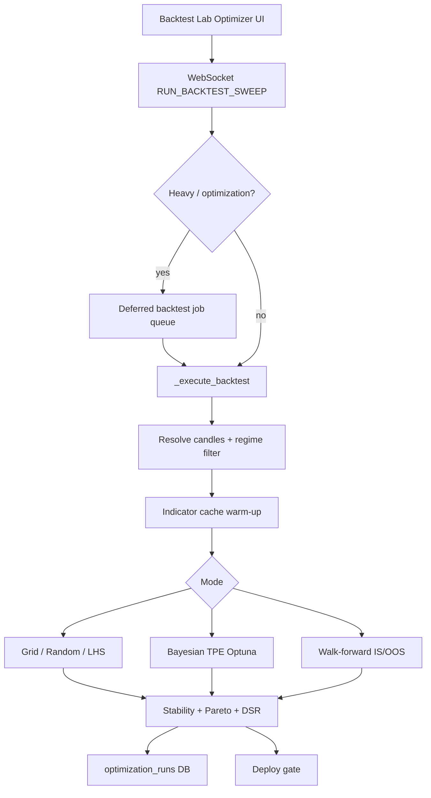

# Optimization Engine — Report, User Guide & Tuning

**Status:** Tiers 1–5 implemented (trust, search quality, validation, UX/workflow, engine performance)  
**Last updated:** 2026-07-07  
**Primary UI:** Backtest Lab → **Optimizer** (`BacktestSweepPanel.jsx`)  
**Primary API:** `RUN_BACKTEST_SWEEP` → `backend/app/api/handlers/bots.py`

---

## 1. Executive summary

The optimization engine turns a single-symbol backtest into a **parameter search + out-of-sample validation** pipeline. It is designed for **research discipline**, not raw in-sample PnL chasing:

| Principle | What the engine enforces |
|-----------|--------------------------|
| OOS before deploy | Deploy gate **blocks** sweep-only runs; walk-forward required |
| Selection-bias awareness | WFE, DSR, PBO audit, trades-per-param floors |
| Strategy-aware defaults | 2–3 params pre-enabled per strategy; default objective **Calmar** |
| Server stability | Sweeps/WF always **deferred** to background jobs (never block WS) |
| Speed | Indicator cache reuse; adaptive trial budget (5 min / 200 trials) |

**Recommended path:** Baseline → sweep (exploratory) → **walk-forward** (validation) → deploy gate → deploy.

---

## 2. Architecture



### Key backend modules

| Module | Role |
|--------|------|
| `backtest_sweep.py` | Grid / random / LHS combo expansion |
| `backtest_bayesian.py` | Optuna TPE + early stopping |
| `backtest_walk_forward.py` | Rolling / anchored WF, IS/OOS aggregation |
| `backtest_selection_bias.py` | WFE, DSR, trades-per-param |
| `backtest_purged_cv.py` | Purge / embargo / final holdout splits |
| `backtest_pbo.py` | PBO / CSCV overfit audit |
| `backtest_param_stability.py` | Sensitivity + stable centroid pick |
| `backtest_multi_objective.py` | Robust score, Pareto frontier |
| `backtest_regime_filter.py` | Optimize on subset of vol regimes |
| `backtest_portfolio_sweep.py` | Shared params across basket symbols |
| `backtest_trial_budget.py` | Time + max-trial caps (Tier 5) |
| `backtest_indicator_cache.py` | Fingerprint-based indicator reuse (Tier 5) |
| `backtest_perf.py` | Job tier routing, duration estimates |
| `deploy_gate.py` | Pre-deploy validation checks |

---

## 3. Feature tiers (what was implemented)

### Tier 1 — Trust & correctness

| # | Feature | Behavior |
|---|---------|----------|
| 1 | Backtest/live parity | HTF confirmation, filter strategies aligned with live (`strategy_runtime.py`) |
| 2 | Walk-Forward Efficiency (WFE) | `OOS objective / IS objective`; deploy gate warns/blocks below 0.5 |
| 3 | Deflated Sharpe (DSR) | Penalizes high trial counts; shown in WF aggregate |
| 4 | Trades per parameter | WF uses **5×** swept params floor (IS windows are shorter); full sweep uses **30×** |
| 5 | OOS warm-up buffer | Indicator lookback prepended to OOS slice; PnL scored only on true OOS bars |

### Tier 2 — Search engine quality

| # | Feature | Behavior |
|---|---------|----------|
| 6 | Bayesian mode | `sweep_mode: "bayesian"` — Optuna TPE, patience-based early stop |
| 7 | Parameter stability | Top-quartile sensitivity; **stable_config** centroid vs single peak |
| 8 | Multi-objective | `robust_score`, Pareto frontier on (PnL, DD, trades) |
| 9 | Extended objectives | Calmar, Sortino, expectancy, win rate, stress PnL, loss streak, etc. |

### Tier 3 — Validation methodology

| # | Feature | Behavior |
|---|---------|----------|
| 10 | Purged WF splits | Train bars whose exit overlaps OOS start are purged; embargo after test |
| 11 | PBO / CSCV audit | Optional “overfit audit” — PBO ≥50% blocks deploy, ≥35% warns |
| 12 | Anchored vs rolling WF | Anchored = expanding IS; rolling = fixed-width slices |
| 13 | Final holdout | Last N% of range never used in sweep/WF; one-shot validation after pick |

### Tier 4 — UX & workflow

| # | Feature | Behavior |
|---|---------|----------|
| 14 | Smarter defaults | Calmar default; strategy-specific enabled params; WF multi-fold on |
| 15 | Run comparison | Compare two saved `optimization_runs` side-by-side |
| 16 | Regime-conditional optimization | Filter bars to trend/elevated/normal/compressed before sweep |
| 17 | Portfolio-aware sweep | Same risk params tested across `portfolio_symbols` |
| 18 | Workflow presets | One-click chips: WF rigorous, meta-label sweep, portfolio optimize |

### Tier 5 — Engine performance

| # | Feature | Behavior |
|---|---------|----------|
| 19 | Adaptive trial budget | Default **5 min** wall clock + **200** max trials (grid still **24**) |
| 20 | Selective indicator cache | Risk-only sweeps reuse one indicator DataFrame; RSI/MACD changes invalidate |
| 21 | Job isolation | `BACKTEST_FORCE_DEFER_OPTIMIZATION` — all sweeps/WF queued, never inline |

---

## 4. User guide

### 4.1 Where to find it

1. Open **Automation Studio** (dock) or **Backtest Lab** sheet.
2. Select symbol, strategy, days, timeframe.
3. Open the **Optimizer** tab (`BacktestSweepPanel`).

### 4.2 Quick start (recommended)

1. **Workflow preset:** click **WF rigorous** (30d, Calmar, multi-fold WF, purged splits).
2. Confirm **2–3 params** are enabled (strategy-specific defaults).
3. Click **Rolling WF (3)** — not “Run sweep” alone.
4. Review WF panel: WFE, stability, regime breakdown, optional PBO.
5. **Apply best config** → deploy; deploy gate must pass.

### 4.3 Search modes

| Mode | Best for | Default cap |
|------|----------|-------------|
| **Grid** | ≤3 params, small grids | 24 combos |
| **Random** | Large grids, exploration | up to 200 |
| **LHS** | Space-filling sample | up to 200 |
| **Bayesian** | 4+ params, continuous tuning | up to 200 trials + early stop |

### 4.4 Walk-forward options

| Control | Meaning |
|---------|---------|
| Multi-fold walk-forward | Sequential IS/OOS slices (default **on**) |
| Folds | 2–5 rolling windows |
| WF mode | **Rolling** (fixed IS) or **Anchored** (expanding IS) |
| Purged splits | Removes overlap leakage at train/test boundary |
| Final holdout % | Reserve tail segment (e.g. 10%) — never optimized |
| PBO audit | CSCV overfit probability (slower) |
| Regime filter | Optimize only on matching vol regime bars |
| Auto-deploy | Creates bot when OOS passes thresholds |

### 4.5 Workflow presets (`BacktestWorkflowPresets.jsx`)

| Preset | Action |
|--------|--------|
| 7d baseline | Single-symbol live-parity backtest |
| OOS holdout | 30% OOS window |
| Portfolio basket | Multi-symbol shared capital |
| **WF rigorous** | 30d + Calmar + multi-fold + purged |
| Meta-label sweep | CHART_AGENT gate on/off |
| Portfolio optimize | Basket + shared risk params |
| WF optimize | Opens Lab optimizer tab |
| Meta-label WF | CHART_AGENT classifier validation |

### 4.6 After a run

- **Sweep table / heatmap** — ranked configs by objective.
- **WF panel** — per-fold IS/OOS, stitched OOS equity, WFE, DSR.
- **Optimization history** — saved runs; select two to **compare**.
- **Deploy gate** — blocks exploratory sweep-only deploy.

### 4.7 What *not* to do

- Deploy from **sweep-only** (no `walk_forward` in results) — gate blocks.
- Sweep **10+ params** on short windows — trades-per-param floor will reject combos.
- Ignore **WFE < 0.5** — likely overfit IS winner.
- Run portfolio sweep in **Bayesian** mode — not supported yet.

---

## 5. Tuning guide

### 5.1 Environment variables (`backend/.env`)

```bash
# Job routing
BACKTEST_DEFER_HEAVY=true                    # defer portfolio, long runs, reasoning
BACKTEST_FORCE_DEFER_OPTIMIZATION=true     # always queue sweep/WF (recommended)
BACKTEST_INLINE_MAX_SEC=30                 # max seconds for inline baseline runs
BACKTEST_PARALLEL_WORKERS=4                # parallel sweep/WF workers

# Tier 5 trial budget (server defaults)
BACKTEST_SWEEP_MAX_TRIALS=200              # random/LHS/Bayesian ceiling
BACKTEST_SWEEP_MAX_GRID=24                 # grid ceiling
BACKTEST_SWEEP_TIME_BUDGET_SEC=300         # 5 minutes wall clock per sweep job

# Deploy gate (server)
DEPLOY_GATE_ENABLED=true
DEPLOY_MIN_OOS_PNL=0
DEPLOY_MIN_OOS_TRADES=1
DEPLOY_MIN_STABILITY_SCORE=0.5
```

### 5.2 Per-request sweep fields (WebSocket / API)

Reserved keys in the `sweep` object (not treated as strategy params):

| Field | Type | Default | Purpose |
|-------|------|---------|---------|
| `sweep_mode` | `grid\|random\|lhs\|bayesian` | `grid` | Search algorithm |
| `max_combos` | int | 24 / 200 | Requested combo count |
| `max_trials` | int | env cap | Hard trial ceiling |
| `time_budget_sec` | float | 300 | Wall-clock stop (0 = disabled) |
| `sweep_objective` | string | `calmar_ratio` | Ranking metric |
| `min_trades` | int | 1 | Per-combo floor before ranking |
| `sweep_seed` | int | — | Reproducible random/LHS |
| `bayesian_patience` | int | 12 | Trials without improvement before stop |
| `bayesian_startup_trials` | int | 8 | Random trials before TPE |
| `purged_splits` | bool | true | Purge/embargo in WF |
| `wf_mode` | `rolling\|anchored` | `rolling` | WF window style |
| `final_holdout_pct` | float | — | Reserved OOS tail |
| `pbo_audit` | bool | false | Run CSCV PBO |
| `optimize_regime` | string | `all` | `trend\|elevated\|normal\|compressed` |
| `portfolio_sweep` | bool | false | Basket aggregation |

### 5.3 Objectives

| Objective | Use when |
|-----------|----------|
| `calmar_ratio` | **Default** — return / max drawdown |
| `max_drawdown_penalty` | PnL minus DD penalty |
| `sharpe_ratio` | Risk-adjusted; check DSR when many trials |
| `robust_score` | Sharpe × √trades × stability |
| `sortino_ratio` | Downside volatility focus |
| `profit_factor` | Gross win / gross loss |
| `expectancy` | Per-trade edge |
| `stress_pnl` | 2× slippage stress test |
| `total_pnl` | Legacy; not recommended for deploy picks |

### 5.4 Strategy-specific first params

See `frontend/src/lib/optimizerDefaults.js` and `docs/INDICATOR_STRATEGIES.md`.

| Strategy | Default swept params |
|----------|---------------------|
| MACD_RSI | `rsi_length`, `macd_slow`, `trailing_stop_percent` |
| BRS_SCALPING | `bb_std`, `rsi_oversold`, `take_profit_percent` |
| SUPERTREND_ADX | `adx_threshold`, `st_multiplier`, `block_elevated_vol` |
| CHART_AGENT | `min_confidence`, `trailing_stop_percent`, `require_trend_alignment` |
| ICT_SMC | `sweep_lookback`, `fvg_min_gap_pct`, `ob_lookback` |

### 5.5 Performance tuning tips

1. **Risk-only sweeps** (SL/TP/allocation) — fastest; indicator cache shared across all combos.
2. **Indicator sweeps** (RSI length, MACD slow) — cache splits per fingerprint; expect longer runs.
3. **Lower `max_combos`** for grid when iterating quickly; use Bayesian for 4+ dimensions.
4. **Shorter `time_budget_sec`** on shared servers; raise `BACKTEST_SWEEP_MAX_TRIALS` for overnight jobs.
5. **Parallel workers** — increase `BACKTEST_PARALLEL_WORKERS` only if RAM allows (each worker holds a DF copy).

### 5.6 Deploy gate checklist

| Check ID | Level | Trigger |
|----------|-------|---------|
| `exploratory_sweep` | block | Sweep without walk-forward |
| `wf_oos` | block | OOS PnL/trades below threshold |
| `wf_stability` | block | Stability < 0.5 across ≥3 folds |
| `wf_dsr` | warn | DSR < 0.95 |
| `final_holdout` | block | Reserved segment failed |
| `pbo_audit` | block/warn | PBO ≥50% / ≥35% |
| `wf_regime` | warn | Single-regime OOS concentration |

---

## 6. Audit report (2026-07-07)

Full review of Tiers 1–5 implementation. **70 optimization-related tests pass.**

### 6.1 Issues found & fixed

| Issue | Severity | Fix |
|-------|----------|-----|
| `BacktestSweepPanel` missing `<Checkbox>` tag | **Critical** (UI crash) | Restored auto-deploy checkbox element |
| Duplicate `openBacktestLab` in `BacktestWorkflowPresets` | **Critical** (build fail) | Removed duplicate destructuring |
| Undefined `walkForward` in JSX | **Critical** (runtime crash) | Removed invalid conditional |
| `_sweep_combo_count` hardcoded 24/100 | Medium | Uses `resolve_max_trials` (200 cap) |
| WF path skipped indicator cache warm-up | Medium | Pre-warm unique fingerprints before `run_walk_forward` |
| Sequential sweep errors not counted toward trial budget | Low | `trial_budget.record_trial()` on error rows |
| Parallel `_consume_result` errors not counted | Low | Same `record_trial()` fix |

### 6.2 Verified OK (no change required)

- Deploy gate backend/frontend parity (`exploratory_sweep`, WFE, PBO, holdout).
- WF min-trades floor: **5×** params in WF, **30×** in full sweep.
- Bayesian early stop + patience wiring.
- Purged splits, anchored WF, final holdout, PBO audit (Tier 3 tests).
- Regime filter + portfolio sweep + deploy gate (Tier 4 tests).
- Indicator fingerprint: risk params share cache; indicator params differ (Tier 5 tests).
- Job isolation: sweep/WF always deferred when `BACKTEST_FORCE_DEFER_OPTIMIZATION=true`.

### 6.3 Known limitations

| Limitation | Workaround |
|------------|------------|
| Portfolio sweep + Bayesian | Use grid/random/LHS for portfolio |
| WF trial budget not enforced per-fold | Keep `max_combos` low; WF multiplies runtime by folds |
| Parallel sweep may finish slightly over time budget | In-flight tasks complete; budget stops *new* trials |
| CHART_AGENT sweep is rules-only | LLM not varied during optimization (by design) |
| Meta-label in sweep grid | Use meta-label WF preset separately |

---

## 7. Troubleshooting

| Symptom | Likely cause | Action |
|---------|--------------|--------|
| “Walk-forward sweep produced no valid in-sample runs” | Too few trades in short IS windows | Increase days; reduce swept params; WF uses 5× floor not 30× |
| “Regime filter left only N bars” | Filter too aggressive | More days or use `all` regimes |
| Sweep queued, no immediate result | Tier 5 job isolation | Normal — watch progress; check `/api/v1/backtest/jobs/active` |
| Deploy blocked: exploratory sweep | Sweep-only run | Re-run with **Walk-forward** button |
| PBO block | High overfit risk | Fewer trials; simpler grid; longer history |
| Terminal failed to render | JSX/syntax error in optimizer chain | `npx vite build` in `frontend/`; hard-refresh |

---

## 8. Test coverage

```bash
cd backend
python -m pytest tests/test_backtest_tier1.py tests/test_backtest_tier2.py \
  tests/test_backtest_tier3.py tests/test_backtest_tier4.py tests/test_backtest_tier5.py \
  tests/test_backtest_perf.py tests/test_deploy_gate.py -q
```

Expected: **70 passed**.

---

## 9. Related docs

- [INDICATOR_STRATEGIES.md](./INDICATOR_STRATEGIES.md) — strategy params and live/backtest parity notes
- [BACKTEST_AGENT_WALKTHROUGH.md](./BACKTEST_AGENT_WALKTHROUGH.md) — earlier backtest/agent upgrades
- [DATABASE.md](./DATABASE.md) — `optimization_runs`, `backtest_jobs` tables
