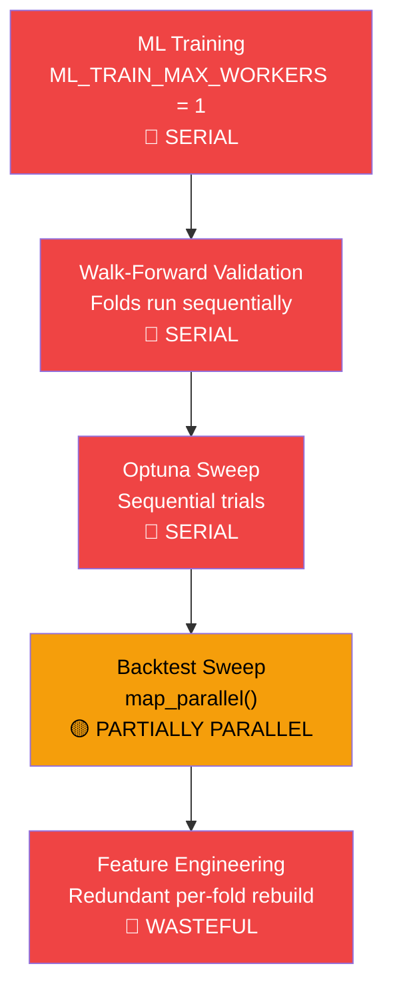

# Optimizer Performance Deep-Dive: Bottleneck Analysis & GPU/Multi-Core Acceleration

> **Status:** Phase 0–2 implemented (2026-08-02) — knobs in `.env.example`; Opt #2/#3/#4/#7/#8 in ML Validate/Auto-Tune surface. Keep `BACKTEST_PARALLEL_BACKEND=auto`; WF IS ProcessPool shortcut stays removed (Tier A).  
> **Created:** 2026-08-01  
> **Scope:** Backend compute pipeline — ML training, walk-forward validation, Optuna hyperparam sweep, and backtest optimization

---

## Executive Summary

The optimizer is slow because **every stage runs single-threaded/single-process by design**, and available multi-core CPU and GPU resources go underutilized. Here's the high-level picture:



**5 bottlenecks identified. Estimated total speedup with all fixes: 3–8× on multi-core CPU, 5–15× with GPU.**

---

## System Architecture (Current State)

### Compute Path

```
User clicks "Optimize" / "Validate" / "Auto-Tune"
  └─ Frontend (ModelTrainingDashboard / AlgoPanel)
       └─ POST /api/v1/ml/train  OR  /api/v1/ml/validate  OR  RUN_BACKTEST action
            └─ ml_train_executor.py  →  ProcessPoolExecutor(max_workers=1)
                 └─ ml_walk_forward_validator.py  →  Sequential fold loop
                      └─ Per-fold: trainer(symbol, candles, config)
                           └─ ml_feature_engineering.py  →  Feature matrix build
                           └─ torch training loop  →  GPU if available
                      └─ Per-fold: evaluate_oos_accuracy()
                           └─ ONNX or torch inference on test candles
            └─ ml_hyperparam_sweep.py  →  Sequential Optuna trial loop
                 └─ Per-trial: evaluate_trial_purged_cv()  →  WF inside WF
            └─ backtest_walk_forward.py  →  ThreadPool/ProcessPool for sweep combos
                 └─ backtester.py  →  Per-bar simulation loop
```

### Current Config Defaults

| Config | Default | Source | Effect |
|--------|---------|--------|--------|
| `ML_TRAIN_MAX_WORKERS` | **1** | [config.py:L75](file:///c:/Users/Dhimeji01/.gemini/antigravity/scratch/trading-terminal/backend/app/config.py#L75) | Only 1 train/validate job runs at a time |
| `ML_ASYNC_MAX_INFLIGHT` | **1** | [config.py:L80](file:///c:/Users/Dhimeji01/.gemini/antigravity/scratch/trading-terminal/backend/app/config.py#L80) | Only 1 async ML job queued |
| `BACKTEST_PARALLEL_WORKERS` | **min(cpu_count, 8)** | [config.py:L196](file:///c:/Users/Dhimeji01/.gemini/antigravity/scratch/trading-terminal/backend/app/config.py#L196) | Backtest sweep combos parallelism |
| `BACKTEST_PARALLEL_MAX` | **16** | [config.py:L198](file:///c:/Users/Dhimeji01/.gemini/antigravity/scratch/trading-terminal/backend/app/config.py#L198) | Hard cap on parallel workers |
| `BACKTEST_PARALLEL_BACKEND` | **auto** | [config.py:L202](file:///c:/Users/Dhimeji01/.gemini/antigravity/scratch/trading-terminal/backend/app/config.py#L202) | Process unless CUDA loaded |
| `BACKTEST_BATCH_INFERENCE` | **true** | [config.py:L204](file:///c:/Users/Dhimeji01/.gemini/antigravity/scratch/trading-terminal/backend/app/config.py#L204) | Batched ONNX/sklearn inference |
| `BACKTEST_VECTORIZED_FEATURES` | **true** | [config.py:L209](file:///c:/Users/Dhimeji01/.gemini/antigravity/scratch/trading-terminal/backend/app/config.py#L209) | Columnar NumPy feature matrix |
| `BACKTEST_INFERENCE_DEVICE` | **auto** | [config.py:L213](file:///c:/Users/Dhimeji01/.gemini/antigravity/scratch/trading-terminal/backend/app/config.py#L213) | CUDA for research, CPU for live |
| `ML_TRAIN_PROCESS_ISOLATION` | **true** | [config.py:L72](file:///c:/Users/Dhimeji01/.gemini/antigravity/scratch/trading-terminal/backend/app/config.py#L72) | Isolate torch in subprocess |
| `ML_TRAIN_TORCH_IN_PROCESS` | **false** | [config.py:L89](file:///c:/Users/Dhimeji01/.gemini/antigravity/scratch/trading-terminal/backend/app/config.py#L89) | Force torch in main process |

---

## Bottleneck #1: ML_TRAIN_MAX_WORKERS = 1 (Process Pool Serialization)

> [!CAUTION]
> This is the **single biggest bottleneck**. Every ML train, validate, and auto-tune job is funneled through a `ProcessPoolExecutor(max_workers=1)`.

### Evidence

[ml_train_executor.py:L20-21](file:///c:/Users/Dhimeji01/.gemini/antigravity/scratch/trading-terminal/backend/app/services/bots/ml_train_executor.py#L20-L21):
```python
_pool: ProcessPoolExecutor | None = None
_pool_lock = threading.Lock()
```

[ml_train_executor.py:L78-80](file:///c:/Users/Dhimeji01/.gemini/antigravity/scratch/trading-terminal/backend/app/services/bots/ml_train_executor.py#L78-L80):
```python
def _max_workers() -> int:
    from app.config import ML_TRAIN_MAX_WORKERS
    return max(1, int(ML_TRAIN_MAX_WORKERS))  # Default: 1
```

### Impact

- Walk-forward validation with 5 folds: each fold trains sequentially → 5× slower than necessary
- Auto-tune with 20 screen trials: each trial trains sequentially → 20× slower than necessary
- Batch training of multiple strategies: each strategy waits for the previous one

### Why It Was Set to 1

The comment at [config.py:L71](file:///c:/Users/Dhimeji01/.gemini/antigravity/scratch/trading-terminal/backend/app/config.py#L71) explains: "Isolate torch/ONNX train+validate in a max-1 process pool (MEMORY #9)." This was a deliberate memory protection — torch models can spike RSS, and running multiple concurrently was causing OOM on limited-RAM hosts.

### Fix Options

| Option | Workers | When | Risk |
|--------|---------|------|------|
| **Raise to 2** | `ML_TRAIN_MAX_WORKERS=2` | ≥16GB RAM, single GPU | Low — torch uses GPU memory, not CPU RAM for forward/backward |
| **Raise to 3–4** | `ML_TRAIN_MAX_WORKERS=3` | ≥32GB RAM, multi-GPU or GPU+CPU | Medium — watch ORT thread contention |
| **Auto-scale** | Based on `torch.cuda.device_count()` + available RAM | Any | Best — needs code change |

---

## Bottleneck #2: Walk-Forward Folds Run Sequentially

> [!WARNING]
> Walk-forward validation is the most time-consuming operation. Each fold runs `trainer()` then `evaluate_oos_accuracy()` **one at a time** in a for-loop.

### Evidence

[ml_walk_forward_validator.py:L610](file:///c:/Users/Dhimeji01/.gemini/antigravity/scratch/trading-terminal/backend/app/services/bots/ml_walk_forward_validator.py#L610):
```python
for fold in folds:  # Sequential!
    # ...
    train_result = trainer(symbol, train_candles, config=cfg)  # 30s–5min each
    # ...
    oos_metrics = evaluate_oos_accuracy(strategy, test_candles, cfg, ...)  # 5–30s each
```

### Why This Is Parallelizable

Walk-forward folds are **independent** after data partitioning:
- Each fold trains on its own IS window and evaluates on its own OOS window
- There's a purge/embargo between folds, but that's computed upfront in `generate_wf_folds()`
- The only dependency is `prev_test_end` for embargo — but this can be pre-computed since fold boundaries are deterministic

### Measured Impact (Estimated)

| Folds | Sequential Time | Parallel (4 workers) | Speedup |
|-------|----------------|---------------------|---------|
| 3 | 3× single fold | ~1× single fold | **3×** |
| 5 | 5× single fold | ~1.5× single fold | **3.3×** |
| 8 | 8× single fold | ~2× single fold | **4×** |

### Constraint

For GPU training, parallel folds compete for GPU memory. Solutions:
- **CPU folds in parallel, GPU fold sequential** — split strategy
- **Alternating GPU/CPU** — odd folds on GPU, even on CPU
- **Data-parallel** — each fold gets a fraction of GPU memory (PyTorch DataParallel)

---

## Bottleneck #3: Optuna Hyperparam Sweep Is Single-Threaded

> [!WARNING]
> The ML Auto-Tune (Optuna) runs each trial sequentially. With 20 trials × purged CV per trial, this is the slowest operation in the entire app.

### Evidence

[ml_hyperparam_sweep.py:L453](file:///c:/Users/Dhimeji01/.gemini/antigravity/scratch/trading-terminal/backend/app/services/bots/ml_hyperparam_sweep.py#L453):
```python
for i in range(n_screen):  # Sequential!
    trial = study.ask()
    params = _suggest_from_space(trial, space)
    # ...
    result = _evaluate(bars, trial_cfg, ...)  # Each trial: 30s–5min
    study.tell(trial, float(score))
```

### Why This Is a Problem

Optuna TPE (Tree-structured Parzen Estimator) is **inherently sequential** — each trial's suggestion depends on results of previous trials. However:

1. **The first `n_startup_trials` are random** (default 5–8) → these CAN run in parallel
2. **Multi-fidelity screen phase** evaluates with reduced data → cheaper → parallelizable
3. **Promotion phase** runs only top-k (3) at full fidelity → parallelizable

### Fix Options

| Approach | How | Speedup |
|----------|-----|---------|
| **Parallel startup trials** | Run first 5–8 random trials concurrently | 3–5× on startup phase |
| **Optuna parallel ask/tell** | Use `study.ask()` in batch, `study.tell()` in batch (Optuna 3.x supports this) | 2–4× on screen phase |
| **Replace TPE with Ax/BoTorch** | Batch Bayesian optimization natively supports parallel evaluation | 3–8× overall |
| **Async multi-fidelity (ASHA)** | Optuna's built-in `HyperbandPruner` with async bracket evaluation | 2–5× with early stopping |

---

## Bottleneck #4: Feature Engineering Rebuilds Per Fold

> [!IMPORTANT]
> Each walk-forward fold rebuilds the entire feature matrix from raw candles — including the overlapping portions that are shared between folds.

### Evidence

In `evaluate_oos_accuracy()` → `_evaluate_oos_transformer_torch()` at [ml_walk_forward_validator.py:L406](file:///c:/Users/Dhimeji01/.gemini/antigravity/scratch/trading-terminal/backend/app/services/bots/ml_walk_forward_validator.py#L406):
```python
feat_matrix = precompute_signal_feature_matrix(
    test_candles, feature_lookback=feature_lb,
)  # Recomputed for EVERY fold's OOS window
```

And in each trainer call, the trainer internally builds features from `train_candles`.

### The Waste

For a 5-fold WF with 10,000 candles:
- Fold 1 IS: candles[0:7000] → builds features for 7,000 bars
- Fold 2 IS: candles[0:7500] → builds features for 7,500 bars (7,000 already computed!)
- Fold 3 IS: candles[0:8000] → builds features for 8,000 bars (7,500 already computed!)
- Total bars processed: ~37,000 (with only 10,000 unique bars)
- **Waste factor: ~3.7×**

### Fix: Precompute Once, Slice Per Fold

```python
# Build features for ALL candles ONCE before the fold loop
full_feature_matrix = precompute_signal_feature_matrix(candles, feature_lookback)
full_labels = label_triple_barrier(candles, ...)

for fold in folds:
    train_features = full_feature_matrix[fold.train_start:fold.train_end]
    train_labels = full_labels[fold.train_start:fold.train_end]
    test_features = full_feature_matrix[fold.test_start:fold.test_end]
    test_labels = full_labels[fold.test_start:fold.test_end]
    # Train on sliced features (no rebuild)
```

**Estimated speedup: 2–4× for feature-heavy strategies (LSTM, Transformer, GNN)**

---

## Bottleneck #5: Backtest Sweep Parallelism Capped Conservatively

### Evidence

[backtest_perf.py:L24-31](file:///c:/Users/Dhimeji01/.gemini/antigravity/scratch/trading-terminal/backend/app/services/bots/backtest_perf.py#L24-L31):
```python
def parallel_worker_count(task_count: int) -> int:
    hard_cap = max(1, min(int(BACKTEST_PARALLEL_MAX), 32))
    cap = max(1, min(int(BACKTEST_PARALLEL_WORKERS), hard_cap))
    return min(cap, tasks)
```

Default: `min(cpu_count, 8)` workers, hard cap 16.

### What's Good

The backtest sweep path (`backtest_walk_forward.py`) already uses `ThreadPoolExecutor` / `ProcessPoolExecutor` via `map_parallel()` — this is the **one area that does use multi-core**. The `configure_parallel_thread_env()` function even sets `OMP_NUM_THREADS` to prevent thread oversubscription.

### What Can Improve

1. **The 8-core soft cap** is too conservative for modern systems (12–32 cores common)
2. **Thread-per-combo** model wastes overhead for small combos — numpy vectorization across combos would be faster
3. **No GPU dispatch for backtest inference** — `BACKTEST_INFERENCE_DEVICE=auto` defaults to CPU ONNX even when CUDA is available for research mode

---

## Proposed Optimizations

### Optimization 1: Raise ML_TRAIN_MAX_WORKERS (Config Change Only)

> **Effort:** 0 (env variable)  |  **Speedup:** 1.5–2×  |  **Risk:** Medium (RAM)

```bash
# .env changes
ML_TRAIN_MAX_WORKERS=2          # Allow 2 concurrent train/validate jobs
ML_ASYNC_MAX_INFLIGHT=2         # Allow 2 queued async jobs
ML_TRAIN_RSS_LIMIT_MB=6144      # Raise soft RSS limit for workers
```

**When safe:** ≥16GB system RAM, GPU present (torch tensors go to VRAM, not CPU RAM).

---

### Optimization 2: Parallel Walk-Forward Folds [Code Change]

> **Effort:** 3–4 hours  |  **Speedup:** 2–4× on validation  |  **Risk:** Medium

#### [MODIFY] [ml_walk_forward_validator.py](file:///c:/Users/Dhimeji01/.gemini/antigravity/scratch/trading-terminal/backend/app/services/bots/ml_walk_forward_validator.py)

Change the fold loop from sequential to parallel:

```python
# Before (sequential):
for fold in folds:
    train_result = trainer(symbol, train_candles, config=cfg)
    oos_metrics = evaluate_oos_accuracy(...)

# After (parallel with ProcessPool):
from concurrent.futures import ProcessPoolExecutor, as_completed

def _run_fold(fold_data):
    """Execute a single WF fold in an isolated process."""
    trainer = get_trainer(fold_data['strategy'])
    train_result = trainer(fold_data['symbol'], fold_data['train_candles'], config=fold_data['config'])
    oos = evaluate_oos_accuracy(fold_data['strategy'], fold_data['test_candles'], fold_data['config'], train_result)
    return {'fold': fold_data['fold_idx'], 'train': train_result, 'oos': oos}

# Pre-compute fold data (all purge/embargo done upfront)
fold_data_list = precompute_fold_data(folds, candles, cfg, symbol, strategy)

# For GPU strategies: sequential (GPU memory contention)
# For CPU strategies (ML_SIGNAL_BOOST): parallel
if strategy in CPU_TRAIN_STRATEGIES:
    with ProcessPoolExecutor(max_workers=min(len(folds), 4)) as pool:
        futures = {pool.submit(_run_fold, fd): fd for fd in fold_data_list}
        for future in as_completed(futures):
            fold_results.append(future.result())
else:
    # GPU strategies: sequential to avoid VRAM contention
    for fd in fold_data_list:
        fold_results.append(_run_fold(fd))
```

**Key design:**
- CPU-bound strategies (ML_SIGNAL_BOOST with XGBoost/LightGBM): fully parallel folds
- GPU-bound strategies (LSTM, Transformer, RL): sequential folds to avoid VRAM contention
- Pre-compute fold boundaries + purge/embargo before parallelization
- Each worker spawns its own process (no shared state)

---

### Optimization 3: Parallel Optuna Startup Trials [Code Change]

> **Effort:** 2–3 hours  |  **Speedup:** 2–3× on auto-tune  |  **Risk:** Low

#### [MODIFY] [ml_hyperparam_sweep.py](file:///c:/Users/Dhimeji01/.gemini/antigravity/scratch/trading-terminal/backend/app/services/bots/ml_hyperparam_sweep.py)

```python
# Phase A screen: run startup trials in parallel batches
if multi_fidelity:
    # First n_startup trials are random (TPE hasn't learned yet)
    batch_size = min(n_startup, 4)  # Run 4 random trials concurrently
    startup_configs = [
        _suggest_from_space(study.ask(), space) 
        for _ in range(batch_size)
    ]
    
    with ProcessPoolExecutor(max_workers=batch_size) as pool:
        results = pool.map(_evaluate_screen, startup_configs)
    
    for trial, result in zip(startup_trials, results):
        study.tell(trial, extract_objective_score(result, strat))
    
    # Remaining trials: sequential TPE (informed by startup results)
    for i in range(n_startup, n_screen):
        trial = study.ask()  # Now TPE has data to make informed suggestions
        ...
```

---

### Optimization 4: Feature Matrix Caching Across Folds [Code Change]

> **Effort:** 2 hours  |  **Speedup:** 2–4× on feature-heavy strategies  |  **Risk:** Low

#### [NEW] [ml_feature_cache.py](file:///c:/Users/Dhimeji01/.gemini/antigravity/scratch/trading-terminal/backend/app/services/bots/ml_feature_cache.py)

```python
class WfFeatureCache:
    """Precompute feature matrix + labels once, slice per fold."""
    
    def __init__(self, candles, config):
        self.feature_matrix = precompute_signal_feature_matrix(candles, ...)
        self.labels = label_triple_barrier(candles, ...)
    
    def get_fold_data(self, train_start, train_end, test_start, test_end):
        return {
            'train_features': self.feature_matrix[train_start:train_end],
            'train_labels': self.labels[train_start:train_end],
            'test_features': self.feature_matrix[test_start:test_end],
            'test_labels': self.labels[test_start:test_end],
        }
```

#### [MODIFY] [ml_walk_forward_validator.py](file:///c:/Users/Dhimeji01/.gemini/antigravity/scratch/trading-terminal/backend/app/services/bots/ml_walk_forward_validator.py)

- Build `WfFeatureCache` once before the fold loop
- Pass pre-computed features to each trainer via config (new `_precomputed_features` key)
- Trainers that support it skip feature computation and use the cached matrix

---

### Optimization 5: GPU Acceleration for Research Backtests [Config Change]

> **Effort:** 0 (env variable)  |  **Speedup:** 2–5× on inference-heavy backtests  |  **Risk:** Low

```bash
# Enable CUDA for research/backtest ONNX inference
BACKTEST_INFERENCE_DEVICE=cuda
# Increase batch size for GPU inference
BACKTEST_INFERENCE_BATCH_SIZE=2048
```

The infrastructure already exists in [ml_onnx_runtime.py](file:///c:/Users/Dhimeji01/.gemini/antigravity/scratch/trading-terminal/backend/app/services/bots/ml_onnx_runtime.py) and [ml_batch_inference.py](file:///c:/Users/Dhimeji01/.gemini/antigravity/scratch/trading-terminal/backend/app/services/bots/ml_batch_inference.py) — it just defaults to CPU. Setting `BACKTEST_INFERENCE_DEVICE=cuda` + larger batch sizes will use CUDA EP for research-mode backtests.

---

### Optimization 6: Raise Parallel Worker Caps [Config Change]

> **Effort:** 0 (env variable)  |  **Speedup:** 1.5–2× on sweep operations  |  **Risk:** Low

```bash
# For systems with 12+ cores
BACKTEST_PARALLEL_WORKERS=12
BACKTEST_PARALLEL_MAX=24
BACKTEST_PARALLEL_BACKEND=process  # Force ProcessPool (bypasses GIL)

# Thread tuning for ORT/numpy inside workers
ORT_INTRA_OP_THREADS=2
OMP_NUM_THREADS=2
MKL_NUM_THREADS=2
```

---

### Optimization 7: Auto-Tune Multi-Fidelity Aggressive Pruning [Code Change]

> **Effort:** 1–2 hours  |  **Speedup:** 1.5–2× on auto-tune  |  **Risk:** Low

#### [MODIFY] [ml_hyperparam_sweep.py](file:///c:/Users/Dhimeji01/.gemini/antigravity/scratch/trading-terminal/backend/app/services/bots/ml_hyperparam_sweep.py)

Current multi-fidelity uses 40% of data for screen and epochs/3. Make this more aggressive:

```python
# Current:
screen_fraction: float = 0.4     # 40% of data for screen
_apply_fidelity_caps: epochs/3   # 33% of epochs

# Proposed:
screen_fraction: float = 0.25    # 25% of data (still enough for signal)
_apply_fidelity_caps: epochs/5   # 20% of epochs for quick rejection

# Also: reduce screen CV folds
cv_folds_screen: int = 2  →  1  # Single holdout for screen (not full CV)
```

This makes the cheap screen phase 3× cheaper, allowing more trials in the same time budget.

---

### Optimization 8: Torch DataLoader with pin_memory + num_workers [Code Change]

> **Effort:** 2–3 hours  |  **Speedup:** 1.5–3× on GPU training  |  **Risk:** Low

Currently, deep trainers (LSTM, Transformer, TCN) build tensors on CPU and move batches to GPU in the training loop. They don't use PyTorch DataLoader's `pin_memory` or `num_workers` for async data loading.

#### [MODIFY] LSTM/Transformer/TCN trainers

```python
# Current pattern (in each trainer):
for epoch in range(epochs):
    for batch_start in range(0, len(X_train), batch_size):
        batch_x = X_train[batch_start:batch_start+batch_size].to(device)
        batch_y = y_train[batch_start:batch_start+batch_size].to(device)

# Proposed: use DataLoader with pinned memory
dataset = TensorDataset(X_train, y_train)
loader = DataLoader(
    dataset, 
    batch_size=batch_size,
    pin_memory=True,         # Pre-copies to CUDA pinned memory
    num_workers=2,           # Async data loading in background threads
    persistent_workers=True, # Reuse workers across epochs
)
for epoch in range(epochs):
    for batch_x, batch_y in loader:
        batch_x = batch_x.to(device, non_blocking=True)
        batch_y = batch_y.to(device, non_blocking=True)
```

`pin_memory=True` eliminates the CPU→GPU copy stall. `non_blocking=True` overlaps the transfer with computation.

---

## Priority Matrix

| # | Optimization | Type | Speedup | Effort | Priority |
|---|-------------|------|---------|--------|----------|
| 5 | GPU inference for research backtests | Config | 2–5× | 0 min | 🔴 **Do now** |
| 6 | Raise parallel worker caps | Config | 1.5–2× | 0 min | 🔴 **Do now** |
| 1 | Raise ML_TRAIN_MAX_WORKERS | Config | 1.5–2× | 0 min | 🔴 **Do now** |
| 4 | Feature matrix caching | Code | 2–4× | 2 hrs | 🟡 High |
| 2 | Parallel WF folds | Code | 2–4× | 3–4 hrs | 🟡 High |
| 8 | DataLoader pin_memory | Code | 1.5–3× | 2–3 hrs | 🟡 High |
| 7 | Aggressive multi-fidelity | Code | 1.5–2× | 1–2 hrs | 🟢 Medium |
| 3 | Parallel Optuna startup | Code | 2–3× | 2–3 hrs | 🟢 Medium |

---

## Recommended Immediate Action (Config Changes)

Create or update your `.env` file with these settings:

```bash
# ── GPU Acceleration ──────────────────────────────────────────
ML_TRAIN_DEVICE=cuda                    # Use GPU for training (if CUDA available)
BACKTEST_INFERENCE_DEVICE=cuda          # Use GPU for research backtest inference
BACKTEST_INFERENCE_BATCH_SIZE=2048      # Larger batches for GPU throughput

# ── Multi-Core Parallelism ────────────────────────────────────
ML_TRAIN_MAX_WORKERS=2                  # Allow 2 concurrent train/validate jobs
ML_ASYNC_MAX_INFLIGHT=2                 # Allow 2 queued async ML jobs
BACKTEST_PARALLEL_WORKERS=12            # Use up to 12 cores for sweep combos
BACKTEST_PARALLEL_MAX=24                # Hard cap at 24 workers
BACKTEST_PARALLEL_BACKEND=process       # Force multiprocessing (bypass GIL)

# ── Thread Tuning ─────────────────────────────────────────────
ORT_INTRA_OP_THREADS=2                  # ORT matmul threads per worker
ORT_INTER_OP_THREADS=1                  # ORT graph-level parallelism
OMP_NUM_THREADS=2                       # OpenMP threads per worker
MKL_NUM_THREADS=2                       # MKL threads per worker

# ── Memory ────────────────────────────────────────────────────
ML_TRAIN_RSS_LIMIT_MB=6144              # 6GB soft limit per train worker

# ── Trial Budget (wider sweeps in same wall time) ─────────────
BACKTEST_SWEEP_TIME_BUDGET_SEC=600      # 10 min time budget per sweep
BACKTEST_SWEEP_MAX_TRIALS=200           # More trials allowed
```

> [!IMPORTANT]
> These config changes alone (no code changes) should give you a **2–3× speedup** immediately. The code changes (Optimizations 2–4, 7–8) would add another **2–5× on top**.

---

## Durability knobs & Auto-Tune resume

| Knob / path | Meaning |
|-------------|---------|
| `BACKTEST_HEAVY_SIDECAR=1` | ML/RL optimizer backtests run in the heavy-job sidecar (API stays responsive) |
| `data/optuna/{job_id}.db` | Optuna SQLite study for Auto-Tune — reload on resume |
| `ml_jobs.checkpoint_json` | Trial history + best params flushed after each Optuna tell; WF folds appended per fold |
| `data/ml_checkpoints/{job_id}/` | Last completed epoch weights for LSTM/TCN/Transformer |

**Resume semantics**

- Hyperparam sweep: hydrate keeps `resume_ok` on interrupted jobs; remaining trials continue from the SQLite study + trial_history (skip completed count).
- Walk-forward validate: finished folds are skipped from `completed_fold_indices`.
- GBM: fold-level checkpoints only (no epoch state).
- FE Auto-Tune shows **Resuming trial X/Y…** when `phase=hyperparam_resume` or `checkpoint.resume_ok`.
- Session bootstrap reattaches resumable ML jobs (not only `queued`/`running`).

---

## Verification Plan

### After Config Changes
```bash
# 1. Verify CUDA is being used for training
# Look for "using cuda" in backend logs when training starts

# 2. Run a walk-forward validate and time it
# Compare against previous runs

# 3. Monitor GPU utilization during training
nvidia-smi -l 1  # Watch GPU memory/compute usage

# 4. Monitor CPU utilization during sweep
# All cores should light up during backtest sweeps
```

### After Code Changes
```bash
cd backend && python -m pytest tests/ -x -v
```

- Feature cache tests: verify sliced features match full recomputation
- Parallel fold tests: verify results match sequential execution
- Parallel startup tests: verify Optuna study receives all results
