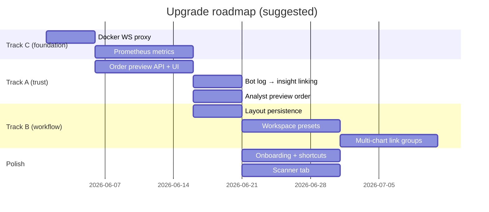

# Antigravity Trading Terminal — Upgrade Roadmap

> **Status:** Draft for planning  
> **Last updated:** June 2026  
> **Scope:** Post–Chart Analyst v1 — usability, understanding, efficiency, performance, ops  
> **Tracks:** (A) Explainability + pre-trade preview · (B) Workspace persistence + linked components · (C) Observability + Docker WS

---

## Executive summary

The terminal already delivers a strong sim/live trading core: OMS, bots, archive, Chart Analyst, distributed runtime, and a polished shadcn UI. The next level is not primarily “more strategies,” but helping users **understand faster**, **act with confidence**, and **trust the system under load**.

This document prioritizes three implementation tracks plus a broader backlog. Each track has goals, user-visible outcomes, technical touchpoints, and a suggested phase order.

---

## Current strengths (build on these)

| Layer | What's well built |
|-------|-------------------|
| **Trading core** | Market/limit orders, SL/TP, FIFO P&L, risk gates, signal ledger, reconciliation tab |
| **Bots** | 5 bar-close + 3 tick strategies + `CHART_AGENT`, backtester, analytics, bot detail drawer |
| **Intelligence** | Rule engine, optional LLM narrator, `ChartAnalystBadge`, Analyst tab, chart SL/TP overlays |
| **Data** | 1m archive, scroll-back charts (15k bars), tick capture, optional Parquet export |
| **Infra** | Redis server/worker split, unified WS+HTTP router, REST bootstrap, WS→REST fallback |
| **UX foundation** | Command palette (⌘K), keyboard shortcuts, settings panel, error boundaries |

## Known gaps

| Area | Gap |
|------|-----|
| **Explainability** | Analyst reasons exist but aren't wired through order/bot flows |
| **Workspace** | Theme/chart settings persist; dock layout and multi-chart state do not |
| **Broker mode** | Read-only mode badge + Settings → Operator / environment (no in-app switch) |
| **Performance** | ~1.8MB JS bundle; monolithic `ChartWidget` / `useStore`; no list virtualization |
| **Observability** | Logging + `/health` only; no metrics/tracing dashboard |
| **Depth chart** | Basic book visualization; needs polish (aggregation, flash updates) |
| **E2E** | Smoke/layout/analyst API; full place-order, deploy-bot, workspace, and REST fallback flows added |
| **Docs** | README synced with session bootstrap, shortcuts, and E2E inventory |

---

## Industry patterns (reference)

Modern trading terminals emphasize:

- **Chart-first layouts** with collapsible config ([Parasol dashboard UX](https://parasol.so/blog/dashboard-ux-overhaul))
- **Saved, linkable workspaces** ([TradeStation TITAN X layouts](https://www.tradestation.com/insights/2026/04/04/build-customize-layouts-tradestation-titan-x/))
- **Pre-trade risk transparency** ([Lyra trading interface](https://www.lyraplatform.com/platform/trading-interface/))
- **Stale-data honesty and performance as trust** ([Trading app design 2026](https://lollypop.design/blog/2026/june/trading-app-design/))
- **Overview-first explainability** ([RiskState visualizer](https://riskstate.ai/docs/visualizer-guide))

This roadmap applies those patterns without adopting heavy multi-agent/vision pipelines on the 1m bar-close hot path.

---

## Track A — Explainability + pre-trade preview

### Goal

Users always know **why** the system suggests or executes something, and **what will happen** before they click Buy/Sell or Deploy.

### User-visible outcomes

1. Order ticket shows estimated qty, notional, SL/TP prices, and risk % **before** submit.
2. Bot log lines link to the insight/rule reasons that produced the signal.
3. Chart Analyst badge popover offers “Preview order” (HITL) using insight levels.
4. Post-trade: “Why did we enter?” pulls from `bot_trades` + `agent_insights` (template first; RAG later).

### Technical touchpoints

| Component | Change |
|-----------|--------|
| `OrderEntryWidget.jsx` | Pre-submit preview panel; call backend preview endpoint or client-side risk math |
| `backend/app/services/bots/manager.py` | Expose preview helper reusing `_execute_order` sizing logic without placing |
| `backend/app/api/http/` | `POST /api/v1/orders/preview` (or WS action `preview_order`) |
| `ChartAnalystBadge.jsx` | “Preview order” → populate order entry with levels from `insight.levels` |
| `ResizableDock.jsx` / bot logs | Clickable log rows → insight detail drawer |
| `agent_insights` + `bot_trades` | Join on `symbol` + `bar_time` / `signal_id` for post-trade explain |

### Design principles

- **Rules decide; LLM explains** — preview uses deterministic sizing/risk, never LLM output.
- **Same math as execution** — preview must call shared code path as `_execute_order` to avoid drift.
- **Progressive disclosure** — one-line summary in ticket; expand for full reasons.

### Suggested phases

| Phase | Deliverable | Effort |
|-------|-------------|--------|
| A1 | Order preview API + ticket UI (qty, SL, TP, blocked reasons) | ~1 week |
| A2 | Bot log → insight linking + “why this signal” drawer | ~3–5 days |
| A3 | Analyst badge → “Preview order” → order entry prefill | ~3–5 days |
| A4 | Post-trade explain card in bot detail / history | ~1 week |

### Success metrics

- Time-to-understand: user can answer “why BUY?” in <10s from UI alone.
- Preview matches actual fill qty within tolerance (unit tests on shared risk path).
- Zero orders placed where preview showed `blocked: true`.

---

## Track B — Workspace persistence + linked components

### Goal

Traders reopen the terminal exactly where they left off, and linked panes stay in sync without manual re-selection.

### User-visible outcomes

1. Named workspace presets: “Day trade”, “Multi-crypto”, “Bot ops”.
2. Dock height, active tab, sidebar width, view mode, overlay toggles restore on load.
3. Multi-chart **link groups** — watchlist click updates only linked charts.
4. Command palette lists all shortcuts; optional `?` shortcuts sheet.

### Technical touchpoints

| Component | Change |
|-----------|--------|
| `useSettingsStore.js` | Extend persisted schema: `workspace: { dockHeight, activeTab, sidebarWidth, viewMode, overlays }` |
| `App.jsx` | Hydrate layout from settings on mount; debounced save on change |
| `MultiChartGrid.jsx` | Link group state per pane (color icon); selective `setActiveSymbol` |
| `SymbolCommandPalette.jsx` | Add ⌘B, ⌘[, workspace switcher commands |
| New `ShortcutsSheet.jsx` | Modal from `?` or Settings → Keyboard |

### Design principles

- **Auto-save** — no explicit “Save layout” required ([TITAN X pattern](https://www.tradestation.com/insights/2026/04/04/build-customize-layouts-tradestation-titan-x/)).
- **Export/import** — JSON download for multi-machine or multi-monitor setups.
- **Sensible defaults** — first visit uses current hardcoded defaults; migration from existing localStorage keys.

### Suggested phases

| Phase | Deliverable | Effort |
|-------|-------------|--------|
| B1 | Persist dock height, active tab, sidebar width, view mode | ~3–5 days |
| B2 | Persist per-symbol overlay toggles + chart timeframe | ~3–5 days |
| B3 | Named workspace presets (save/load/delete) | ~1 week |
| B4 | Multi-chart link groups | ~1 week |
| B5 | Shortcuts sheet + palette completeness | ~2–3 days |

### Success metrics

- Reload restores layout with zero manual adjustment (E2E test).
- Link group: changing symbol in watchlist updates only linked panes (E2E test).
- Settings JSON export/import round-trips without data loss.

---

## Track C — Observability + Docker WebSocket

### Goal

Operators and developers can **see** system health, latency, and failures; Docker deployment works for remote users without localhost WS hacks.

### User-visible outcomes

1. Header or admin panel shows feed lag, WS status, worker heartbeat, last bar-close analyze latency.
2. Grafana (or simple metrics page) for bot errors, order outcomes, LLM call rate.
3. Docker Compose: single origin — frontend proxies both `/api` and `/ws`.
4. Structured logs grepable by `symbol`, `bot_id`, `insight_id`.

### Technical touchpoints

| Component | Change |
|-----------|--------|
| `frontend/nginx.conf` | `location /ws` with Upgrade headers → backend:8765 |
| `docker-compose.yml` | `VITE_WS_URL` same-origin (`ws://host/ws` or `wss://...`) |
| `backend/app/api/http/app.py` | `GET /metrics` Prometheus exposition |
| `chart_analyst.py` | Export histogram: `agent_analyze_duration_seconds` |
| `manager.py` | Counter: `bot_signals_total`, `bot_orders_blocked_total` |
| Logging | JSON formatter with `request_id`, `symbol`, `bot_id` |
| Optional | OpenTelemetry span: bar-close → analyze → evaluate → OMS |

### Design principles

- **Metrics on hot paths only** — bar-close latency, order result, WS connections.
- **No PII in metrics labels** — use symbol ok; no API keys, no user emails.
- **Graceful degradation visible in UI** — tie Track C health to Track A stale-data banners.

### Suggested phases

| Phase | Deliverable | Effort |
|-------|-------------|--------|
| C1 | nginx WebSocket proxy + compose env fix | ~1–2 days |
| C2 | Prometheus `/metrics` + basic counters/histograms | ~1 week |
| C3 | Structured JSON logging on trade + agent paths | ~3–5 days |
| C4 | Admin/health UI surfacing worker + analyze latency | ~3–5 days |
| C5 | Optional Grafana dashboard JSON in `docs/grafana/` | ~2–3 days |

### Success metrics

- Remote Docker user: WS connects through nginx (E2E or manual checklist).
- `/metrics` scrape succeeds; `agent_analyze_duration` p99 visible.
- Incident debug: find all logs for `insight_id=X` in one grep.

---

## Broader backlog (after A/B/C)

### Usability & understanding

| Item | Notes |
|------|-------|
| First-run onboarding tour | 5 steps: symbol → chart → order → backtest → analyst |
| Portfolio summary strip | Net equity, day P&L, open bots, connection health |
| Stale data badges | Per-widget data age; WS-down + REST-fallback banner |
| Price/signal alerts | User rules; toast + dock badge |
| Scanner dock tab | Rank watchlist by screener/analyst signals |
| In-app help + README sync | Glossary, mode explanation, strategy tooltips |

### Performance

| Item | Notes |
|------|-------|
| Code-split dock tabs | `React.lazy` for admin, analyst, multi-chart |
| Virtualized tables | History, bot logs, analyst history |
| Chart update throttle | Forming bar at 10–15 fps; overlays on bar close |
| Redis-backed rate limits | Shared across server/worker |
| Remove unused `lightweight-charts` | Or use for sparklines only |

### Intelligence (v2, lightweight)

| Item | Notes |
|------|-------|
| Insight `sub_reports` | Local trend/momentum/risk sections; rules still set `signal` |
| On-demand vision | 1H/4H only, user-triggered, never sets signal |
| RAG post-trade explain | Over `bot_trades` + insights |

### Testing

| Item | Notes |
|------|-------|
| E2E: place order → history | SIM market order flow |
| E2E: deploy bot → log line | CHART_AGENT optional |
| E2E: WS disconnect → REST order | Transport fallback |
| Distributed worker smoke | Redis bar-close in CI |

---

## Recommended implementation order

**Rationale:** Fix Docker WS (C1) early so remote testing of A/B is realistic. Order preview (A1) is highest user trust ROI. Layout persistence (B1) is independent and quick. Metrics (C2) validate analyze latency before adding more intelligence.

---

## Top 10 priorities (if timeboxed)

1. Pre-trade order preview (Track A1)
2. Docker WebSocket proxy (Track C1)
3. Saved workspace state — dock, tab, sidebar (Track B1)
4. Portfolio / connection summary strip
5. Stale data + REST-fallback UX
6. Bot log → insight explainability (Track A2)
7. Analyst → preview order → ticket (Track A3)
8. Prometheus metrics on analyze + orders (Track C2)
9. Multi-chart link groups (Track B4)
10. Trading flow E2E tests

---

## Out of scope (for now)

- Full QuantAgent-style multi-agent pipeline on every 1m bar
- Multi-user SaaS auth (unless product direction changes)
- Replacing ECharts entirely
- More strategies without better comparison/backtest UX

---

## File references (current codebase)

| Area | Path |
|------|------|
| Order entry | `frontend/src/components/OrderEntryWidget.jsx` |
| Chart analyst UI | `frontend/src/components/ChartAnalystBadge.jsx`, `AnalystTab.jsx` |
| Bot execution | `backend/app/services/bots/manager.py` |
| Agent service | `backend/app/services/agent/chart_analyst.py` |
| Settings persistence | `frontend/src/store/useSettingsStore.js` |
| Layout shell | `frontend/src/App.jsx`, `ResizableDock.jsx` |
| HTTP/health | `backend/app/api/http/app.py` |
| Docker | `docker-compose.yml`, `frontend/nginx.conf` |
| Chart Analyst plan | `.cursor/plans/chart_agent_analyst_fd2c5f2c.plan.md` |

---

## Implementation status (2026-06-15)

### Tracks A/B/C v1 — complete
(See prior section.)

### Tier 5 + polish phase — complete (v1 scope)

| Item | Delivered |
|------|-----------|
| **#19** | `sub_reports` (trend/momentum/risk), `SubReportCards`, v2 insight envelope |
| **#21** | `MARKET_SCAN` + `ScannerTab` dock panel |
| **#20** | `insightOrderDraft.js`, `InsightOrderPreviewDialog`, HITL confirm flow |
| **#22** | `CHART_VISION` handler, client PNG capture, Analyst “Describe 4H” |
| **P3** | `PortfolioSummaryBar` (equity, cash, invested, open P&L, bots) |
| **P4** | `StaleDataBanner` + REST-fallback indicator in portfolio bar |
| **Ops** | JSON structured logging on preview, Grafana JSON in `docs/grafana/`, workspace JSON export/import |
| **E2E** | `frontend/e2e/trading.spec.js` (preview, scan, analyze v2) |

**Config:** `SCANNER_ENABLED` (default true), `AGENT_VISION_ENABLED` (default false), `AGENT_VISION_CACHE_SEC` (4h).

---

## Implementation status (2026-06-22)

### Startup / monolith stability — complete

| Item | Delivered |
|------|-----------|
| Lazy sim feed | SBBS warm deferred; `SIM_*` config; fast bind |
| Session bootstrap | `GET /api/v1/session`, frontend single-round-trip |
| Liveness | `GET /health/live` |
| WS deferred payloads | Account/bots/history after `terminal_config` |
| Archive backfill | `asyncio.to_thread`; default off |
| Backtest sweep | Non-blocking parallel runs |

### Agent automation — complete (v1)

| Item | Delivered |
|------|-----------|
| Calibration Phase 2 | Meta-label gate + apply suggestions API/UI |
| Regime routing | Elevated/compressed ATR config overrides |
| Pipeline | Scan-deploy, walk-forward auto-deploy |

### Polish / E2E / docs — complete (v1 scope)

| Item | Delivered |
|------|-----------|
| Onboarding | Spotlight tour + E2E |
| Code-split | Lazy dock/panel chunks |
| Virtualized tables | History, bot logs, scanner |
| Post-trade explain | `EXPLAIN_TRADE` + BotDetailDrawer |
| Worker CI | Bar-close + heartbeat smoke jobs |
| E2E trading flows | `trading-flows.spec.js` — order → history, deploy bot, REST fallback |
| E2E workspace | `workspace.spec.js` — layout restore, link groups |
| Docs | README + roadmap sync |

---

## Next step

OpenTelemetry spans (bar-close → analyze → OMS) remain optional. Remaining polish: full distributed E2E with live bot order placement in CI, Docker remote WS manual validation per [`docs/grafana/IMPORT_CHECKLIST.md`](grafana/IMPORT_CHECKLIST.md).

### Delivered 2026-06-22 (roadmap follow-up)

| Area | Delivered |
|------|-----------|
| Bot metrics | `bot_signals_total`, `bot_orders_blocked_total` on manager hot path |
| C3 logging | `LOG_JSON` + structured events on order preview/place, bot orders, trade explain |
| C4 health UI | `/health` observability block + feed lag; Settings metrics snapshot |
| RAG explain | Nearest-bar insight fallback; exit trades join entry insight snapshot |
| Distributed CI | Redis bar-close integration test in worker-smoke job |
| CHART_AGENT TF | Regression tests for 5m/15m/4h signal + resample alignment |
| Calibration | Scheduled background refresh (`CALIBRATION_REFRESH_SEC`) |
| Backtest gate | Meta-label calibration gate replay in backtester |
| Pipeline | Deploy dedupe by `scanner_insight_id`; single retry on create failure |
| C5 ops | Grafana import checklist + bot panels in dashboard JSON |

---

## Implementation status (2026-06-15)
