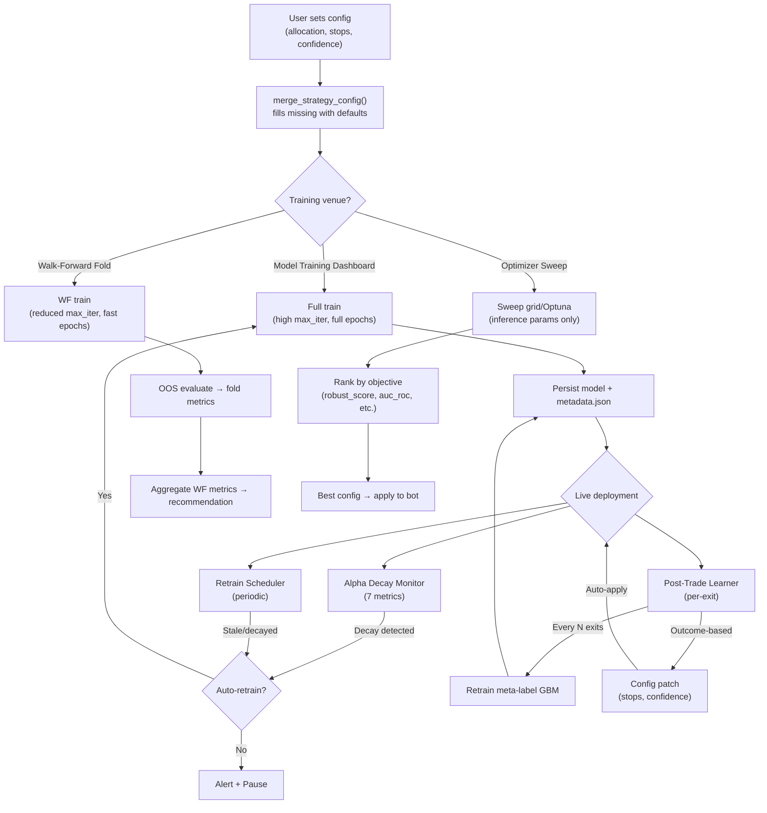

# ML Model Parameter Tuning & Re-Tuning Report

## Overview

The trading terminal has a **multi-layer parameter management system** for its 7 ML strategies plus the meta-label GBM classifier. Parameters are set at three distinct points:

1. **Initial training** — hardcoded defaults + config overrides at model build time  
2. **Hyperparameter sweep** — grid/Optuna-based optimizer in the Backtest Lab  
3. **Automated re-tuning** — decay-triggered retraining, post-trade learning, and scheduled refresh  

---

## 1. How Parameters Are Initially Set (Training Time)

Each model type reads its defaults from `merge_strategy_config()` and allows user overrides via the `config` dict. Here are the concrete parameters per model:

### ML_SIGNAL_BOOST (HistGradientBoosting — [strategies_ml.py](file:///c:/Users/Dhimeji01/.gemini/antigravity/scratch/trading-terminal/backend/app/services/bots/strategies_ml.py#L71-L100))

| Parameter | Default | Source |
|---|---|---|
| `max_depth` | 4 (WF) / 5 (full) | hardcoded |
| `max_iter` | 40 (WF) / 150 (full) | config `max_iter` |
| `learning_rate` | 0.1 (WF) / 0.08 (full) | hardcoded |
| `min_samples_leaf` | `min_samples // 20` | derived |
| `class_weight` | `"balanced"` | hardcoded |
| `triple_barrier_atr_mult` | 2.0 | config |
| `triple_barrier_max_bars` | 30 | config |
| `min_confidence` (inference) | 0.55 | config |

> [!NOTE]
> Walk-forward mode (`_wf_mode`) deliberately reduces `max_iter` and `max_depth` for speed during interactive validation, then reverts for the final production fit.

### Meta-Label GBM ([meta_label_model.py](file:///c:/Users/Dhimeji01/.gemini/antigravity/scratch/trading-terminal/backend/app/services/bots/meta_label_model.py#L341-L347))

| Parameter | Default | Config override? |
|---|---|---|
| `max_depth` | 5 | No — hardcoded |
| `max_iter` | 120 | No — hardcoded |
| `learning_rate` | 0.08 | No — hardcoded |
| `min_samples_leaf` | `min_samples // 15` | Derived from `meta_label_min_train_samples` |
| `random_state` | 42 | No |
| `val_fraction` | 0.2 | Yes, via `train_meta_label_model()` arg |

> [!IMPORTANT]
> The meta-label GBM's architecture params (`max_depth`, `max_iter`, `learning_rate`) are **not exposed to the optimizer or config system**. They are hardcoded. Only the `min_prob` threshold and `min_train_samples` are configurable.

### LSTM_DIRECTION ([ml_lstm_trainer.py](file:///c:/Users/Dhimeji01/.gemini/antigravity/scratch/trading-terminal/backend/app/services/bots/ml_lstm_trainer.py#L226-L237))

| Parameter | Default | Config key |
|---|---|---|
| `lookback` | 60 | `lookback` |
| `hidden_dim` | 64 | `hidden_dim` |
| `num_layers` | 2 | `num_layers` |
| `learning_rate` | 0.001 | `learning_rate` |
| `batch_size` | 64 | `batch_size` |
| `epochs` | 50 | function arg |
| Dropout | 0.3 (fc), 0.2 (LSTM) | hardcoded |
| LR scheduler | ReduceLROnPlateau (factor=0.5, patience=5) | hardcoded |

### RL_PPO_AGENT ([rl_ppo_trainer.py](file:///c:/Users/Dhimeji01/.gemini/antigravity/scratch/trading-terminal/backend/app/services/bots/rl_ppo_trainer.py#L206-L256))

| Parameter | Default (full) | Default (WF) | Config key |
|---|---|---|---|
| `gamma` | 0.99 | 0.99 | `gamma` |
| `gae_lambda` | 0.95 | 0.95 | `gae_lambda` |
| `clip_epsilon` | 0.2 | 0.2 | `clip_epsilon` |
| `ppo_epochs` | 10 | 2 | `ppo_epochs` |
| `n_steps` | 2048 | 512 | `n_steps` |
| `hidden_dim` | 128 | 64 | `hidden_dim` |
| `learning_rate` | 3e-4 | 3e-4 | `learning_rate` |
| `batch_size` | 64 | 64 | `batch_size` |
| `vf_coef` | 0.5 | — | `vf_coef` |
| `ent_coef` | 0.01 | — | `ent_coef` |
| `max_grad_norm` | 0.5 | — | `max_grad_norm` |
| `total_timesteps` | 50,000 | 2,048 | `total_timesteps` |

---

## 2. Hyperparameter Sweep (User-Driven Tuning)

### Frontend: ML Optimizer Panel

The [MlOptimizerPanel.jsx](file:///c:/Users/Dhimeji01/.gemini/antigravity/scratch/trading-terminal/frontend/src/components/MlOptimizerPanel.jsx) delegates to `TaOptimizerPanel` with ML-specific field sets. It:

- Filters the sweep grid to **ML-relevant fields only** (no TA indicator periods)
- Uses the `robust_score` objective by default for ML (vs `calmar_ratio` for TA)
- Shows IS/OOS gap warnings (overfitting detection) when IS Sharpe > 2× OOS Sharpe

### Sweep Defaults per Strategy ([optimizerDefaults.js](file:///c:/Users/Dhimeji01/.gemini/antigravity/scratch/trading-terminal/frontend/src/lib/optimizerDefaults.js#L11-L28))

Each strategy has 2–3 suggested params to sweep:

| Strategy | Sweep params |
|---|---|
| `ML_SIGNAL_BOOST` | `min_confidence`, `triple_barrier_atr_mult`, `trailing_stop_percent` |
| `LSTM_DIRECTION` | `lookback`, `min_confidence`, `trailing_stop_percent` |
| `RL_PPO_AGENT` | `gamma`, `min_confidence`, `trailing_stop_percent` |
| `TCN_MULTI_HORIZON` | `lookback`, `min_return`, `min_confidence` |
| `VAE_REGIME_DETECTOR` | `anomaly_threshold`, `suppress_threshold`, `trailing_stop_percent` |
| `TRANSFORMER_SIGNAL` | `lookback`, `min_confidence`, `trailing_stop_percent` |
| `GNN_CROSS_ASSET` | `min_corr`, `min_confidence`, `trailing_stop_percent` |
| `HYBRID_ENSEMBLE` | `ensemble_threshold`, `ensemble_weight_ml`, `trailing_stop_percent` |

> [!TIP]
> The design explicitly **separates training from tuning**: the optimizer sweeps inference-time thresholds (confidence, risk params), while the Model Training Dashboard handles full retraining (architecture, learning rate, epochs). The optimizer hint text states: *"Tune inference hyperparameters and risk exits — retrain models in Model Training."*

### ML-Specific Objectives

The sweep can optimise for:
- `robust_score` (Sharpe × √trades — default for ML)
- `auc_roc` (classification quality)
- `log_loss` (lower = better)
- `alpha_decay_half_life` (longevity of edge)
- `oos_is_ratio` (OOS/IS performance ratio — overfitting guard)

---

## 3. Walk-Forward Validation (Anti-Overfitting Engine)

The [ml_walk_forward_validator.py](file:///c:/Users/Dhimeji01/.gemini/antigravity/scratch/trading-terminal/backend/app/services/bots/ml_walk_forward_validator.py) is the central piece that prevents parameter overfitting:

### Mechanism
1. Splits data into **rolling or anchored folds** (default 5 folds)
2. For each fold: trains on IS window, evaluates on OOS window
3. Applies **purge bars** (gap between train/test to prevent leakage)
4. Applies **embargo** after each test window (prevents label contamination across folds)
5. Aggregates OOS accuracy, checks **stability** (CV, trend slope)

### Deployment Recommendation Logic ([L591-621](file:///c:/Users/Dhimeji01/.gemini/antigravity/scratch/trading-terminal/backend/app/services/bots/ml_walk_forward_validator.py#L591-L621))

```
- DEPLOY: OOS accuracy ≥ 50%, stable, no issues
- DEPLOY_WITH_CAUTION: moderate OOS accuracy
- REVIEW: 1-2 issues (low accuracy, high variance, declining trend)
- REJECT: ≥3 issues or accuracy < 30%
```

### Strategy Trainer Registry

All 7 ML strategies are registered via lazy imports:

| Strategy | Trainer function | File |
|---|---|---|
| `ML_SIGNAL_BOOST` | `train_ml_signal_model` | [strategies_ml.py](file:///c:/Users/Dhimeji01/.gemini/antigravity/scratch/trading-terminal/backend/app/services/bots/strategies_ml.py) |
| `LSTM_DIRECTION` | `train_lstm_signal_model` | [ml_lstm_trainer.py](file:///c:/Users/Dhimeji01/.gemini/antigravity/scratch/trading-terminal/backend/app/services/bots/ml_lstm_trainer.py) |
| `RL_PPO_AGENT` | `train_ppo_agent` | [rl_ppo_trainer.py](file:///c:/Users/Dhimeji01/.gemini/antigravity/scratch/trading-terminal/backend/app/services/bots/rl_ppo_trainer.py) |
| `TCN_MULTI_HORIZON` | `train_tcn_model` | `ml_tcn_trainer.py` |
| `VAE_REGIME_DETECTOR` | `train_vae_regime_model` | `ml_vae_regime.py` |
| `TRANSFORMER_SIGNAL` | `train_transformer_model` | `ml_transformer_trainer.py` |
| `GNN_CROSS_ASSET` | `train_gnn_model` | `ml_gnn_trainer.py` |

---

## 4. Automated Re-Tuning (Three Triggers)

### Trigger A: Retrain Scheduler ([ml_retrain_scheduler.py](file:///c:/Users/Dhimeji01/.gemini/antigravity/scratch/trading-terminal/backend/app/services/bots/ml_retrain_scheduler.py))

Monitors **model age** and **alpha decay scores**. Queues retraining when:

| Trigger | Threshold | Priority |
|---|---|---|
| No model exists | — | 10 (highest) |
| Alpha decay exceeded | Score > 0.4 | 8 |
| Model staleness | Age > 168h (7 days) | 5 |

**Cooldown**: 24h minimum between retrains per symbol/strategy pair.

### Trigger B: Alpha Decay Monitor ([alpha_decay.py](file:///c:/Users/Dhimeji01/.gemini/antigravity/scratch/trading-terminal/backend/app/services/bots/alpha_decay.py))

Evaluates 7 decay metrics against live bots:

1. **Win Rate Divergence**: Live rolling WR > 15% below backtest expectation
2. **Sharpe Decay**: Live Sharpe < 50% of backtest Sharpe
3. **Regime Mismatch**: Trend strategy in ranging market (or vice versa), using ADX threshold
4. **Filter Rejection Stacking**: > 80% of recent signals blocked
5. **Meta-Label Confidence Drift**: Avg P(win) dropped > 0.15 from training
6. **ML Model Staleness**: Model age exceeds `ml_max_model_age_hours` (default 168h)
7. **OOS Accuracy Drift**: Live win rate > 15% below training validation accuracy

**Remediation actions** (all configurable via env vars):
- **Auto-retrain** (`ALPHA_DECAY_AUTO_RETRAIN`): Triggers walk-forward retrain via the retrain scheduler for ML strategies, or retrains meta-label GBM for non-ML strategies
- **Auto-pause** (`ALPHA_DECAY_AUTO_PAUSE`): Pauses the bot as a circuit breaker
- **Notification**: Fires an alert + copilot narration

### Trigger C: Post-Trade Learner ([posttrade_learner.py](file:///c:/Users/Dhimeji01/.gemini/antigravity/scratch/trading-terminal/backend/app/services/bots/posttrade_learner.py))

After every closed trade:

1. **Classifies outcome**: `clean_win`, `stop_too_tight`, `good_entry_bad_exit`, `regime_mismatch`, `clean_loss`, `messy_win`, `flat`
2. **Generates config patches** based on outcome class:
   - `stop_too_tight` → widens stop by `POSTTRADE_LEARNER_STOP_WIDEN_PCT`
   - `good_entry_bad_exit` → adds trailing stop or bumps TP by 10%
   - `regime_mismatch` → enables `block_ranging_markets` + bumps `min_confidence`
   - `clean_loss` → bumps `min_confidence` by `POSTTRADE_LEARNER_CONFIDENCE_BUMP`
3. **Auto-applies patches** if `POSTTRADE_LEARNER_AUTO_APPLY` is enabled
4. **Periodic meta-label retrain**: Every `POSTTRADE_LEARNER_RETRAIN_EVERY_N` exits, retrains the GBM
5. All patches are **validated** through `validate_suggested_params()` (bounded by strategy-specific min/max ranges)

---

## 5. Parameter Flow Diagram



---

## 6. Key Findings & Observations

> [!IMPORTANT]
> **Architecture params are mostly hardcoded.** For the two GBM models, `max_depth`, `max_iter`, and `learning_rate` cannot be tuned via config or the optimizer. Only inference-time thresholds (`min_confidence`, `min_prob`) and risk parameters (`trailing_stop_percent`, `triple_barrier_atr_mult`) are swept. Deep-learning models (LSTM, PPO, TCN, Transformer, GNN) expose more architecture params via config (hidden_dim, num_layers, learning_rate, etc.), but these are not in the default sweep grids.

> [!NOTE]
> **Walk-forward uses different hyperparameters than production.** WF mode reduces `max_iter`, `max_depth`, `hidden_dim`, `ppo_epochs`, and `n_steps` for speed. This means the validation metrics are from a weaker model than what ultimately gets deployed. The assumption is that more capacity helps, but this could mask overfitting if the full model overfits where the lighter one doesn't.

> [!NOTE]
> **Post-trade learner adjusts inference config, not model weights.** It widens stops, bumps confidence thresholds, and toggles regime filters — it never re-tunes the underlying model architecture. Meta-label retraining is triggered periodically (every N exits), but with the same hardcoded architecture.

> [!TIP]
> **Three separate retraining paths can overlap.** The Alpha Decay Monitor, the Retrain Scheduler, and the Post-Trade Learner can all trigger meta-label retraining independently. The Retrain Scheduler's 24h cooldown prevents rapid-fire retrains, but the Post-Trade Learner's N-exit trigger has no cross-check with the cooldown. This could lead to redundant retrains.
