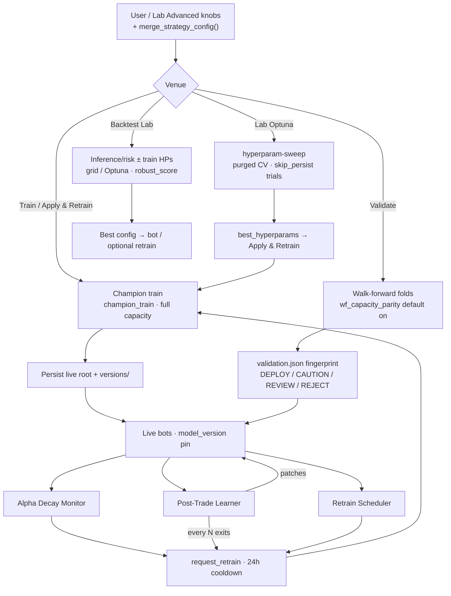

# ML Model Parameter Tuning & Re-Tuning Report

> **Updated:** August 2026 — reflects Lab Optuna auto-tune, registry SSOT, `wf_capacity_parity`, GBM `gbm_*` knobs, batch train, and Backtest Lab training-HP sweeps.

## Overview

The trading terminal manages parameters for **7 Lab ML strategies** (`ML_STRATEGIES` in [`ml_registry.py`](../backend/app/services/bots/ml_registry.py)) plus a **bot-scoped meta-label GBM**. Tuning happens on four distinct tracks:

1. **Initial / champion training** — defaults + Lab Advanced knobs + optional Optuna best HPs  
2. **Lab Optuna auto-tune** — purged-CV search over architecture / training knobs (`POST /api/v1/ml/hyperparam-sweep`)  
3. **Backtest Lab optimizer** — inference/risk sweeps (optional training HPs) via grid/Optuna  
4. **Automated re-tuning** — decay-triggered retrain, post-trade learning, scheduled refresh (shared cooldown queue)

**SSOT for Lab strategies, artifact layout, and trainers:** [`ml_registry.py`](../backend/app/services/bots/ml_registry.py) (`ML_STRATEGIES`, `MODEL_SUBDIRS`, `STRATEGY_ARTIFACTS`, `get_trainer()`).

---

## 1. How Parameters Are Initially Set (Training Time)

Each model reads defaults through `merge_strategy_config()` and Lab overrides. Architecture knobs are **config-driven** (not hardcoded for Lab GBM). Walk-forward lean caps apply only when `wf_capacity_parity` is **false** (default is **true** — WF matches production capacity).

### ML_SIGNAL_BOOST (HistGradientBoosting — [`strategies_ml.py`](../backend/app/services/bots/strategies_ml.py))

| Parameter | Default (parity / full) | Lean WF only (`wf_capacity_parity=false`) | Config key |
|---|---|---|---|
| `max_depth` | 5 | 4 | `gbm_max_depth` |
| `max_iter` | 150 | 40 | `gbm_max_iter` (fallback: `max_iter`) |
| `learning_rate` | 0.08 | 0.1 | `gbm_learning_rate` |
| `l2_regularization` | 0 | — | `gbm_l2_reg` |
| `min_samples_leaf` | derived | derived | `min_train_samples` / `wf_min_train_samples` |
| `class_weight` | `"balanced"` | same | hardcoded |
| `triple_barrier_atr_mult` | 2.0 | same | `triple_barrier_atr_mult` |
| `triple_barrier_max_bars` | 30 | same | `triple_barrier_max_bars` |
| `val_fraction` | 0.2 | same | `val_fraction` |
| `min_confidence` (inference) | 0.55 | same | `min_confidence` |

> [!NOTE]
> **Champion vs fold writes:** Lab Validate / Optuna trials set `_wf_mode` / `skip_persist` so folds do **not** overwrite the live champion. **Apply & Retrain** / Train use `champion_train` + `prepare_lab_champion_train_config` / `apply_champion_train_overrides` to strip trial-only flags and always persist.

### Meta-Label GBM ([`meta_label_model.py`](../backend/app/services/bots/meta_label_model.py))

Bot-scoped (not Lab registry versions). Architecture accepts kwargs but is **not** in Lab Optuna or Backtest sweep grids by default:

| Parameter | Default | Exposed? |
|---|---|---|
| `gbm_max_depth` | 5 | kwargs only |
| `gbm_max_iter` | 120 | kwargs only |
| `gbm_learning_rate` | 0.08 | kwargs only |
| `val_fraction` | 0.2 | `train_meta_label_model()` arg |
| `meta_label_min_prob` | 0.52 | bot config |
| `meta_label_min_train_samples` | config | bot config |

Retrain: `POST /api/v1/bots/{bot_id}/meta-label/retrain`, Backtest meta-label WF, and post-trade learner (via retrain queue).

### LSTM_DIRECTION ([`ml_lstm_trainer.py`](../backend/app/services/bots/ml_lstm_trainer.py))

| Parameter | Default | Config key |
|---|---|---|
| `lookback` | 60 | `lookback` |
| `hidden_dim` | 64 | `hidden_dim` |
| `num_layers` | 2 | `num_layers` |
| `learning_rate` | 0.001 | `learning_rate` |
| `batch_size` | 64 | `batch_size` |
| `epochs` | 50 | `epochs` / Lab Advanced |
| Dropout | 0.3 (fc), 0.2 (LSTM) | hardcoded |
| Early stop | patience from config | `early_stop_patience` |
| LR scheduler | ReduceLROnPlateau | hardcoded |

### RL_PPO_AGENT ([`rl_ppo_trainer.py`](../backend/app/services/bots/rl_ppo_trainer.py))

| Parameter | Default (full / parity) | Lean WF | Config key |
|---|---|---|---|
| `gamma` | 0.99 | 0.99 | `gamma` |
| `gae_lambda` | 0.95 | 0.95 | `gae_lambda` |
| `clip_epsilon` | 0.2 | 0.2 | `clip_epsilon` |
| `ppo_epochs` | 10 | 2 | `ppo_epochs` |
| `n_steps` | 2048 | 512 | `n_steps` |
| `hidden_dim` | 128 | 64 | `hidden_dim` |
| `learning_rate` | 3e-4 | 3e-4 | `learning_rate` |
| `batch_size` | 64 | 64 | `batch_size` |
| `vf_coef` / `ent_coef` / `max_grad_norm` | 0.5 / 0.01 / 0.5 | — | same keys |
| `total_timesteps` | 50,000 | 2,048 | `total_timesteps` |

Same pattern applies to **TCN**, **Transformer**, **VAE**, **GNN** (lookback / hidden / epochs / LR / heads / latent_dim as applicable). Lab Advanced knobs and Optuna search spaces cover the primary training HPs.

### Training window & storage key

[`ml_training_window.py`](../backend/app/services/bots/ml_training_window.py) + Lab UI: windows 1–36 months; timeframes `1m` / `5m` / `15m` / `1h` / `4h`. On-disk key: `SYMBOL` or `SYMBOL__15M`-style under `backend/data/{subdir}/`.

---

## 2. Lab Optuna Auto-Tune (Architecture Search)

**UI:** [`MlAutoTunePanel.jsx`](../frontend/src/components/MlAutoTunePanel.jsx) inside Model Training Dashboard (also ML Lab standalone).  
**API:** `POST /api/v1/ml/hyperparam-sweep` → [`run_ml_hyperparam_sweep`](../backend/app/services/bots/ml_hyperparam_sweep.py); status via job GET (rehydrates offloaded `best_hyperparams`).

### Default search spaces (`default_search_space`)

| Strategy | Tuned keys |
|---|---|
| `ML_SIGNAL_BOOST` | `gbm_max_depth` 2–8, `gbm_learning_rate` 0.01–0.2 log, `gbm_max_iter` 100–500, `gbm_l2_reg` 0–5, `val_fraction` 0.15–0.3, `triple_barrier_atr_mult` 1–4 |
| LSTM / Transformer / TCN / GNN | `learning_rate`, `hidden_dim` {64,128,256}, `epochs` 30–150, `batch_size`, `lookback` 30–180 (not GNN), `num_layers`, `early_stop_patience`; Transformer +`d_model`; GNN +`n_heads` |
| `RL_PPO_AGENT` | `learning_rate`, `clip_epsilon`, `ent_coef`, `n_steps`, `hidden_dim`, `total_timesteps` |
| `VAE_REGIME_DETECTOR` | `latent_dim`, `anomaly_threshold`, `hidden_dim`, `learning_rate`, `epochs` |

### Behavior
- Objective: purged CV OOS (or val holdout); multi-fidelity **screen → promote** top-k  
- Studies persist under `data/optuna/`; resumable checkpoints  
- Trials force `skip_persist` / `_wf_mode` — **stripped** on **Apply & Retrain**  
- Lab **Advanced knobs** ([`MlAdvancedKnobs.jsx`](../frontend/src/components/ml-lab/MlAdvancedKnobs.jsx)): `n_folds`, `validate_max_bars`, PBO segments, PPO timesteps, deep `hidden_dim` / `epochs` / patience, GBM `gbm_max_iter` / `gbm_max_depth`

---

## 3. Backtest Lab Hyperparameter Sweep (User-Driven)

### Frontend routing

[`BacktestSweepPanel`](../frontend/src/components/BacktestSweepPanel.jsx) → [`MlOptimizerPanel`](../frontend/src/components/MlOptimizerPanel.jsx) → [`TaOptimizerPanel`](../frontend/src/components/TaOptimizerPanel.jsx) for ML.

- Default objective for ML: **`robust_score`** (TA defaults to `calmar_ratio`)  
- Toggle **“Include training hyperparams in sweep”** (default **on**) — can sweep `gbm_*` / lookback-style train knobs alongside inference/risk  
- IS/OOS gap warnings when IS Sharpe ≫ OOS Sharpe  

### Sweep defaults ([`optimizerDefaults.js`](../frontend/src/lib/optimizerDefaults.js))

| Strategy | Suggested params |
|---|---|
| `ML_SIGNAL_BOOST` | `min_confidence`, `triple_barrier_atr_mult`, `trailing_stop_percent`, `gbm_learning_rate`, `gbm_max_depth` |
| `LSTM_DIRECTION` | `lookback`, `min_confidence`, `trailing_stop_percent` |
| `RL_PPO_AGENT` | `gamma`, `min_confidence`, `trailing_stop_percent` |
| `TCN_MULTI_HORIZON` | `lookback`, `min_return`, `min_confidence` |
| `VAE_REGIME_DETECTOR` | `anomaly_threshold`, `suppress_threshold`, `trailing_stop_percent` |
| `TRANSFORMER_SIGNAL` | `lookback`, `min_confidence`, `trailing_stop_percent` |
| `GNN_CROSS_ASSET` | `min_corr`, `min_confidence`, `trailing_stop_percent` |
| `HYBRID_ENSEMBLE` | `ensemble_threshold`, `ensemble_weight_ml`, `trailing_stop_percent` |

### ML-specific objectives
- `robust_score` (default)  
- `auc_roc`, `log_loss`, `alpha_decay_half_life`, `oos_is_ratio`  

### Walk-forward sweep (Backtest engine)
[`backtest_walk_forward.py`](../backend/app/services/bots/backtest_walk_forward.py): rolling / anchored / train-% modes; optional final holdout + PBO on winner; runs saved via `optimization_store`. Pin artifacts with `model_version` / [`MlModelVersionSelect`](../frontend/src/components/MlModelVersionSelect.jsx).

> [!TIP]
> Prefer **Lab Optuna** for architecture search (purged CV on train metrics). Prefer **Backtest Lab** for inference thresholds + risk exits on the **simulator**. Applying train HPs from a backtest sweep still requires a proper Lab champion retrain for production artifacts.

---

## 4. Walk-Forward Validation (Anti-Overfitting Engine)

Central entry: [`ml_walk_forward_validator.py`](../backend/app/services/bots/ml_walk_forward_validator.py) via `POST /api/v1/ml/validate`.

### Mechanism
1. Rolling or anchored folds (default ~5)  
2. Train IS → evaluate OOS per fold  
3. **Purge** bars between train/test; **embargo** after test  
4. Aggregate OOS accuracy / return + stability (CV, trend)  
5. Optional **PBO** (UI disables for RL)  
6. Stamp `metadata.json` + `validation.json` (`persist_ml_validation_metadata`); fingerprint = `trained_at` / `version_id` — cleared/invalidated on Activate / champion retrain mismatch  

### Capacity parity
- `wf_capacity_parity` **defaults True** — validation uses full model capacity  
- Lean WF (reduced `max_iter` / depth / PPO steps) only when parity is explicitly off  

### Deployment recommendation
```
DEPLOY              — OOS ≥ ~50%, stable, no issues
DEPLOY_WITH_CAUTION — moderate OOS
REVIEW              — 1–2 issues (low accuracy, high variance, declining trend)
REJECT              — ≥3 issues or accuracy < ~30%
```

### Trainer registry (via `get_trainer`)

| Strategy | Trainer | Module |
|---|---|---|
| `ML_SIGNAL_BOOST` | `train_ml_signal_model` | `strategies_ml.py` |
| `LSTM_DIRECTION` | `train_lstm_signal_model` | `ml_lstm_trainer.py` |
| `RL_PPO_AGENT` | `train_ppo_agent` | `rl_ppo_trainer.py` |
| `TCN_MULTI_HORIZON` | `train_tcn_model` | `ml_tcn_trainer.py` |
| `VAE_REGIME_DETECTOR` | `train_vae_regime_model` | `ml_vae_regime.py` |
| `TRANSFORMER_SIGNAL` | `train_transformer_model` | `ml_transformer_trainer.py` |
| `GNN_CROSS_ASSET` | `train_gnn_model` | `ml_gnn_trainer.py` |

---

## 5. Registry, Versions & Champion Activation

| Concern | Implementation |
|---|---|
| Layout | `backend/data/{subdir}/{SYMBOL[__TF]}/` + `versions/{version_id}/` + `versions/index.json` |
| List / resolve pin | `list_model_versions`, `resolve_model_dir` |
| Snapshot after train | `snapshot_current_version` |
| Activate | `POST /api/v1/ml/activate-version` → `activate_model_version` |
| Desync | `champion_sync_info` → UI `champion_desynced` |
| Status labels | champion / challenger / retired (`update_version_status`) |
| Bot pin | `config.model_version` (empty = live root) |
| Auto-promote gate | `model_promotion.evaluate_challenger` — **library only**, not HTTP-wired; Lab shows challenger hint → user Activate |

**Batch train:** [`BatchTrainDialog`](../frontend/src/components/ml-lab/BatchTrainDialog.jsx) + `runBatchTrainQueue` — sequential `/ml/train` (+ optional validate). Inventory refresh no longer resets mid-batch progress; “stale” scope ≈ model age > 48h.

**Pipeline presets:** `ml_full_pipeline`, `ml_retrain_validate`, `ml_batch_train` ([`mlPipeline.js`](../frontend/src/lib/mlPipeline.js)).

---

## 6. Automated Re-Tuning (Three Triggers → Shared Queue)

All ML retrains should go through [`MlRetrainScheduler.request_retrain`](../backend/app/services/bots/ml_retrain_scheduler.py) (24h cooldown per symbol/strategy/TF; drained by `ml_retrain_drain_loop`).

### Trigger A: Retrain Scheduler

| Trigger | Threshold | Priority |
|---|---|---|
| No model | — | 10 |
| Alpha decay score | > 0.4 | 8 |
| Model staleness | Age > 168h (7 days) | 5 |

UI: `MlRetrainQueue` + `GET /api/v1/ml/retrain-status`. Queue retrain merges **live model** HPs (`retrain_from_live_model` / `merge_live_model_train_hyperparams`) — distinct from Lab **Apply & Retrain** (keeps Optuna best).

### Trigger B: Alpha Decay Monitor ([`alpha_decay.py`](../backend/app/services/bots/alpha_decay.py))

Seven metrics vs live bots:

1. Win-rate divergence vs backtest  
2. Sharpe decay  
3. Regime mismatch (ADX)  
4. Filter rejection stacking  
5. Meta-label confidence drift  
6. ML model staleness (`ml_max_model_age_hours`)  
7. OOS accuracy drift  

Remediation (env-gated): auto-retrain via scheduler, auto-pause, alert / copilot narration (`ALPHA_DECAY_AUTO_RETRAIN`, `ALPHA_DECAY_AUTO_PAUSE`).

### Trigger C: Post-Trade Learner ([`posttrade_learner.py`](../backend/app/services/bots/posttrade_learner.py))

After each closed trade:

1. Classify outcome (`clean_win`, `stop_too_tight`, `good_entry_bad_exit`, `regime_mismatch`, …)  
2. Suggest config patches (stops, TP, `min_confidence`, regime gates) — bounded by `validate_suggested_params()`  
3. Auto-apply if `POSTTRADE_LEARNER_AUTO_APPLY`  
4. Every `POSTTRADE_LEARNER_RETRAIN_EVERY_N` exits → `request_retrain` (shares cooldown with A/B)

---

## 7. Parameter Flow Diagram


```mermaid
graph TD
    A["User / Lab Advanced knobs<br/>+ merge_strategy_config()"] --> B{"Venue"}

    B -->|Train / Apply & Retrain| C["Champion train<br/>champion_train · full capacity"]
    B -->|Validate| D["Walk-forward folds<br/>wf_capacity_parity default on"]
    B -->|Lab Optuna| E["hyperparam-sweep<br/>purged CV · skip_persist trials"]
    B -->|Backtest Lab| F["Inference/risk ± train HPs<br/>grid / Optuna · robust_score"]

    C --> G["Persist live root + versions/"]
    D --> H["validation.json fingerprint<br/>DEPLOY / CAUTION / REVIEW / REJECT"]
    E --> I["best_hyperparams → Apply & Retrain"]
    F --> J["Best config → bot / optional retrain"]

    G --> K["Live bots · model_version pin"]
    H --> K
    I --> C

    K --> L["Alpha Decay Monitor"]
    K --> M["Post-Trade Learner"]
    K --> N["Retrain Scheduler"]

    L --> O["request_retrain · 24h cooldown"]
    M -->|"patches"| K
    M -->|"every N exits"| O
    N --> O
    O --> C
```

---

## 8. Key Findings (Current)

> [!IMPORTANT]
> **Lab GBM architecture is tunable.** `gbm_max_depth`, `gbm_learning_rate`, `gbm_max_iter`, and `gbm_l2_reg` are config keys, Lab Advanced knobs, Optuna search space, and (optionally) Backtest Lab sweep fields. Older docs that said GBM arch was “hardcoded” are obsolete for Lab models. **Meta-label** still keeps architecture mostly off the optimizer UI (kwargs exist; `min_prob` is the primary live knob).

> [!NOTE]
> **`wf_capacity_parity` defaults on.** Validation no longer silently uses a weaker lean model unless you turn parity off. Fold artifacts still do not overwrite the champion (`_wf_mode` / `skip_live_artifact_writes`).

> [!NOTE]
> **Two retrain semantics.** Lab **Apply & Retrain** applies Optuna/Lab HPs to a fresh champion. Scheduler / alpha-decay / post-trade queue retrains merge **live** hyperparameters so production doesn’t silently inherit trial flags (`skip_persist`, lean WF caps).

> [!TIP]
> **Shared cooldown reduces redundant retrains.** Alpha decay, scheduler, and post-trade meta-label retrain all call `request_retrain` (24h per key). Config patches from the post-trade learner remain independent of that cooldown.

> [!WARNING]
> **Open gaps.** Auto challenger promotion (`model_promotion`) is not HTTP-wired — Activate is manual. Meta-label is outside Lab version registry. Including training HPs in Backtest sweeps does not replace Lab purged-CV Optuna for architecture quality.

---

## 9. Important Entry Points

| Layer | Path |
|---|---|
| Registry SSOT | `backend/app/services/bots/ml_registry.py` |
| Train executor | `backend/app/services/bots/ml_train_executor.py` |
| Optuna sweep | `backend/app/services/bots/ml_hyperparam_sweep.py` |
| WF validate | `backend/app/services/bots/ml_walk_forward_validator.py` |
| Artifacts / versions | `backend/app/services/bots/ml_model_artifacts.py` |
| Retrain queue | `backend/app/services/bots/ml_retrain_scheduler.py` |
| HTTP routes | `backend/app/api/http/app.py` (`/api/v1/ml/*`) |
| Lab UI | `frontend/src/components/dock/ModelTrainingDashboard.jsx` |
| Auto-tune UI | `frontend/src/components/MlAutoTunePanel.jsx` |
| Batch train | `frontend/src/components/ml-lab/BatchTrainDialog.jsx` |
| Backtest ML optimizer | `frontend/src/components/MlOptimizerPanel.jsx` |
| Sweep defaults | `frontend/src/lib/optimizerDefaults.js` |
| ML Lab API helpers | `frontend/src/lib/mlLabApi.js` |
